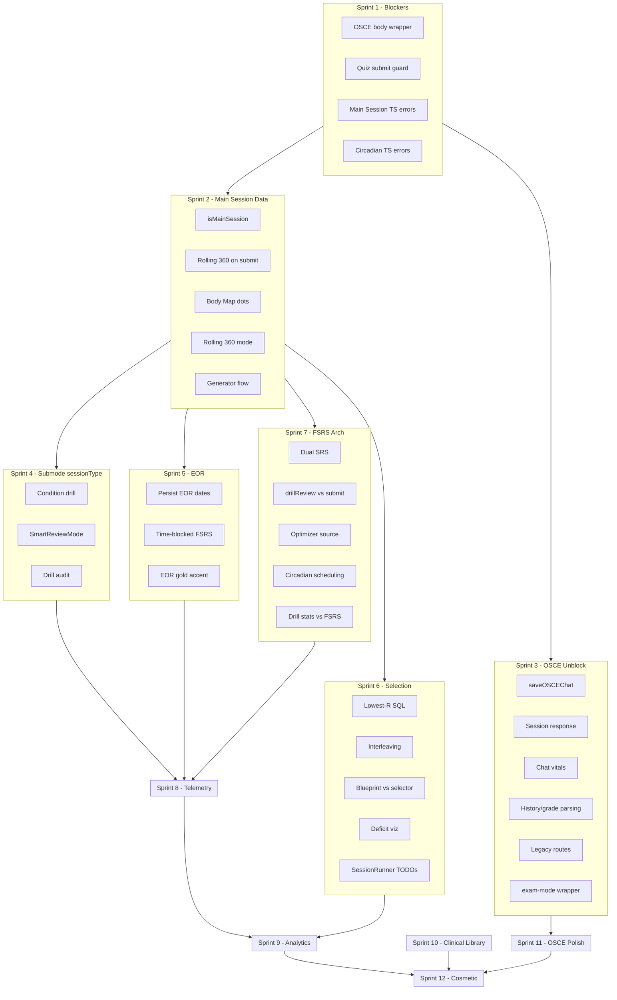

# 50 Improvements — Sprint Plan

This plan splits the 50 improvements into 12 sprints. Each sprint is cohesive and dependency-ordered. Sprint durations are estimates based on complexity.

---

## Sprint Overview

| Sprint | Theme                               | Items | Est.     |
| ------ | ----------------------------------- | ----- | -------- |
| 1      | Critical Blockers                   | 4     | 1–2 days |
| 2      | Main Session Data Integrity         | 5     | 2–3 days |
| 3      | OSCE Production Unblock             | 6     | 2–3 days |
| 4      | Submode SessionType Contamination   | 3     | 1 day    |
| 5      | EOR Foundation                      | 3     | 2–3 days |
| 6      | Main Session Selection & Scheduling | 5     | 2–3 days |
| 7      | FSRS/SRS Architecture               | 5     | 3–4 days |
| 8      | Data Collection & Telemetry         | 6     | 2–3 days |
| 9      | Analytics & Visualization           | 6     | 2–3 days |
| 10     | Clinical Library & Content          | 4     | 1–2 days |
| 11     | OSCE Polish                         | 3     | 1–2 days |
| 12     | Cosmetic & UX Polish                | 4     | 1–2 days |

---

## Sprint 1: Critical Blockers (P0)

Unblocks production and build.

1. **OSCE API body wrapper** — Production 400s on session/chat/complete. Wrap payloads in `body` in [services/domain/osceService.ts](services/domain/osceService.ts).
2. **Quiz Submit double-submit guard** — Add `disabled={isSubmitting}` or ref guard in [components/session/QuizView.tsx](components/session/QuizView.tsx).
3. **Main Session TypeScript errors** — Fix null checks in [lib/services/mainSessionQuestionSelector.ts](lib/services/mainSessionQuestionSelector.ts) and [lib/services/rolling360Service.ts](lib/services/rolling360Service.ts).
4. **Circadian analytics TS errors** — Fix strict-null in [services/circadianAnalyticsService.ts](services/circadianAnalyticsService.ts) and [lib/circadian.ts](lib/circadian.ts).

**Exit criteria:** `npm run typecheck` passes; OSCE session create/chat/complete work in production; submit cannot be double-fired.

---

## Sprint 2: Main Session Data Integrity

Ensures main-session attempts feed Rolling 360 and analytics.

1. **isMainSession on attempt API** — Add `isMainSession` to [functions/api/questions/attempt.ts](functions/api/questions/attempt.ts) schema; pass from [lib/services/sync/syncManager.ts](lib/services/sync/syncManager.ts) and [components/session/QuizView.tsx](components/session/QuizView.tsx).
2. **Rolling 360 update on submit** — Call `updateRolling360OnSubmit` from [lib/services/drillReviewService.ts](lib/services/drillReviewService.ts) and/or [functions/api/questions/attempt.ts](functions/api/questions/attempt.ts) when `isMainSession` is true.
3. **Body Map system dots** — Resolve `BodyMapWidget.SYSTEM_TO_REGION` vs `UserRolling360Stats.systemStats` key mismatch; store systemStats under short codes in [lib/services/rolling360Service.ts](lib/services/rolling360Service.ts) or map in widget.
4. **Rolling 360 mode vs isMainSession** — Align query in rolling360Service (use `isMainSession: true` instead of `mode = 'main_session'` where schema expects it).
5. **Main Session generator flow wiring** — Confirm GET `/api/study/session/:sessionId/questions` exists and [SessionRunner](components/session/SessionRunner.tsx) uses it; validate CommuterMode path.

**Exit criteria:** Main-session answers update Rolling 360; Body Map shows system dots; generator-based session flow works.

---

## Sprint 3: OSCE Production Unblock

Makes OSCE usable in production.

1. **saveOSCEChat with full messages** — Replace dual `saveChatMessage` with single `saveOSCEChat(sessionId, fullMessages)` in [components/modes/PatientEncounterMode.tsx](components/modes/PatientEncounterMode.tsx).
2. **Parse session response (wsUrl, features)** — Extend [services/domain/osceService.ts](services/domain/osceService.ts) to return `{ session, wsUrl?, features? }`; wire in PatientEncounterMode.
3. **OSCE chat vitals persistence** — Extend `/api/osce/chat` to accept and persist `physicalFindings`/vitals, or document that vitals are intervention-only.
4. **getSessionHistory and grade parsing** — Verify [services/domain/osceService.ts](services/domain/osceService.ts) parses Cloudflare response shape correctly.
5. **Legacy Express routes alignment** — Update [routes/osce.ts](routes/osce.ts) to use same `body` contract as Cloudflare.
6. **OSCE exam-mode wrapper** — Wrap active/results view in `exam-mode` in PatientEncounterMode so gold accent (#7a6f52) applies.

**Exit criteria:** Full OSCE flow works in production; chat persists; grading shows; gold accent on OSCE.

---

## Sprint 4: Submode SessionType Contamination

Prevents drill reviews from polluting FSRS.

1. **Condition Drill sessionType** — Add `sessionType: 'cram'` to submit-review body in [hooks/game/use-condition-drill.ts](hooks/game/use-condition-drill.ts).
2. **SmartReviewMode sessionType** — Add appropriate `sessionType` to submit-review in [components/modes/SmartReviewMode.tsx](components/modes/SmartReviewMode.tsx) (main vs cram based on mode).
3. **Drill sessionType audit** — Audit Photo, DDx, ECG, Derm, Guideline, Antibiotic, and other drills that call submit-review; add `sessionType: 'cram'` (or `rapid_recall`) where appropriate.

**Exit criteria:** Only main session and Due review write to FSRS; drill modes do not affect long-term scheduling.

---

## Sprint 5: EOR Foundation

Persists EOR state and starts time-blocked scheduling.

1. **EOR persist rotation dates server-side** — Add `eorTestDate`, `rotationStartDate`, `rotationEndDate` to User in [prisma/schema.prisma](prisma/schema.prisma); update [functions/api/user/profile.ts](functions/api/user/profile.ts), [functions/api/_shared/zodSchemas.ts](functions/api/_shared/zodSchemas.ts), [hooks/useUserProfile.ts](hooks/useUserProfile.ts); sync from Settings/Command Center.
2. **EOR time-blocked FSRS** — Create [lib/fsrs/eorScheduler.ts](lib/fsrs/eorScheduler.ts); apply clamp in [functions/api/srs/submit.ts](functions/api/srs/submit.ts), [lib/services/drillReviewService.ts](lib/services/drillReviewService.ts), [lib/services/userProgressService.ts](lib/services/userProgressService.ts).
3. **EOR exam-mode gold accent** — Apply `exam-mode` or equivalent to EOR countdown and EOR-specific UI in [components/dashboard/EorCountdownCard.tsx](components/dashboard/EorCountdownCard.tsx) and related components.

**Exit criteria:** EOR dates persist; next-review is clamped to rotation end in EOR mode; EOR UI uses gold accent.

---

## Sprint 6: Main Session Selection & Scheduling

Improves question selection and interleaving.

1. **Lowest-R fallback SQL** — Implement lowest-retrievability query in [lib/services/mainSessionQuestionSelector.ts](lib/services/mainSessionQuestionSelector.ts) for deficit systems when no overdue cards exist.
2. **Strict interleaving** — Enforce no consecutive same-system questions in the assembler; fix `wouldViolateInterleaving` logic.
3. **Blueprint quotas vs selector** — Unify or document: either use Interleaved Assembler for “Build Session” as well, or clearly separate pipelines.
4. **Deficit visualization** — Add deficit widget to Command Center showing targeted systems and brief rationale.
5. **SessionRunner TODOs** — Implement or remove `growthAreas={[]}` and “review missed” TODOs in [components/session/SessionRunner.tsx](components/session/SessionRunner.tsx).

**Exit criteria:** Deficit-based selection and interleaving work; users see why sessions target certain systems.

---

## Sprint 7: FSRS/SRS Architecture

Resolves dual storage and optimizer data source.

1. **Dual SRS storage** — Decide single source of truth (DB preferred); either deprecate [lib/services/srsService.ts](lib/services/srsService.ts) localStorage path or define sync flow; update [hooks/useSRSItems.ts](hooks/useSRSItems.ts).
2. **drillReviewService vs srs/submit path** — Clarify canonical FSRS path; document when each is used; avoid duplicate writes.
3. **FSRS optimizer data source** — Standardize on ReviewLog with `sessionType: 'MAIN'`; ensure all main-session paths write ReviewLog.
4. **Circadian phase in scheduling** — Use [UserCircadianProfile](prisma/schema.prisma) (or equivalent) in scheduling/retention logic when available.
5. **Drill stats vs FSRS** — Document or refactor [services/core/drillStatsService.ts](services/core/drillStatsService.ts) `calculateNextReview` vs FSRS; separate drill stats from SRS.

**Exit criteria:** One clear FSRS path; optimizer uses ReviewLog; drill stats vs FSRS clearly separated.

---

## Sprint 8: Data Collection & Telemetry

Ensures consistent behavioral and review data.

1. **UserBehaviorMetrics from all drills** — Ensure Condition drill, Photo drill, DDx, etc. send behavioral telemetry to `/api/user/behavior-metrics`.
2. **QuestionAttempt.telemetryJson completeness** — Guarantee all QuestionAttempt creation paths store full telemetry.
3. **ReviewLog.telemetry schema** — Document and enforce shared schema; validate or migrate existing data.
4. **Ghost Grader / BehaviorLog usage** — Ensure Ghost Grader output feeds FSRS modifiers or analytics where intended.
5. **Calibration observation flow** — Ensure submit-review returns `implicitMetrics`; wire `recordCalibrationObservation` in all relevant drill paths.
6. **Grand Rounds session type** — Confirm Grand Rounds uses `sessionType: 'cram'` so it does not affect FSRS.

**Exit criteria:** Behavioral telemetry sent from all drill paths; telemetry schema documented; calibration wired.

---

## Sprint 9: Analytics & Visualization

Aligns client and server analytics.

1. **Client heatmap vs server analytics** — Define single source of truth; ensure sync populates same records used by both.
2. **focus === 'all' filter** — Ensure `sessionSettings.focus` is set and synced so heatmap uses correct subset.
3. **LearningPatternEngine** — Implement or feature-flag [services/analytics/learningPatternEngine.ts](services/analytics/learningPatternEngine.ts) interference detection; remove placeholder returns.
4. **Advanced analytics data** — Audit [services/ai/advancedUserAnalyticsEngine.ts](services/ai/advancedUserAnalyticsEngine.ts); add fallbacks for missing data.
5. **Rapid Recall high score persistence** — Persist high score via API if desired; surface in profile/analytics.
6. **Landing live stats** — Add live stats ticker to [pages/LandingPage.tsx](pages/LandingPage.tsx) from PlatformStatistics or similar.

**Exit criteria:** Heatmap and server analytics aligned; focus filter correct; placeholder analytics resolved.

---

## Sprint 10: Clinical Library & Content

Completes content and condition features.

1. **Condition page DrugConditionLink** — Fetch and display related drugs via `DrugConditionLink` in [pages/conditions/[id].tsx](pages/conditions/[id].tsx).
2. **Clinical Library ingest/citation** — Verify [functions/api/content/library/ingest.ts](functions/api/content/library/ingest.ts) and citation API; document and wire for SmartConditionView where applicable.
3. **Question generator Staging Lake** — Connect main `/api/questions/generate` to StagingQuestion pipeline or document separation.
4. **Registry sync automation** — Document runbook and/or add deploy step or cron for [scripts/syncAllRegistries.ts](scripts/syncAllRegistries.ts).

**Exit criteria:** Condition pages show drug links; ingest/citation documented; sync runbook clear.

---

## Sprint 11: OSCE Polish

Finishes OSCE flows and design.

1. **Finalize SOAP and timing on End Encounter** — Call `finalizeSOAP` and `endTimingSession` in PatientEncounterMode; send payloads to POST `/api/osce/complete`.
2. **Stormy Slate OSCE components** — Audit [components/modes/osce/](components/modes/osce/) and [components/osce/](components/osce/) for hardcoded colors; use semantic tokens.
3. **RapportMeter and OrderPanel wiring** — Wire rapport updates from chat flow; confirm OrderPanel DB seeding and `onOrderPlaced` behavior.

**Exit criteria:** SOAP/timing sent on completion; OSCE uses semantic tokens; OrderPanel and RapportMeter behave as designed.

---

## Sprint 12: Cosmetic & UX Polish

Final polish.

1. **Quiz explanation CLS** — Reserve min-height or stable container for explanation block in QuizView to reduce layout shift.
2. **Condition count TODO** — Replace placeholder in CommandCenterHub with real condition count from registry/API.
3. **EOR daily target** — Make 300 configurable or derived from rotation length in [config/rotation-systems.ts](config/rotation-systems.ts).
4. **OSCESimulator TODO** — Implement case loading or document as future work in [components/modes/osce/OSCESimulator.tsx](components/modes/osce/OSCESimulator.tsx).

**Exit criteria:** No layout shift on explanation; placeholders removed; configs rationalized.

---

## Dependency Diagram

---

## Execution Notes

- **Sprints 1–3** should be done first; they unblock production and core flows.
- **Sprints 4–5** depend on Sprint 2 (isMainSession and Rolling 360).
- **Sprints 6–7** can run in parallel after Sprint 2.
- **Sprints 8–12** can be ordered by product priority; dependencies are minimal.
- Reuse existing plans: [.cursor/plans/osce_module_audit_plan_a9e4be36.plan.md](.cursor/plans/osce_module_audit_plan_a9e4be36.plan.md), [.cursor/plans/main_session_audit_execution_plan_f5f8210c.plan.md](.cursor/plans/main_session_audit_execution_plan_f5f8210c.plan.md), [.cursor/plans/eor_module_audit_plan_be0c3008.plan.md](.cursor/plans/eor_module_audit_plan_be0c3008.plan.md) for implementation detail.

