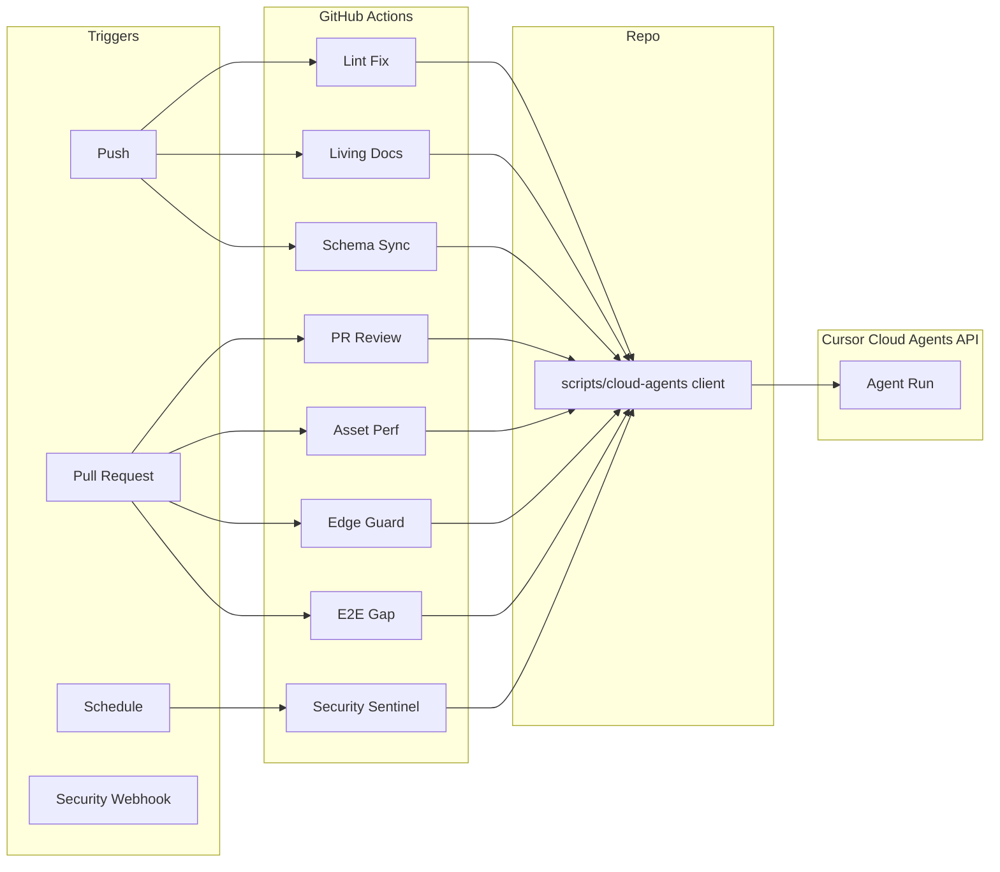

# Cloud Agents API Integration Plan

## Scope

Integrate the **Cursor Cloud Agents API** (Basic Auth, programmatic launch) into this repository to automate maintenance, reviews, documentation, security, and compliance—while respecting the constraint that **MCP is not supported** (agents only see repo context).

---

## 1. Foundation: API Client and Secrets

**Goal:** One place to call the Cloud Agents API from GitHub Actions and local scripts.

- **New directory:** `scripts/cloud-agents/` (or `tools/agents/`).
- **Script/Module:** Thin client that:
  - Reads API base URL and API key from environment (e.g. `CURSOR_AGENTS_API_KEY`, optional `CURSOR_AGENTS_BASE_URL`).
  - Sends POST with Basic Auth to launch an agent with a given instruction and optional repo/branch context.
  - Returns job/run ID for polling or "fire-and-forget."
- **Secrets:** Document that the API key comes from the Cursor Dashboard; store in GitHub as `CURSOR_AGENTS_API_KEY` (or similar). Never commit the key.
- **Docs:** Add a short `docs/automation/CLOUD_AGENTS_API.md` describing how to use the client, which env vars are required, and how to trigger from CI vs. locally.

This foundation is reused by every integration below.

---

## 2. Gemini Suggestions (Included as Requested)

### 2.1 Automate Routine Maintenance (CI/CD)

- **Auto-fix lint/format:** In [.github/workflows/ci-cd.yml](.github/workflows/ci-cd.yml), when the "Code Quality" or "Lint" step fails, add an optional job (or separate workflow) that triggers an agent with: *"Fix ESLint and Prettier issues in the files reported in [failure output]. Do not change behavior; only fix lint/format. Use project rules in .cursorrules and .cursor/rules."*
- **PR review agent:** On `pull_request`, optionally trigger an agent with: *"Review this PR: [link or diff]. Focus on Edge runtime rules (no Node APIs in `functions/`), Prisma singleton usage, and Zod validation in API routes. Leave comments as if reviewing the code."* Output can be posted as a comment via GitHub API (e.g. with a dedicated "review bot" step that parses agent output and uses `gh pr comment` or GitHub Actions bot).

**Integration point:** New job in `ci-cd.yml` (or `ci.yml`) that runs on failure / on PR, calls `scripts/cloud-agents/` client with the right instruction.

### 2.2 "Fire and Forget" Asynchronous Work

- **Script:** e.g. `scripts/cloud-agents/trigger-refactor.ts` (or a generic `trigger.ts --instruction "..."`) that accepts an instruction and branch name, launches the agent via the client, and exits (no polling).
- **Use cases:** Complex refactors (e.g. "Refactor auth to use the new provider in `contexts/` and `functions/api`"), or batch test generation ("Generate unit tests for files in `lib/` that have no adjacent `*.test.ts`").
- **Docs:** Add examples to `docs/automation/CLOUD_AGENTS_API.md` for one-off refactors and test-generation prompts.

### 2.3 Multi-Repository Management

- **Script:** `scripts/cloud-agents/bulk-repos.ts` (or similar) that takes a list of repo paths (or GitHub repo names) and a single instruction (e.g. "Update the logging library to 2.0 and fix breaking changes"), and launches one agent per repo. Useful if you later split shared libs or run multiple apps (e.g. PANaCEa + another microservice).
- **Tailoring:** Today the repo is a single app; this is "ready when you need it." Document in the same automation doc.

### 2.4 Custom Tooling (e.g. Slack Bot)

- **Idea:** Internal Slack command `/fix-bug [issue URL]` that calls a small backend (or serverless function) which invokes the Cloud Agents API with: *"Investigate and suggest a fix for this issue: [url]. Repo: StudyPANaCEa."*
- **Implementation:** Out-of-repo or a separate minimal service that uses the same client contract (env-based API key, same POST shape). Referenced from the main docs so the team can add it when needed.

---

## 3. Your Three Tailored Implementations

### 3.1 "Living Documentation" Pipeline (Tailored)

- **Trigger:** GitHub Action on push/PR when files under `functions/api/**` or key backend files (e.g. `lib/prisma.ts`, `functions/api/_shared/*`) change. Use `paths` filter in the workflow.
- **Agent task (tailored to this repo):**  
*"The following files under `functions/api/` or shared API code changed: [list]. (1) If there is an existing API doc (e.g. `docs/api/` or `docs/automation/api-surface.md`), update it to match new or changed routes and request/response shapes. (2) Update any references in `docs/` and `README*.md` that describe these endpoints. (3) If the project has no single API doc yet, create `docs/api/API_OVERVIEW.md` listing the changed routes with method, path, and a one-line description. Follow .cursorrules and existing doc style in `docs/`."*
- **Benefit:** With 50+ route files under `functions/api/`, keeping a single overview and doc references in sync reduces drift; [docs/deployment/PRODUCTION_CHECKLIST.md](docs/deployment/PRODUCTION_CHECKLIST.md) already recommends OpenAPI—this can evolve toward that.

### 3.2 Proactive Security Sentinel (Tailored)

- **Trigger:** (1) Scheduled workflow (e.g. nightly) or (2) Dependabot alert webhook. If using Dependabot, add a workflow that runs when a security alert is opened.
- **Agent task (tailored):**  
*"A dependency vulnerability was reported: [package name and version / link]. Create a new branch from main. Upgrade the package to the suggested safe version (or minimal fix). Run `npm ci`, `npx prisma generate`, `npm run build`, and `npm test`. If all pass, push the branch and open a Pull Request with title 'Security: bump [package] to [version]' and label 'Security Fix'. If tests fail, describe what broke and do not open the PR."*
- **Benefit:** Shortens time-to-remediation for dependencies (e.g. Prisma, Clerk, Sentry, Vite) without requiring the IDE to be open.

### 3.3 Asset & Performance Optimizer (Tailored)

- **Trigger:** PR that touches `public/`, or `**/*.css`, or adds new `import` in entry points or large components (e.g. under `components/`, `App.tsx`). Use `paths` in the workflow.
- **Agent task (tailored):**  
*"This PR adds or changes front-end assets or imports. (1) List any new or modified images under `public/` or under `src/`; suggest WebP or responsive images where appropriate. (2) If new CSS was added, suggest minification or Tailwind-purge alignment. (3) Check if new heavy imports (e.g. Recharts, Framer Motion, new libs) could cause the main bundle to exceed 500KB; if so, suggest code-splitting or lazy loading consistent with existing `config/lazyComponents.tsx` and project conventions."*
- **Benefit:** [CI already checks main bundle size](.github/workflows/ci-cd.yml) (500KB threshold); the agent gives actionable suggestions before merge and keeps [vite.config.ts](vite.config.ts) and lazy-loading patterns in mind.

---

## 4. Three Additional Crucial Implementations (Brainstormed)

### 4.1 Edge Runtime & Prisma Compliance Guard

- **Problem:** [.cursorrules](.cursorrules) forbids Node APIs in `functions/` and requires Prisma singleton and Zod validation; violations cause production bugs on Cloudflare.
- **Trigger:** PR that changes any file under `functions/`.
- **Agent task:**  
*"Review only the changed files under `functions/`. (1) Flag any use of `fs`, `path`, `os`, `process.cwd`, or other Node-only APIs. (2) Ensure Prisma is imported from the shared singleton (e.g. `@/lib/prisma` or the project's canonical path), not `new PrismaClient()`. (3) Ensure API handlers validate request body/query with Zod and return structured JSON errors. (4) Output a short checklist: Node APIs yes/no, Prisma singleton yes/no, Zod present yes/no."*
- **Integration:** Optional job in CI that runs on PRs touching `functions/`, calls the agent, and posts the checklist as a PR comment (or fails the job if "Node APIs: yes").

### 4.2 Content & Schema Sync Agent

- **Problem:** This app is content-heavy (conditions, SRS, grand rounds, library, Prisma schema). When schema or seed/scripts change, config and implementation docs can drift.
- **Trigger:** Push/PR that changes `prisma/schema.prisma` or key content scripts (e.g. under `scripts/db/`, `scripts/automation/`, or `config/conditionRegistry.ts` / `config/training-modes.ts`).
- **Agent task:**  
*"Schema or content-related code changed: [list]. (1) Update `docs/implementation/` and any `docs/` files that describe the data model or content pipeline so they match the new schema and script behavior. (2) If `config/conditionRegistry.ts`, `config/training-modes.ts`, or similar configs reference DB concepts, check they're still consistent with the schema. (3) Propose edits only; list files and suggested changes."*
- **Benefit:** Keeps [docs/implementation/](docs/implementation/) and config in sync with [prisma/schema.prisma](prisma/schema.prisma) and content scripts.

### 4.3 E2E and Regression Test Gap Filler

- **Problem:** New features in `components/modes/` or `functions/api/` often land without corresponding E2E or unit tests.
- **Trigger:** PR that adds or significantly changes files under `components/modes/`, `components/session/`, or `functions/api/*` (new or modified handlers).
- **Agent task:**  
*"These files were added or changed: [list]. (1) Identify user-facing flows that touch these areas (e.g. starting a session, submitting an answer, opening a mode). (2) Check `e2e/` and `playwright/` for existing tests covering those flows. (3) If gaps exist, propose new or extended Playwright tests (or Vitest for pure logic) following the patterns in this repo. Output concrete test file paths and code snippets."*
- **Benefit:** Improves coverage where it's missing and aligns with existing [e2e/](e2e/) and Playwright setup.

---

## 5. Implementation Order and Technical Notes

| Phase | What                                                                              | Dependencies |
| ----- | --------------------------------------------------------------------------------- | ------------ |
| 1     | Foundation: `scripts/cloud-agents/` client + env docs                             | None         |
| 2     | CI: Lint auto-fix on failure; PR review agent (comment poster)                    | Phase 1      |
| 3     | Living Documentation workflow (path filter: `functions/api/**`)                   | Phase 1      |
| 4     | Security Sentinel (schedule or Dependabot webhook)                                | Phase 1      |
| 5     | Asset & Performance Optimizer (path filter: assets/imports)                       | Phase 1      |
| 6     | Edge/Prisma Compliance Guard (path filter: `functions/**`)                        | Phase 1      |
| 7     | Fire-and-forget + bulk-repo scripts + doc examples                                | Phase 1      |
| 8     | Content & Schema Sync (path filter: prisma, scripts/db, config)                   | Phase 1      |
| 9     | E2E Gap Filler (path filter: components/modes, components/session, functions/api) | Phase 1      |
| 10    | Optional: Slack or internal tooling (separate service using same client)          | Phase 1      |

**Key constraints**

- **No MCP:** Agents cannot call external DBs or tools; all context is the repo. Instructions must be self-contained (e.g. "run this command" is not possible; "suggest changes to these files" is).
- **Auth:** Use API key from Cursor Dashboard; store in GitHub Secrets and in local `.env` (gitignored) for scripts.
- **Idempotency and safety:** Prefer "suggest and open PR" over "push to main" so humans can review agent changes.

---

## 6. Diagram: Where Agents Plug In

---

## 7. Deliverables Summary

- **New:** `scripts/cloud-agents/` (client + trigger scripts), `docs/automation/CLOUD_AGENTS_API.md`.
- **Modified:** `.github/workflows/ci-cd.yml` (or new workflows) for each agent-triggered job with path filters and secure use of `CURSOR_AGENTS_API_KEY`.
- **Optional:** Small "review bot" that turns agent output into PR comments; separate Slack/serverless for `/fix-bug` when desired.

This plan includes all four Gemini use cases, your three tailored flows (Living Docs, Security Sentinel, Asset/Performance), and three additional high-value flows (Edge Guard, Content/Schema Sync, E2E Gap Filler) specific to this repository's stack and structure.