# EOR Module Deep Audit and Execution Plan

## Current State Summary

The EOR module today is **UI and content-scope only**. It does **not** affect when reviews are scheduled. EOR "mode" is determined client-side when: Clinical Year + current rotation in `EOR_ROTATIONS` + `eorTestDate` set in localStorage. That drives the EOR countdown card, "EOR Readiness" label on the exam readiness card, and EOR test date inputs in Command Center and Settings. **No rotation start/end dates exist in schema or API; no time-constrained FSRS logic exists.**

---

## 1. Isolated Time-Blocked FSRS (EOR Scheduler)

### Gap

- FSRS next-review is computed in [lib/fsrs.ts](lib/fsrs.ts) (`next()` → `due = now + interval * 86400000`) with no cap.
- [functions/api/srs/submit.ts](functions/api/srs/submit.ts), [lib/services/drillReviewService.ts](lib/services/drillReviewService.ts), and [lib/services/userProgressService.ts](lib/services/userProgressService.ts) persist `nextReviewDate`/`dueDate` without any rotation or EOR window.
- [functions/api/srs/next.ts](functions/api/srs/next.ts) returns next-due items with no EOR/rotation filter.
- **Rotation start date is not stored anywhere**; only `eorTestDate` (EOR exam date) exists in client `UserProfile` in localStorage.

### Design Outline for Time-Blocked EOR FSRS

- **Scope:** EOR scheduler must be **isolated** to EOR mode: when the user is in Clinical Year, on an EOR rotation, and has both **rotation start** and **rotation end** (or EOR test date) set. Only then should scheduling be constrained.
- **Time block:** Define a window `[rotationStartDate, rotationEndDate]` (or `[rotationStartDate, eorTestDate]`). All EOR-scoped next-review dates must be **clamped** to be `<= rotationEndDate` (or `eorTestDate`). No reviews may be scheduled after the rotation ends.
- **Isolation rules:**
  - EOR scheduling logic should live in a dedicated module (e.g. `lib/fsrs/eorScheduler.ts` or `services/eor/eorFsrsScheduler.ts`) that:
    - Accepts `rotationStart`, `rotationEnd` (or `eorTestDate`), and the raw FSRS `due` from `fsrs.next()`.
    - Returns `clampedDue = min(due, rotationEnd)` and optionally a flag `scheduledPastRotation: boolean` for analytics.
  - Main FSRS flow (`lib/fsrs.ts`) remains unchanged. The clamp is applied **after** `fsrs.next()` in the **callers** when the request context is EOR (e.g. session type or user profile indicates EOR mode).
- **Call sites to modify:**
  - [functions/api/srs/submit.ts](functions/api/srs/submit.ts): Before persisting `nextReviewDate`, if the user is in EOR mode (need to pass rotation end from client or resolve from profile), clamp `nextReviewDate` to rotation end.
  - [lib/services/drillReviewService.ts](lib/services/drillReviewService.ts): Same clamp when updating UserProgress for MAIN session and EOR context.
  - [lib/services/userProgressService.ts](lib/services/userProgressService.ts): When computing `nextReviewDate` from `fsrsCard.scheduled_days`, apply EOR clamp if EOR context.
- **Data requirements:** Rotation **start** date must be stored. Options:
  - Add `rotationStartDate` (and optionally `rotationEndDate`) to `UserProfile` in localStorage and to API/DB (see Section 3), **or**
  - Derive rotation start from EOR test date minus a default rotation length (e.g. 6 weeks) if only `eorTestDate` is stored. Prefer explicit start/end for clarity.

### Files to Create

- **New:** `lib/fsrs/eorScheduler.ts` (or `services/eor/eorFsrsScheduler.ts`) — pure function: `clampDueToRotationWindow(due: Date, rotationEnd: Date): Date` and optionally `isEorSchedulingContext(profile): boolean`.

### Files to Modify

- [functions/api/srs/submit.ts](functions/api/srs/submit.ts): Accept EOR window (or profile); clamp `nextReviewDate` before write when EOR.
- [lib/services/drillReviewService.ts](lib/services/drillReviewService.ts): Same clamp when in EOR context.
- [lib/services/userProgressService.ts](lib/services/userProgressService.ts): Apply clamp when building next review date in EOR context.
- [functions/api/srs/next.ts](functions/api/srs/next.ts): Optionally prioritize or filter items due before rotation end when in EOR mode (if product wants “only show due before EOR”); otherwise at least ensure returned due dates are already clamped.

### Blocker / Debt

- **EOR context must be available server-side.** Today `eorTestDate` (and rotation) are client-only (localStorage). To clamp on submit, the API must receive rotation end (or start+end) in the request body or resolve from persisted profile. **Persisting `eorTestDate` (and rotation start/end) to the backend is a prerequisite** (see Section 3).

---

## 2. FSRS Logic Accuracy (Confidence / Decimal Values)

### Current Behavior

- **FSRS core** ([lib/fsrs.ts](lib/fsrs.ts)) uses integer `Rating` (1–4) only. No change needed there.
- **Implicit path** ([lib/implicit-metrics.ts](lib/implicit-metrics.ts)): `deriveContinuousRating()` returns `grade` (float 1.0–4.0), `confidence` (0–1), and `discreteRating` (integer). The **discrete** rating is used for `fsrs.next()`; the **continuous** grade is used for `applyStabilityModifierFromGrade()` and stored in `ReviewLog.grade_continuous`.
- **Buckets:** `gradeToRating(grade)` in implicit-metrics uses thresholds 1.5, 2.5, 3.5 (same idea as [lib/fsrs-optimizer-bridge.ts](lib/fsrs-optimizer-bridge.ts)). Confidence is used for stability softening and analytics, not as a direct FSRS input.

### What to Verify for EOR

- Ensure the **EOR code path** (when it exists) uses the **same** implicit pipeline: `deriveContinuousRating` → `discreteRating` for `fsrs.next()`, and **decimal** `grade`/`confidence` for modifiers and logging. No hardcoded integers for rating in EOR-specific submit or drill flow.
- **Files to audit:** Once EOR submit/drill paths are added or touched, ensure they use [lib/implicit-metrics.ts](lib/implicit-metrics.ts) (and optionally [lib/fsrs-optimizer-bridge.ts](lib/fsrs-optimizer-bridge.ts)) and do not pass hardcoded 1–4. No separate EOR-specific rating logic.

### Action

- **Document** in the new EOR scheduler module that EOR scheduling uses the same FSRS + implicit-metrics pipeline; no new rating derivation. In implementation, pass through the same `rating`/grade/confidence used elsewhere.

---

## 3. Core EOR Flow and State Management

### Gaps

| Area                        | Current State                                                                                                                                                                                                             | Required Change                                                                                                                                                                     |
| --------------------------- | ------------------------------------------------------------------------------------------------------------------------------------------------------------------------------------------------------------------------- | ----------------------------------------------------------------------------------------------------------------------------------------------------------------------------------- |
| **eorTestDate persistence** | Stored only in localStorage (`panceai_user_profile`) via [services/analytics/userProfileService.ts](services/analytics/userProfileService.ts). Not in API or DB.                                                          | Persist `eorTestDate` (and optionally rotation start/end) in backend so EOR scheduler and APIs can clamp and filter.                                                                |
| **Profile API**             | [functions/api/user/profile.ts](functions/api/user/profile.ts) and [functions/api/_shared/zodSchemas.ts](functions/api/_shared/zodSchemas.ts) — `profileUpdateSchema` has no `eorTestDate`. GET/PUT do not read/write it. | Add `eorTestDate` (and `rotationStartDate`/`rotationEndDate` if desired) to schema and profile GET/PUT.                                                                             |
| **Prisma**                  | [prisma/schema.prisma](prisma/schema.prisma) — `User` has `currentRotation` but no `eorTestDate` or rotation dates.                                                                                                       | Add `eorTestDate DateTime?`, and optionally `rotationStartDate DateTime?`, `rotationEndDate DateTime?` to `User`. Migration + backfill optional.                                    |
| **useUserProfile**          | [hooks/useUserProfile.ts](hooks/useUserProfile.ts) — `UserProfileData` and `UserProfileUpdateInput` do not include `eorTestDate`.                                                                                         | Add `eorTestDate` (and rotation dates if added) to types and ensure UI calls `updateProfile({ eorTestDate })` and syncs with API.                                                   |
| **Single source of truth**  | Command Center and Settings update localStorage via `updateUserProfile`; `useUserProfile` updates API only for fields in `UserProfileUpdateInput`.                                                                        | After API supports `eorTestDate`, have profile load from API when available and merge or replace localStorage for these fields so EOR state is consistent and server-authoritative. |

### Files to Modify

- [prisma/schema.prisma](prisma/schema.prisma): Add `eorTestDate`, optionally `rotationStartDate`/`rotationEndDate` on `User`.
- [functions/api/_shared/zodSchemas.ts](functions/api/_shared/zodSchemas.ts): Add `eorTestDate` (and rotation dates) to `profileUpdateSchema`.
- [functions/api/user/profile.ts](functions/api/user/profile.ts): In GET, return `eorTestDate` (and rotation dates); in PUT and `buildProfileUpdateData`, handle them (as ISO strings → Date).
- [hooks/useUserProfile.ts](hooks/useUserProfile.ts): Add `eorTestDate` (and rotation dates) to `UserProfileData` and `UserProfileUpdateInput`; ensure settings/command center use API for persistence when logged in.
- [services/analytics/userProfileService.ts](services/analytics/userProfileService.ts): Keep localStorage as cache or fallback; on load, prefer API-sourced EOR fields when available so one source of truth.

### Files to Create

- Migration: `prisma/migrations/YYYYMMDD_add_eor_dates_to_user/migration.sql` adding columns.

---

## 4. Partially Coded Features and Polish

| Item                                      | Location                                                                                                                             | Current State                                                                    | Completion Steps                                                                                                                                                                                                                      |
| ----------------------------------------- | ------------------------------------------------------------------------------------------------------------------------------------ | -------------------------------------------------------------------------------- | ------------------------------------------------------------------------------------------------------------------------------------------------------------------------------------------------------------------------------------- |
| **EOR daily target (300)**                | [components/dashboard/EorCountdownCard.tsx](components/dashboard/EorCountdownCard.tsx) — `getEorDailyTarget()` uses hardcoded `300`. | Arbitrary; not tied to rotation length or user goal.                             | Make configurable: constant in config (e.g. `config/rotation-systems.ts`) or user preference; or derive from `rotationEnd - rotationStart` and a target questions-per-day. Replace magic `300` with named constant or computed value. |
| **“Final stretch” copy**                  | Same file; shows when `daysRemaining <= 14 && > 0`.                                                                                  | Static text.                                                                     | Consider linking “rotation-relevant content” to actual rotation systems (e.g. `getSystemsForRotation(rotation)`) in copy or a tooltip; optional.                                                                                      |
| **EOR countdown in Quick Wins**           | [components/navigation/CommandCenterHub.tsx](components/navigation/CommandCenterHub.tsx).                                            | Renders when `eorTestDate && currentRotation && isEorRotation(currentRotation)`. | Ensure after backend persistence, profile still has `eorTestDate` when set (from API or merged localStorage). No logic change beyond state source.                                                                                    |
| **Condition count TODO**                  | CommandCenterHub line ~911: `total: 100, // TODO: Get actual condition count per system from registry`.                              | Placeholder.                                                                     | Resolve condition count from registry or API and pass real value; remove TODO.                                                                                                                                                        |
| **ExamReadinessCard EOR label**           | [components/dashboard/Rolling360/ExamReadinessCard.tsx](components/dashboard/Rolling360/ExamReadinessCard.tsx).                      | Uses `loadUserProfile()` and sets `examLabel = 'EOR'` when in EOR mode.          | After profile includes API-sourced EOR fields, ensure `loadUserProfile()` merges API data so EOR mode is detected consistently.                                                                                                       |
| **Rotation selector + EOR test date**     | [components/settings/EnhancedSettingsTab.tsx](components/settings/EnhancedSettingsTab.tsx).                                          | Persists via `handleUpdateProfile({ eorTestDate })` (local).                     | Switch to `updateProfile` from `useUserProfile` (API) when available so EOR test date is saved to backend.                                                                                                                            |
| **Calibration / Provisional / Confident** | Same ExamReadinessCard; `examLabel` passed to `ProvisionalState` and `ConfidentState`.                                               | EOR vs PANCE is only label/copy.                                                 | No structural change; ensure any new EOR-specific copy or tooltips use semantic tokens (Section 5).                                                                                                                                   |

### Files to Modify

- [components/dashboard/EorCountdownCard.tsx](components/dashboard/EorCountdownCard.tsx): Replace 300 with config or computed target; optional copy tweak for “rotation-relevant.”
- [config/rotation-systems.ts](config/rotation-systems.ts): Optional: add `EOR_TARGET_QUESTIONS_DEFAULT` or a small helper for daily target from rotation length.
- [components/navigation/CommandCenterHub.tsx](components/navigation/CommandCenterHub.tsx): Replace condition-count TODO; ensure EOR state from profile (API + localStorage merge).
- [components/settings/EnhancedSettingsTab.tsx](components/settings/EnhancedSettingsTab.tsx): Persist EOR test date (and rotation dates) via API when user is authenticated.

---

## 5. Design System (Stormy Slate and Darker Gold #7a6f52)

### Findings

- **Tailwind** ([tailwind.config.js](tailwind.config.js) ~line 221): `.exam-mode` uses `--color-accent: #7a6f52` (darker gold). Root/base theme in Tailwind does not define global accent; it’s in CSS.
- **index.css**: Light and dark themes set `--color-accent` to **slate** (`#64748b`, `#94a3b8`), not gold. So the **default** accent is slate; the **spec** and CONTRAST doc call for darker gold `#7a6f52` for accents.
- **EOR UI:** [EorCountdownCard.tsx](components/dashboard/EorCountdownCard.tsx) uses `text-data-pass`, `bg-data-pass/15`, `var(--color-text-primary)`, etc. No raw `#7a6f52` in the component; it relies on semantic tokens.

### Inconsistency

- **Docs/specs:** Stormy Slate with **darker gold (#7a6f52)** for accents (e.g. [docs/CONTRAST_RATIO_IMPROVEMENT_PLAN.md](docs/CONTRAST_RATIO_IMPROVEMENT_PLAN.md), [tailwind.config.js](tailwind.config.js) exam-mode).
- **index.css:** Accent is slate. So EOR (and rest of app) do not currently use the darker gold accent globally.

### Execution Steps

- **Decision:** Choose one source of truth for default accent (Stormy Slate): either (a) slate everywhere, or (b) darker gold `#7a6f52` for accents per spec. User requested “darker gold (#7a6f52) applied correctly for accents.”
- **If (b) darker gold for accents:**  
  - In [index.css](index.css), set `--color-accent` and `--color-accent-button` (and related) to `#7a6f52` / `#6a5f42` (or values from CONTRAST_RATIO_IMPROVEMENT_PLAN) for both light and dark, ensuring WCAG AA.  
  - Audit EOR components (EorCountdownCard, ExamReadinessCard when in EOR mode, Command Center EOR block, EnhancedSettingsTab EOR section) and replace any remaining raw colors with semantic tokens (`var(--color-accent)`, `var(--color-accent-button)`, `--color-text-primary`, etc.).  
  - Ensure EOR-specific highlights (e.g. “EOR Countdown” header, key dates) use accent tokens, not `text-data-pass` only, if accent is intended for emphasis.
- **Files to modify:** [index.css](index.css) (accent variables); [components/dashboard/EorCountdownCard.tsx](components/dashboard/EorCountdownCard.tsx); [components/navigation/CommandCenterHub.tsx](components/navigation/CommandCenterHub.tsx) (EOR section); [components/settings/EnhancedSettingsTab.tsx](components/settings/EnhancedSettingsTab.tsx) (EOR test date / rotation block); [components/dashboard/Rolling360/ExamReadinessCard.tsx](components/dashboard/Rolling360/ExamReadinessCard.tsx) if any EOR-specific inline styles exist.

---

## 6. Repository Clean-up (EOR-Related)

### Redundant / Outdated

- **Duplicate EOR_ROTATIONS:** Defined in both [config/rotation-systems.ts](config/rotation-systems.ts) (canonical) and [components/settings/EnhancedSettingsTab.tsx](components/settings/EnhancedSettingsTab.tsx) (inline array). **Action:** Remove the inline array in EnhancedSettingsTab; import `EOR_ROTATIONS` or `isEorRotation` from `config/rotation-systems.ts`.
- **Docs:** [docs/archive/COMPREHENSIVE_ISSUES_REPORT.md](docs/archive/COMPREHENSIVE_ISSUES_REPORT.md) mentions rotation-focused study (“ignore SRS due dates, focus on tag”) as a feature idea, not EOR-specific. Keep as archive; no delete. No other EOR-dedicated doc found; no redundant EOR doc to remove.
- **Stormy Slate SOP:** [sops/product-ux/stormy-slate-design-system-spec.md](sops/product-ux/stormy-slate-design-system-spec.md) is a placeholder. **Action:** Either populate it with the chosen accent (e.g. #7a6f52) and token list or add a one-line reference to `index.css` and tailwind so the spec is not empty.

### Not EOR-Specific but Relevant

- [AUDIT_MAIN_SESSION_UI.md](AUDIT_MAIN_SESSION_UI.md) and similar audit docs mention Stormy Slate and accent; they remain valid for design system work; no deletion.

### Files to Modify

- [components/settings/EnhancedSettingsTab.tsx](components/settings/EnhancedSettingsTab.tsx): Remove inline `EOR_ROTATIONS`; use `isEorRotation` (or `EOR_ROTATIONS`) from `config/rotation-systems.ts`.
- [sops/product-ux/stormy-slate-design-system-spec.md](sops/product-ux/stormy-slate-design-system-spec.md): Add minimal spec (accent #7a6f52, pointer to index.css/tailwind) or reference.

### Files to Delete

- None strictly required for EOR; clean-up is limited to deduplication and spec update above.

---

## Prioritized Execution Order

```mermaid
flowchart LR
  subgraph phase1 [Phase 1 - Foundation]
    A[Persist eorTestDate + rotation dates in API/DB]
    B[Profile schema + GET/PUT + useUserProfile]
  end
  subgraph phase2 [Phase 2 - EOR Scheduler]
    C[Create eorScheduler clamp module]
    D[Integrate clamp in submit + drillReviewService + userProgressService]
    E[Optional: next.ts EOR filter]
  end
  subgraph phase3 [Phase 3 - Polish and UI]
    F[Daily target 300 + EOR copy/config]
    G[Stormy Slate accent 7a6f52 + EOR tokens]
    H[CommandCenter condition count + Settings API persist]
  end
  subgraph phase4 [Phase 4 - Clean-up]
    I[Dedupe EOR_ROTATIONS in EnhancedSettingsTab]
    J[Stormy Slate SOP update]
  end
  phase1 --> phase2
  phase2 --> phase3
  phase3 --> phase4
```

1. **Phase 1 (Blocker for time-blocked FSRS):** Persist EOR state in backend — schema, migration, profile API, useUserProfile and sync with localStorage.
2. **Phase 2:** Implement EOR time-blocked scheduler (clamp module + integration in submit, drillReviewService, userProgressService, and optionally next.ts).
3. **Phase 3:** Polish (daily target, design tokens/accent, condition count, Settings API persist).
4. **Phase 4:** Clean-up (EOR_ROTATIONS dedupe, Stormy Slate spec).

---

## Immediate Blockers and Technical Debt

| Blocker                                          | Impact                                                                          | Resolution                                                                                                        |
| ------------------------------------------------ | ------------------------------------------------------------------------------- | ----------------------------------------------------------------------------------------------------------------- |
| **eorTestDate and rotation dates not in API/DB** | EOR scheduler cannot clamp server-side; EOR state is lost on new device/logout. | Add fields to User, profile API, and useUserProfile (Phase 1).                                                    |
| **No rotation start date**                       | Time window for clamping is undefined without start.                            | Add `rotationStartDate` (and optionally `rotationEndDate`) or derive start from eorTestDate minus default length. |
| **EOR context not in request**                   | submit.ts and drill flow do not know if the session is “EOR mode.”              | Pass rotation end (or profile) in request or resolve from User in DB after persistence.                           |
| **Accent inconsistency (slate vs gold)**         | EOR and global UI may not match “Stormy Slate + darker gold” spec.              | Decide and apply single accent source in index.css; audit EOR components for tokens.                              |

---

## Summary Table: Files to Touch

| Action     | Files                                                                                                                                                                                                                                                                                                                                                                                                                                                                                                                                                                                                    |
| ---------- | -------------------------------------------------------------------------------------------------------------------------------------------------------------------------------------------------------------------------------------------------------------------------------------------------------------------------------------------------------------------------------------------------------------------------------------------------------------------------------------------------------------------------------------------------------------------------------------------------------- |
| **Create** | `lib/fsrs/eorScheduler.ts` (or `services/eor/eorFsrsScheduler.ts`); migration for User eor/rotation dates                                                                                                                                                                                                                                                                                                                                                                                                                                                                                                |
| **Modify** | `prisma/schema.prisma`, `functions/api/_shared/zodSchemas.ts`, `functions/api/user/profile.ts`, `hooks/useUserProfile.ts`, `functions/api/srs/submit.ts`, `lib/services/drillReviewService.ts`, `lib/services/userProgressService.ts`, `functions/api/srs/next.ts` (optional), `components/dashboard/EorCountdownCard.tsx`, `config/rotation-systems.ts` (optional), `components/navigation/CommandCenterHub.tsx`, `components/settings/EnhancedSettingsTab.tsx`, `index.css`, `components/dashboard/Rolling360/ExamReadinessCard.tsx` (if needed), `sops/product-ux/stormy-slate-design-system-spec.md` |
| **Delete** | None (only remove inline EOR_ROTATIONS in EnhancedSettingsTab)                                                                                                                                                                                                                                                                                                                                                                                                                                                                                                                                           |

No code has been written; this plan is ready for implementation approval and then step-by-step execution in the order above.