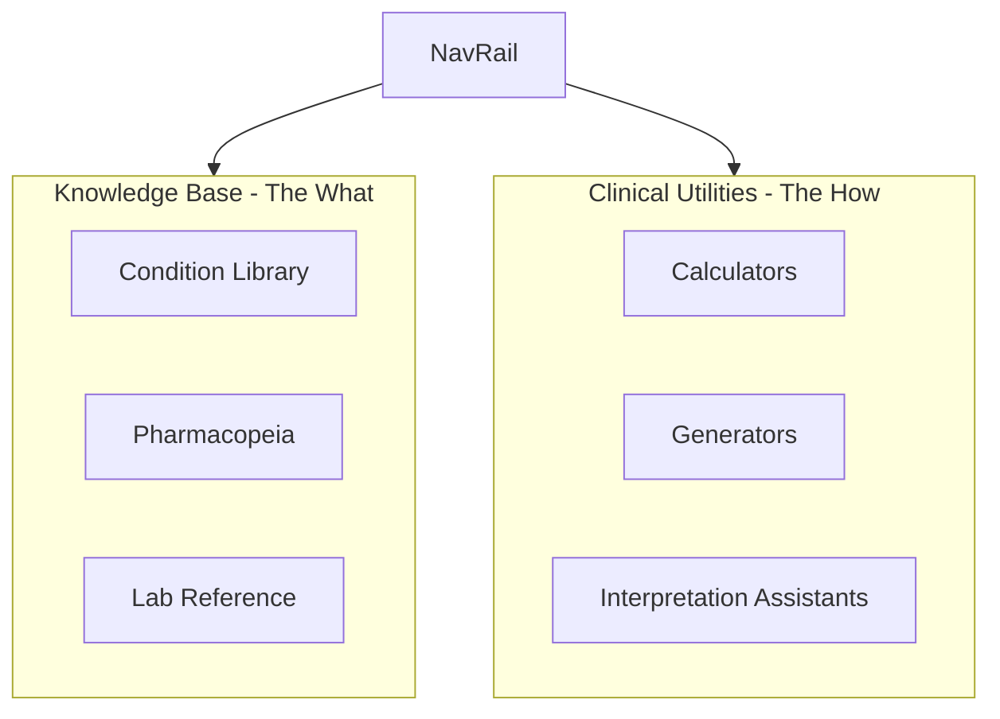

# Knowledge Base vs Clinical Utilities Structural Revamp

## Current State Analysis

**Reference** (`/study/reference`): `ClinicalReferenceLibrary` - Condition Library only (MedicalContent by system/subcategory).

**Toolkit** (`/study/toolkit`): `ToolkitHub` with 6 tabs:

- Calculators (MDCalc-style: Well's, CURB-65, GFR, Anion Gap, etc.)
- Clinical Library (redundant with Reference)
- Pharmacopeia (drug reference by class)
- Physiology (hardcoded lab values + anatomy placeholder)
- Imaging Atlas (placeholder linking to Radiology Scroll)
- Generators (MnemonicGenerator, StudyGuideGenerator, ClinicalMotionFlashcards, LectureConverter)

**Redundancy:** Condition Library exists in both Reference and Toolkit. Pharmacopeia is in Toolkit but is static reference (should move to Knowledge Base).

---

## Target Architecture




---

## Implementation Plan

### Phase 1: Route and Navigation Restructure

**1.1 Update NavRail and Routes**

- Rename "Reference" to "Knowledge Base" and "Toolkit" to "Clinical Utilities" in NavRail.
- Paths: `/study/knowledge` (was `/study/reference`), `/study/utilities` (was `/study/toolkit`).
- Add redirects: `/study/reference` → `/study/knowledge`, `/study/toolkit` → `/study/utilities` for bookmarks/links.

**Files:** [components/layout/NavRail.tsx](components/layout/NavRail.tsx), [App.tsx](App.tsx), [config/navigation.ts](config/navigation.ts), [routes.ts](config/routes.ts) if present.

**1.2 Create Knowledge Base Hub**

New component `KnowledgeBaseHub.tsx` (or repurpose `ClinicalReferenceLibrary` as the Knowledge Base shell) with three tabs/sections:


| Section           | Source                                                                  | Notes                                 |
| ----------------- | ----------------------------------------------------------------------- | ------------------------------------- |
| Condition Library | Existing `ClinicalReferenceLibrary` content                             | Core encyclopedia, PANCE blueprint    |
| Pharmacopeia      | Move from `ToolkitHub` → `PharmacopeiaContent` / `DrugReferenceLibrary` | Drug monographs, dosing, MoA          |
| Lab Reference     | New component using `NormalLabValue` + `LabTest` APIs                   | Normal values, clinical differentials |


**Data sources:**

- Conditions: `/api/content/library`, `/api/content/systems` (existing)
- Drugs: `/api/drugs/classes`, `/api/drugs/library` (existing)
- Labs: `functions/api/reference/labs/`, `functions/api/labs/tests.ts`; Prisma `NormalLabValue`, `LabTest` (existing schema)

**1.3 Build Lab Reference Component**

- Create `LabReferenceBrowser.tsx` under `components/library/` or `components/knowledge/`.
- Fetch from `/api/reference/labs` or similar; use `NormalLabValue` for ranges, `LabTest` for differentials (`increaseIndicates`, `decreaseIndicates`, `commonAbnormalities`).
- UI: Category filters (BMP, CBC, LFT, etc.), search, card/list of labs with normal range and differentials.

### Phase 2: Clinical Utilities Slim-Down

**2.1 Remove Redundant Tabs from ToolkitHub**

- Remove **Clinical Library** tab (now in Knowledge Base).
- Remove **Pharmacopeia** tab (moved to Knowledge Base).
- Remove **Physiology** tab (lab values → Lab Reference in Knowledge Base; anatomy placeholder can be deprecated or moved to Condition Library context).
- Remove **Imaging Atlas** tab or relocate: Imaging is reference-style; if kept, move to Knowledge Base as optional fourth section.

**2.2 Retain and Refine Utilities**

- **Calculators** tab: Keep as-is (Well's, Anion Gap, GFR, etc.).
- **Generators** tab: Keep (MnemonicGenerator, StudyGuideGenerator, ClinicalMotionFlashcards, LectureConverter).

**2.3 Add Interpretation Assistants Section**

New tab or subsection: **Interpretation Assistants** — Input → Calculation/Logic → Output.


| Tool            | Input                             | Output                                                                | Status  |
| --------------- | --------------------------------- | --------------------------------------------------------------------- | ------- |
| ABG Interpreter | pH, pCO2, HCO3, O2                | Acidosis/alkalosis, metabolic/respiratory, compensation, differential | **New** |
| EKG Interpreter | Rhythm, rate, intervals, findings | Diagnostic interpretation, DDx                                        | **New** |


- **ABG Interpreter:** Rule-based (e.g., Winter's formula, compensation rules). User enters values → system computes and returns interpretation.
- **EKG Interpreter:** Structured form (rhythm, rate, PR, QRS, QT, ST, T-wave) → rule-based or AI-assisted interpretation. Can leverage existing `ECGPattern` and `ECGConditionLink` for DDx suggestions.

### Phase 3: Component and File Structure

**Proposed structure:**

```
components/
├── knowledge/                    # NEW - Knowledge Base hub
│   ├── KnowledgeBaseHub.tsx      # Shell with 3 tabs
│   ├── ConditionLibraryView.tsx  # Wrapper around ClinicalReferenceLibrary logic
│   ├── PharmacopeiaView.tsx      # Extracted from ToolkitHub
│   └── LabReferenceView.tsx      # NEW - LabReferenceBrowser
│
├── library/                      # Existing, reused
│   ├── ClinicalReferenceLibrary.tsx  # Condition browse/search (embedded in Knowledge Base)
│   ├── DrugReferenceLibrary.tsx      # Option: use as PharmacopeiaView or merge
│   └── ...
│
├── toolkit/                      # Renamed conceptually to "utilities"
│   ├── UtilitiesHub.tsx          # Rename from ToolkitHub; calculators + generators + interpreters
│   ├── calculators/              # Unchanged
│   ├── interpretation/           # NEW
│   │   ├── ABGInterpreter.tsx
│   │   └── EKGInterpreter.tsx
│   └── generators/               # MnemonicGenerator, etc. (unchanged)
```

**Alternative (minimal refactor):** Keep `ClinicalReferenceLibrary` and `ToolkitHub` as top-level components but:

- Add tab/section navigation inside `ClinicalReferenceLibrary` for Condition Library | Pharmacopeia | Lab Reference.
- Slim `ToolkitHub` to Calculators | Generators | Interpretation Assistants only.
- Create `KnowledgeBaseHub` as thin wrapper that composes Condition Library + Pharmacopeia + Lab Reference.

### Phase 4: API and Data Validation

- Verify `NormalLabValue` and `LabTest` API coverage for Lab Reference.
- Ensure drug APIs (`/api/drugs/library`, `/api/drugs/classes`) support Pharmacopeia in Knowledge Base.
- No schema changes required; existing Prisma models are sufficient.

### Phase 5: QuickReferenceDrawer and Deep Links

- Update `QuickReferenceDrawer` tabs (drugs, labs, calculators) to deep-link to Knowledge Base (drugs, labs) and Clinical Utilities (calculators) as appropriate.
- Update `CommandCenterHub` and `MenuView` references from "Reference"/"Toolkit" to "Knowledge Base"/"Clinical Utilities".

---

## Migration Summary


| Current Location                  | New Location                                              |
| --------------------------------- | --------------------------------------------------------- |
| Reference (Condition Library)     | Knowledge Base → Condition Library                        |
| Toolkit → Clinical Library        | Removed (redundant)                                       |
| Toolkit → Pharmacopeia            | Knowledge Base → Pharmacopeia                             |
| Toolkit → Physiology (lab values) | Knowledge Base → Lab Reference                            |
| Toolkit → Physiology (anatomy)    | Deprecate or integrate into Condition Library             |
| Toolkit → Imaging Atlas           | Knowledge Base (optional) or remove                       |
| Toolkit → Calculators             | Clinical Utilities → Calculators                          |
| Toolkit → Generators              | Clinical Utilities → Generators                           |
| (new)                             | Clinical Utilities → Interpretation Assistants (ABG, EKG) |


---

## Open Questions

1. **Imaging Atlas:** Include in Knowledge Base as a fourth section, or leave as a separate drill/resource?
2. **SOAP Note generator:** User mentioned "SOAP note templates" in Generators. `SOAPNoteTrainer` exists for OSCE grading; a standalone SOAP *template* generator (e.g., input chief complaint → structured SOAP template) would be new. Confirm if desired.
3. **AI case generators:** "AI-driven case generators" — `StudyGuideGenerator` and `MnemonicGenerator` exist; dedicated case vignette generator (e.g., "Generate DKA case") may need to be added. Confirm scope.

