# Lengthy Fix Plan (from Untitled-1 audit)

This plan addresses every actionable item in the attached document (lines 1–656): routing dead ends, UI bugs, design system docs, deprecated/duplicate code clean-up, and optional rotation/date scope.

---

## Phase 1: Routing and dead ends

### 1.1 Condition detail page

- **Problem:** No route for `/conditions/:id`; `knownPaths` does not include `/conditions/`*, so all condition links 404.
- **Changes:**
  - In [App.tsx](App.tsx): Add `path.startsWith('/conditions')` to the `isKnownPath` check (around line 237) so `/conditions/...` does not set `showNotFound`.
  - Add a new `<Route path="/conditions/:id" ... />` **before** the `path="*"` route. Lazy-load the condition page: add to [config/lazyComponents.tsx](config/lazyComponents.tsx) a lazy import for the default export from `../pages/conditions/[id]` (e.g. `ConditionPage`), then in App use `<Route path="/conditions/:id" element={<Suspense fallback={...}><ConditionPage /></Suspense>} />`. The existing [pages/conditions/[id].tsx](pages/conditions/[id].tsx) reads the id from `window.location.pathname` via `getConditionIdFromPath()`; optionally refactor to `useParams().id` for consistency with React Router (and keep a fallback to pathname for SSR/safety).
  - In [config/routes.ts](config/routes.ts): Add `CONDITION: '/conditions'` (or a helper like `conditionDetail: (id: string) => \`/conditions/${id}`) for type-safe links.

### 1.2 Gap Analysis and Clinical Profile

- **Problem:** [ProgressPage.tsx](pages/ProgressPage.tsx) navigates to `/gap-analysis` and `/clinical-profile` but no routes exist; components exist in lazyComponents.
- **Changes:**
  - In [App.tsx](App.tsx): Extend `knownPaths` or `isKnownPath` with `path === '/gap-analysis'` and `path === '/clinical-profile'`.
  - Add two routes before `path="*"`:  
    - `<Route path="/gap-analysis" element={<Suspense><GapAnalysisDashboard /></Suspense>} />`  
    - `<Route path="/clinical-profile" element={<Suspense><ClinicalProfileDashboard /></Suspense>} />`
  - Ensure [GapAnalysisDashboard](components/dashboard/GapAnalysisDashboard.tsx) and [ClinicalProfileDashboard](components/dashboard/ClinicalProfile/ClinicalProfileDashboard.tsx) are imported (or lazy-imported) in App if not already. GapAnalysisDashboard uses `navigate('/')` and optional `onStudySystem`; ClinicalProfileDashboard is self-contained. Pass any required props (e.g. `onStudySystem` from App if you want to route to study by system).
  - In [config/routes.ts](config/routes.ts): Add `GAP_ANALYSIS: '/gap-analysis'` and `CLINICAL_PROFILE: '/clinical-profile'`.

### 1.3 Admin Content Management

- **Problem:** [AdminDashboard.tsx](pages/admin/AdminDashboard.tsx) has `<a href="/admin/content-management">` but no route.
- **Options (choose one):**
  - **A (recommended):** Add route and wire page. In [App.tsx](App.tsx): add `path.startsWith('/admin')` to `isKnownPath` (if not already covered by `/admin`); add `<Route path="/admin/content-management" element={<Suspense><ContentManagement userRole={...} userId={...} /></Suspense>} />`. ContentManagement requires `userRole` and `userId` from auth; obtain from Clerk in App (or a wrapper) and pass in. Add `ADMIN_CONTENT_MANAGEMENT: '/admin/content-management'` to [config/routes.ts](config/routes.ts). Replace the `<a href="...">` with `<Link to={ROUTES.ADMIN_CONTENT_MANAGEMENT}>` or `navigate(ROUTES.ADMIN_CONTENT_MANAGEMENT)`.
  - **B:** Remove or repurpose the Content Management card (e.g. link to Refinery or another admin route) and leave ContentManagement page for a later phase.

### 1.4 DrillHub and /drill/*

- **Problem:** [DrillHub.tsx](pages/DrillHub.tsx) is never mounted; it navigates to `/drill/photo`, `/drill/contrastive`, `/drill/wordle`.
- **Changes:**
  - If DrillHub should be reachable: add `path === '/drill'` and `path.startsWith('/drill/')` to `isKnownPath` in App. Add `<Route path="/drill" element={<Suspense><DrillHub /></Suspense>} />`. For `/drill/photo` and `/drill/contrastive`, either (a) add explicit routes that set view and render the existing photo/contrastive drill views (similar to `/modes/...`), or (b) keep DrillHub as the single entry and let it use `navigate(mode.route)` and add child routes under `/drill` that render the same drill components (requires a small router under `/drill`). Option (a) is simpler: add routes like `path="/drill/photo"` that set view to the corresponding drill view and render the same main shell as `path="*"` (or redirect to `/modes/...` if those modes have equivalent routes). Document in plan that “DrillHub at /drill” is the hub; “/drill/photo” and “/drill/contrastive” can redirect to the existing mode views.
  - Add to [config/routes.ts](config/routes.ts): `DRILL_HUB: '/drill'`, and optionally `DRILL_PHOTO`, `DRILL_CONTRASTIVE` if you add dedicated routes.

### 1.5 ContextNavRail related-module links

- **Problem:** [NavRailContext.tsx](contexts/NavRailContext.tsx) hardcodes `href: '/d/aspirin'`, `href: '/l/troponin'`; no routes for `/d/`* or `/l/*`.
- **Changes:** Either (a) add routes for drug/lab detail pages (e.g. `/study/utilities?tab=calculators` or a future `/drugs/:id`, `/labs/:id`) and set `href` accordingly, or (b) temporarily set `href` to a valid in-app path (e.g. `/study/utilities`) or `#` and add a comment that related-module links are TBD. Option (b) is minimal: update the mock `relatedModules` to use `/study/utilities` (or `ROUTES.STUDY_UTILITIES`) so clicks don’t 404; later replace with real drug/lab routes when they exist.

### 1.6 UI and link fixes

- **KeyDifferencesTable:** [KeyDifferencesTable.tsx](components/conditions/KeyDifferencesTable.tsx) (lines 278–281): replace the two `className` attributes on `<table>` with a single `className="w-full min-w-[600px] border-collapse border-[var(--color-border)]"`.
- **PANRELASimulator:** [PANRELASimulator.tsx](components/lifelong-learning/PANRELASimulator.tsx) (lines 488, 500, 512): replace `href="#"` with real URLs (e.g. UpToDate, ACC/AHA guidelines, Lexicomp) or with `role="button"` and `onClick` that open external links, or remove the links and show “Coming soon” until targets are defined.
- **EnhancedLoader:** [EnhancedLoader.tsx](components/loading/EnhancedLoader.tsx) (line 264): change “Contact support” link from `https://github.com/yourusername/panacea/issues` to the real repo (e.g. `https://github.com/<org>/StudyPANaCEa/issues` or a support email).

### 1.7 Docs vs reality

- **File:** [docs/AUDIT_FOUNDATIONAL_FEATURES.md](docs/AUDIT_FOUNDATIONAL_FEATURES.md). Update the “Condition pages and content” and “Navigation and routing” sections to state that `/conditions/:id`, `/gap-analysis`, and `/clinical-profile` **now** have routes (after this fix), and that deep links for these paths resolve correctly. Remove or correct any “Gap: None” that implied they already worked before the fix.

---

## Phase 2: Design system and color tokens

### 2.1 DESIGN_SYSTEM.md

- **File:** [docs/guides/DESIGN_SYSTEM.md](docs/guides/DESIGN_SYSTEM.md). The doc still describes “Gold + Slate” and shows `--color-accent` as gold (`#9a8f72`). The app uses **Stormy Slate** (slate accents in [index.css](index.css): e.g. `--color-accent: #64748b` light, `#94a3b8` dark).
- **Changes:** Update the overview and token table to describe Stormy Slate as the default (slate for accents and data variants). Note that gold (`#9a8f72`, `#a89b7a`) is used only in **exam-mode** (Tailwind plugin) and in legacy/docs references. Align any “Primary brand” wording with slate for default theme; keep gold only in the “Exam mode” subsection if present.

### 2.2 Scripts and docs referencing #7a6f52

- **Files:** [scripts/calculate-contrast-fix.ts](scripts/calculate-contrast-fix.ts), [scripts/contrast-audit.ts](scripts/contrast-audit.ts), and any audit/plan docs that mention “old” or “darker gold” `#7a6f52`.
- **Changes:** Replace or comment references to `#7a6f52` with the current accent (e.g. from `index.css` or a shared constant). If the script is for exam-mode only, keep `#7a6f52` and add a comment that it’s exam-mode. Do not change [tailwind.config.js](tailwind.config.js) `.exam-mode` plugin (keep `#7a6f52` there).

---

## Phase 3: Deprecated layout and shortcut/keybind consolidation

### 3.1 Deprecated layout components

- **Per [components/layout/LAYOUT_README.md](components/layout/LAYOUT_README.md):** MainLayout, Sidebar, AppSidebar, AccountFooter are not mounted.
- **Changes:** Add a short “Deprecated” section at the top of LAYOUT_README (or in each component’s JSDoc) stating they are not in the current tree and kept for possible future route-based layouts. Do not delete the components in this phase unless you explicitly want to remove dead code; the plan assumes “document only” for layout.

### 3.2 KeybindContext and KeyboardShortcutsContext

- **KeybindContext:** [contexts/KeybindContext.tsx](contexts/KeybindContext.tsx) – **KeybindProvider is never mounted** (not in [index.tsx](index.tsx) or App). It overlaps with ShortcutContext.
  - **Options:** (A) Remove KeybindContext and any `useKeybind`/`useKeybindContext` usages (if any), or (B) Consolidate keybind logic into [ShortcutContext](src/context/ShortcutContext.tsx) and then remove KeybindContext. Grep for `useKeybind`/`KeybindProvider` to ensure no remaining imports.
- **KeyboardShortcutsContext:** [contexts/KeyboardShortcutsContext.tsx](contexts/KeyboardShortcutsContext.tsx) – **KeyboardShortcutsProvider is never mounted**. App uses local state for `isShortcutsModalOpen` and `isCommandPaletteOpen`.
  - **Changes:** Either remove the context and its file, or refactor App to use `KeyboardShortcutsProvider` and consume the context for modal/palette state (then remove duplicate state from App). Recommendation: remove the unused context to reduce confusion, unless you plan to centralize shortcut UI state there.

### 3.3 Move ShortcutContext to contexts/

- **Current:** [ShortcutContext](src/context/ShortcutContext.tsx) lives under `src/context/`; other contexts are in `contexts/`.
- **Changes:** Move `src/context/ShortcutContext.tsx` to `contexts/ShortcutContext.tsx`. Update all imports:
  - [index.tsx](index.tsx): `from './contexts/ShortcutContext'`
  - [components/session/QuizView.tsx](components/session/QuizView.tsx): `from '@/contexts/ShortcutContext'`
  - [components/settings/ShortcutSettings.tsx](components/settings/ShortcutSettings.tsx): `from '@/contexts/ShortcutContext'`
  - Any other files importing from `@/src/context/ShortcutContext` or `./src/context/ShortcutContext`. Delete the empty `src/context` directory if it becomes empty.

---

## Phase 4: SrsFlashcardView and legacy SRS

- **Per [docs/implementation/FSRS_GENERATIVE_MNEMONICS.md](docs/implementation/FSRS_GENERATIVE_MNEMONICS.md):** SrsFlashcardView is legacy/hidden; SRS entry point removed; component and APIs kept for possible future use.
- **Changes:** Add a clear “Deprecated / legacy” note at the top of [components/session/SrsFlashcardView.tsx](components/session/SrsFlashcardView.tsx) (JSDoc) and in the FSRS doc, stating that it is not in the active nav and is kept for potential future use. No removal of code in this phase unless you explicitly want to delete it.

---

## Phase 5 (Optional): Rotation dates and date utilities

- **Per document:** User model has `currentRotation` and `rotationExamDate`; profile API does not expose `rotationExamDate`; EOR test date is client-only (localStorage). No date-fns/dayjs; [lib/utils/timeUtils.ts](lib/utils/timeUtils.ts) has no addDays / differenceInDays / isWithinInterval.
- **If you want this in scope:**  
  - **Schema/API:** Extend GET/PUT [functions/api/user/profile.ts](functions/api/user/profile.ts) to return and accept `rotationExamDate` (and optionally rotation start/end if you add them to the User model).  
  - **Frontend:** Use profile API for EOR date in [userProfileService](services/analytics/userProfileService.ts) / [useUserProfile](hooks/useUserProfile.ts) instead of (or in addition to) localStorage.  
  - **Date helpers:** Add a small set of pure date helpers (e.g. in `timeUtils.ts` or `lib/utils/dateUtils.ts`): `addDays(date, n)`, `differenceInDays(a, b)`, `isWithinInterval(date, { start, end })` using native `Date`, or add `date-fns` and use its functions. Use these for any “due date within rotation window” logic if you implement time-blocked EOR FSRS later.
- This phase is **optional** and can be a separate follow-up task; the plan does not assume rotation/date changes are part of the “lengthy fix” unless you confirm.

---

## Implementation order and dependencies

```mermaid
flowchart LR
  subgraph phase1 [Phase 1 Routing]
    A1[conditions route and knownPaths]
    A2[gap-analysis and clinical-profile routes]
    A3[admin content-management route]
    A4[DrillHub and drill routes]
    A5[ContextNavRail hrefs]
    A6[KeyDifferencesTable PANRELASimulator EnhancedLoader]
    A7[Update AUDIT doc]
  end
  subgraph phase2 [Phase 2 Design]
    B1[DESIGN_SYSTEM.md]
    B2[Scripts and docs 7a6f52]
  end
  subgraph phase3 [Phase 3 Cleanup]
    C1[Layout deprecation notes]
    C2[KeybindContext remove or consolidate]
    C3[KeyboardShortcutsContext remove]
    C4[Move ShortcutContext]
  end
  subgraph phase4 [Phase 4 SRS]
    D1[SrsFlashcardView deprecation note]
  end
  phase1 --> phase2
  phase2 --> phase3
  phase3 --> phase4
```

- **Phase 1** can be done in one pass; 1.4 (DrillHub) is slightly more involved if you add child routes.
- **Phase 2** is independent after Phase 1.
- **Phase 3:** Do 3.2 (remove/consolidate Keybind and KeyboardShortcuts contexts) before 3.3 (move ShortcutContext) so import updates are once.
- **Phase 4** is a documentation-only change.
- **Phase 5** is optional and can be scheduled after Phase 4.

---

## Files to touch (summary)

| Area           | Files                                                                                                                                                                                                                                                                                                                                                                                                                                                                   |
| -------------- | ----------------------------------------------------------------------------------------------------------------------------------------------------------------------------------------------------------------------------------------------------------------------------------------------------------------------------------------------------------------------------------------------------------------------------------------------------------------------- |
| Routing        | [App.tsx](App.tsx), [config/routes.ts](config/routes.ts), [config/lazyComponents.tsx](config/lazyComponents.tsx)                                                                                                                                                                                                                                                                                                                                                        |
| Condition page | [pages/conditions/[id].tsx](pages/conditions/[id].tsx) (optional useParams)                                                                                                                                                                                                                                                                                                                                                                                             |
| Admin          | [pages/admin/AdminDashboard.tsx](pages/admin/AdminDashboard.tsx), [pages/admin/ContentManagement.tsx](pages/admin/ContentManagement.tsx) (if routed)                                                                                                                                                                                                                                                                                                                    |
| NavRail        | [contexts/NavRailContext.tsx](contexts/NavRailContext.tsx)                                                                                                                                                                                                                                                                                                                                                                                                              |
| UI bugs        | [components/conditions/KeyDifferencesTable.tsx](components/conditions/KeyDifferencesTable.tsx), [components/lifelong-learning/PANRELASimulator.tsx](components/lifelong-learning/PANRELASimulator.tsx), [components/loading/EnhancedLoader.tsx](components/loading/EnhancedLoader.tsx)                                                                                                                                                                                  |
| Docs           | [docs/AUDIT_FOUNDATIONAL_FEATURES.md](docs/AUDIT_FOUNDATIONAL_FEATURES.md), [docs/guides/DESIGN_SYSTEM.md](docs/guides/DESIGN_SYSTEM.md)                                                                                                                                                                                                                                                                                                                                |
| Scripts/docs   | [scripts/calculate-contrast-fix.ts](scripts/calculate-contrast-fix.ts), [scripts/contrast-audit.ts](scripts/contrast-audit.ts), any audit docs mentioning #7a6f52                                                                                                                                                                                                                                                                                                       |
| Layout         | [components/layout/LAYOUT_README.md](components/layout/LAYOUT_README.md) (and optionally JSDoc on MainLayout, Sidebar, AppSidebar, AccountFooter)                                                                                                                                                                                                                                                                                                                       |
| Contexts       | [contexts/KeybindContext.tsx](contexts/KeybindContext.tsx), [contexts/KeyboardShortcutsContext.tsx](contexts/KeyboardShortcutsContext.tsx), [src/context/ShortcutContext.tsx](src/context/ShortcutContext.tsx) → move to [contexts/ShortcutContext.tsx](contexts/ShortcutContext.tsx), [index.tsx](index.tsx), [components/session/QuizView.tsx](components/session/QuizView.tsx), [components/settings/ShortcutSettings.tsx](components/settings/ShortcutSettings.tsx) |
| SRS            | [components/session/SrsFlashcardView.tsx](components/session/SrsFlashcardView.tsx), [docs/implementation/FSRS_GENERATIVE_MNEMONICS.md](docs/implementation/FSRS_GENERATIVE_MNEMONICS.md)                                                                                                                                                                                                                                                                                |

---

## Testing and verification

- **Routing:** Manually or via E2E: visit `/conditions/<slug>`, `/gap-analysis`, `/clinical-profile`, `/admin/content-management`, `/drill` (and `/drill/photo` if implemented); confirm no 404 and correct content. Confirm Progress page buttons and condition links from ClinicalNetwork/unifiedSearch work.
- **UI:** KeyDifferencesTable table layout and borders; PANRELASimulator links; EnhancedLoader support link.
- **Contexts:** After moving ShortcutContext and removing unused contexts, run app and use shortcuts/settings; confirm no runtime errors and shortcut modal/command palette still work.
- **Build:** `npm run build` and fix any broken imports or type errors.

