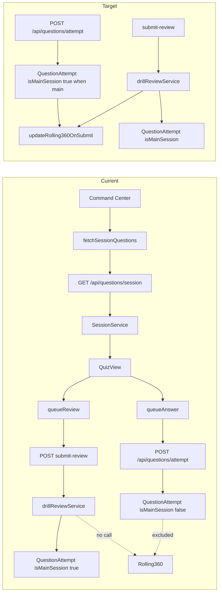

# Main Session Study Flow — Deep Audit & Execution Plan

## Executive Summary

The audit reveals **two parallel question pipelines** (only one is wired to the UI), **missing Rolling 360 updates** on answer submit, **no route** for the generator‑based session flow, **isMainSession** not set on the primary attempt API, and **TypeScript errors** in the selector and Rolling 360 service. The following plan addresses all five focus areas with specific files and priorities, while enforcing PANaCEa architectural rules (semantic design tokens, database‑first, FSRS v6, NCCPA Blueprint weights, API‑contract integrity, and Prisma Edge Client usage).

---

## 1. Core Logic & State

### 1.1 Two Pipelines (Architectural Inconsistency)

- **Pipeline A (in use):** Command Center “Build Session” → `handleConfirmSession` in [`App.tsx`](App.tsx) → `fetchSessionQuestions()` from [`services/core/mainSessionService.ts`](services/core/mainSessionService.ts) → **GET** `/api/questions/session` → [`lib/services/session/sessionService.ts`](lib/services/session/sessionService.ts) (`SessionService.getSessionQuestions`). This uses pool/main/seeds + NCCPA blueprint quotas and **does not** use the Interleaved Assembler or deficit‑based selection.
- **Pipeline B (broken):** [`hooks/useSessionGenerator.ts`](hooks/useSessionGenerator.ts) → **POST** `/api/study/session/generate` → [`lib/services/mainSessionQuestionSelector.ts`](lib/services/mainSessionQuestionSelector.ts) (Priority Waterfall, deficits, interleaving) → creates `StudySession`, returns `questionIds` → **navigates to `/session/${sessionId}`** — but **no route exists** in [`App.tsx`](App.tsx) for `/session/:id`, so this flow is dead. Only [`components/modes/CommuterMode.tsx`](components/modes/CommuterMode.tsx) uses `useSessionGenerator`; it navigates to a non‑existent route.

**Decision:** Choose **Option A** (add `/session/:id` route) because it unlocks the Interleaved Assembler (deficit‑based, FSRS‑aware) for all entry points, aligns with the product goal of using the Priority Waterfall, and keeps the codebase consistent. The extra work is justified by the long‑term benefit of a single, sophisticated question‑selection engine.

**Files to modify (Option A):**

1. **Add route in [`App.tsx`](App.tsx):** Extend the existing `path.startsWith('/study/')` handling to also match `/session/:sessionId`. Set a new view (e.g., `session_run`) that renders a dedicated `SessionRunner` component.
2. **Create `components/session/SessionRunner.tsx`:** Read `sessionId` from route params (or location state), fetch session details and question payloads via a new API endpoint (see step 3), then render `QuizView` with that queue and session metadata.
3. **Create or reuse API endpoint:** Add GET `/api/study/session/:sessionId/questions` in [`functions/api/study/session/[sessionId]/questions.ts`](functions/api/study/session/[sessionId]/questions.ts) that returns the full question objects for the given session ID. Use the existing `MainSessionQuestionSelector` to retrieve the session from the database and expand its question IDs.
4. **Update `CommuterMode`:** Keep `useSessionGenerator` but after generation, navigate to `/session/${sessionId}` (which will now work).
5. **Ensure API‑contract integrity:** Update [`lib/utils/apiConfig.ts`](lib/utils/apiConfig.ts) with a new `API_ENDPOINTS.SESSION_QUESTIONS` constant and use it in the frontend call.

**Validation steps:**
- Run `npm run typecheck` to ensure no TypeScript errors.
- Test locally: start a session via Command Center and via CommuterMode, verify both load questions and proceed to quiz.

### 1.2 isMainSession and Attempt Recording

- **Current behavior:** [`functions/api/questions/attempt.ts`](functions/api/questions/attempt.ts) creates `QuestionAttempt` but **never sets `isMainSession`** (defaults to `false`). So every attempt from the main quiz (via [`lib/services/sync/syncManager.ts`](lib/services/sync/syncManager.ts) `queueAnswer` → POST `/api/questions/attempt`) is stored as non‑main session. Rolling 360 only considers `isMainSession: true`, so these attempts do **not** feed the Rolling 360 widget.
- **Fix:** Add optional `isMainSession` (or derive from `mode`) to the attempt API and set it on the created record. Have the client pass `isMainSession: true` when the session is the main study session.

**Files to modify:**

1. [`functions/api/questions/attempt.ts`](functions/api/questions/attempt.ts):
   - Add `isMainSession: z.boolean().optional().default(false)` to the schema.
   - Pass it through to `questionAttempt.create({ data: { ..., isMainSession: validated.body.isMainSession ?? false } })`.
   - If `mode === 'session'` or a dedicated `mainSession: true` is present, set `isMainSession: true` for main‑session flows.
2. [`lib/services/sync/syncManager.ts`](lib/services/sync/syncManager.ts):
   - In `syncAnswers`, when building the body for `/api/questions/attempt`, add `isMainSession: true` when the queued answer is for a main session (e.g., add a field on `OfflineAnswer` or infer from a session context).
3. [`components/session/QuizView.tsx`](components/session/QuizView.tsx):
   - In `syncManager.queueAnswer({...})`, pass a flag or ensure the sync layer knows this is a main session (e.g., from `sessionSettings.mode` or a new prop `isMainSession`). If the sync manager stores a session type, set `isMainSession: sessionSettings.mode !== 'rapid_recall' && sessionSettings.mode !== 'cram_mode'` (or equivalent) when queueing.

**Validation steps:**
- Submit a main‑session answer and verify the created `QuestionAttempt` row has `isMainSession: true` in the database.
- Confirm that attempts from “Cram Mode” or “Rapid Recall” remain `isMainSession: false`.

### 1.3 Rolling 360 Not Updated on Submit (Critical)

- **Current behavior:** [`lib/services/rolling360Service.ts`](lib/services/rolling360Service.ts) exposes `updateRolling360OnSubmit(attemptData)` but **no caller invokes it** after a main‑session attempt. [`lib/services/drillReviewService.ts`](lib/services/drillReviewService.ts) creates `QuestionAttempt` with `isMainSession: true` when `sessionType` is main but does not call `updateRolling360OnSubmit`. So Rolling 360 stats stay empty or stale unless an admin runs `forceRecalculate` (e.g., backfill).
- **Fix:** After creating a main‑session attempt, call `updateRolling360OnSubmit` so the circular buffer and `UserRolling360Stats` update in real time.

**Files to modify:**

1. [`lib/services/drillReviewService.ts`](lib/services/drillReviewService.ts):
   - After `prisma.questionAttempt.create(...)` when `isMainSession` is true, get `Rolling360Service` (e.g., via `getRolling360Service(prisma)`) and call `updateRolling360OnSubmit({ attemptId, userId, isCorrect, system: question.system ?? 'Unknown', answeredAt: new Date() })`. Ensure `system` is normalized (e.g., use `normalizeSystemName` from rolling360Service) if required by the API.
2. **Alternatively or additionally:** in [`functions/api/questions/attempt.ts`](functions/api/questions/attempt.ts), when the created attempt has `isMainSession: true`, call `getRolling360Service(prisma).updateRolling360OnSubmit(...)` so that the primary attempt path (queueAnswer → attempt API) also updates Rolling 360 once isMainSession is wired (see 1.2).

**Validation steps:**
- After answering a main‑session question, check that `UserRolling360Stats` rows are created/updated for the appropriate system.
- Verify the Rolling 360 widget on the dashboard shows updated statistics.

### 1.4 TypeScript Errors (Blockers)

- [`lib/services/mainSessionQuestionSelector.ts`](lib/services/mainSessionQuestionSelector.ts): Lines 260–261 (`first?.weights`, `results[0]` possibly undefined), and lines 682–690 (`forcedSystem`, `pool?.shift()`, `lastPlacedSystem`). Add null checks or definite assignments so that `first` and `forcedSystem`/`pool` are safely narrowed.
- [`lib/services/rolling360Service.ts`](lib/services/rolling360Service.ts): Lines 675–679 (`attempt` possibly undefined inside loop). Use a non‑null assertion after the `if (attempt == null) continue;` check, or assign to a variable that TypeScript narrows.

**Files to modify:**

1. [`lib/services/mainSessionQuestionSelector.ts`](lib/services/mainSessionQuestionSelector.ts):
   - In `getActiveBlueprint()`, use `const first = results[0];` then `if (!first?.weights) return defaultBlueprint;` and return `first.weights as BlueprintWeights`.
   - In the interleaver loop, use `const forcedSystem = currentOrder[0]; if (forcedSystem === undefined) break;` then `const pool = workingPools.get(forcedSystem); const question = pool?.shift(); if (!question) break;` and ensure `lastPlacedSystem` is typed as `string` (not `string | undefined`) after assignment.
2. [`lib/services/rolling360Service.ts`](lib/services/rolling360Service.ts):
   - After `if (attempt == null) continue;`, call `updateRolling360OnSubmitInTransaction(tx, { attemptId: attempt.id, ... })` so `attempt` is narrowed.

**Validation steps:**
- Run `npm run typecheck` and confirm zero new errors related to these files.
- Run unit tests for both services to ensure they still function correctly.

---

## 2. FSRS Implementation

### 2.1 Rating and Confidence — Decimals vs Integers

- **Current state:** FSRS rating is **integer 1–4** everywhere: [`functions/api/srs/submit.ts`](functions/api/srs/submit.ts), [`functions/api/_shared/zodSchemas.ts`](functions/api/_shared/zodSchemas.ts) (`fsrsRatingSchema`), [`functions/api/_shared/schemas.ts`](functions/api/_shared/schemas.ts). Confidence in [`functions/api/_shared/zodSchemas.ts`](functions/api/_shared/zodSchemas.ts) is `z.number().min(0).max(100).optional()` (no `.int()`), so decimals are allowed for confidence. Behavioral telemetry (e.g., [`components/quiz/Tracker.tsx`](components/quiz/Tracker.tsx) `behavioralPayloadToTelemetryData`) uses numeric fields; some Zod schemas use `.int()` for `timeSpentMs`, `answer_changes`, etc., which is correct for counts/time. The main gap is that **continuous grade (1.0–4.0)** is not stored or passed through; only the discrete 1–4 is used for FSRS scheduling.
- **Recommendation:** Keep FSRS algorithm input as integer 1–4. Ensure any **confidence** value (0–100 or 0–1) is accepted as a decimal and stored/used without coercing to integer. If the product adopts continuous ratings later (see [`.cursor/plans/fsrs_continuous_ratings.plan.md`](.cursor/plans/fsrs_continuous_ratings.plan.md)), add an optional `continuousGrade` or similar field and use it for analytics/optimizer while still rounding to 1–4 for `fsrs.next()`.

**Files to audit/modify:**

1. [`functions/api/_shared/zodSchemas.ts`](functions/api/_shared/zodSchemas.ts): Confirm `confidence` has no `.int()` so decimals are allowed.
2. [`functions/api/drills/submit-review.ts`](functions/api/drills/submit-review.ts) and [`lib/services/drillReviewService.ts`](lib/services/drillReviewService.ts): Ensure `implicitConfidence` and any `grade_continuous` are stored/used as numbers (not rounded to integer) in telemetry/JSON.
3. [`lib/implicit-metrics.ts`](lib/implicit-metrics.ts) / [`lib/services/cognitiveScience/implicitConfidenceInference.ts`](lib/services/cognitiveScience/implicitConfidenceInference.ts): Ensure derived confidence and continuous rating are not inadvertently truncated to integers before sending to API or storage.

### 2.2 Behavioral Telemetry and Ghost Grader

- [`lib/services/drillReviewService.ts`](lib/services/drillReviewService.ts): Uses `deriveContinuousRating`, `applyStabilityModifierFromGrade`, and stores `grade_continuous` and `implicit_rating` in telemetry. Ensure these are decimals. [`lib/srs/ghostGrader.ts`](lib/srs/ghostGrader.ts) returns integer 1–4 for FSRS; no change needed there unless continuous grades are added upstream.
- [`functions/api/_shared/analyzeBehaviorGemini.ts`](functions/api/_shared/analyzeBehaviorGemini.ts): `impliedRating` is `z.number().int().min(1).max(4)`; keep as integer for FSRS. If a continuous value is returned by the model, round before use and optionally store the raw value for analytics.

**Validation steps:**
- Submit a review with a confidence of, e.g., 87.5 and verify the stored value is a decimal in the database.
- Confirm that FSRS scheduling still works with integer ratings.

---

## 3. Design System — Stormy Slate and Darker Gold (#7a6f52)

### 3.1 Current State

- **Light mode:** [`index.css`](index.css) sets `--color-accent: #64748b` (slate) and `--color-accent-border: #9a8f72` (lighter gold). [`tailwind.config.js`](tailwind.config.js) `.exam‑mode` utility uses `--color-accent: #7a6f52` (darker gold).
- **Dark mode:** [`index.css`](index.css) uses `--color-accent: #94a3b8` (slate‑400), `--color-accent-border: #c4b78a` (lighter gold). No `#7a6f52` in dark mode.
- **Documentation:** [`docs/CONTRAST_RATIO_IMPROVEMENT_PLAN.md`](docs/CONTRAST_RATIO_IMPROVEMENT_PLAN.md) and [`AUDIT_FIXES_STEP4_STEP5.md`](AUDIT_FIXES_STEP4_STEP5.md) mention darker gold `#7a6f52` for accents; some docs say “Stormy Slate = slate only” (no gold). The design system is split between “slate only” and “darker gold for accents.”

### 3.2 Decision and Implementation

**Decision:** Stormy Slate **permits** darker gold (`#7a6f52`) for **primary CTAs only** (one per screen). All other accents (secondary buttons, borders, highlights) must remain slate. This aligns with the existing `.exam‑mode` utility and provides a clear visual hierarchy.

**Steps:**

1. **Add semantic token** in [`index.css`](index.css):
   - Define `--color-accent-cta: #7a6f52` for light mode and `--color-accent-cta-dark: #c4b78a` (or another gold with sufficient contrast) for dark mode.
   - Use `var(--color-accent-cta)` in CSS rules for primary CTAs.
2. **Audit Main Session UI** for hardcoded colors:
   - [`components/session/QuizView.tsx`](components/session/QuizView.tsx)
   - [`components/quiz/SessionEndSummary.tsx`](components/quiz/SessionEndSummary.tsx)
   - [`components/quiz/SessionStatsOverlay.tsx`](components/quiz/SessionStatsOverlay.tsx)
   - [`components/navigation/CommandCenterHub.tsx`](components/navigation/CommandCenterHub.tsx)
   - Replace any `bg-blue-*`, `bg-green-*`, `#000`, or raw gold with semantic tokens (`var(--color-accent)`, `var(--color-bg-primary)`, `var(--color-text-primary)`, etc.) per [`.cursor/rules/ui-design-system.mdc`](.cursor/rules/ui-design-system.mdc).
3. **Ensure touch targets ≥ 44px** for all interactive elements.
4. **Skeleton and loaders:** [`components/ui/ClinicalSkeleton.tsx`](components/ui/ClinicalSkeleton.tsx) and any quiz loaders should use `bg‑slate‑700`/`bg‑slate‑800` (or semantic equivalents), not generic gray.

**Validation steps:**
- Run a visual audit using browser dev tools to confirm no hardcoded hex colors remain in the main‑session components.
- Verify primary CTAs have the darker gold token and secondary accents are slate.

---

## 4. Feature Polish (Partial Features)

### 4.1 Catalog of Incomplete or Partial Features

| Feature                              | Location                                                                               | What's missing                                                                                                                                                                                                                                     |
| ------------------------------------ | -------------------------------------------------------------------------------------- | -------------------------------------------------------------------------------------------------------------------------------------------------------------------------------------------------------------------------------------------------- |
| **Session end sync**                 | [`components/quiz/SessionEndSummary.tsx`](components/quiz/SessionEndSummary.tsx)         | `syncSessionAnalytics` and `collectSessionAnalytics`; ensure `sessionSettings?.mode` and focus are passed and stored; “Resume” button for in‑progress session not present in Command Center.                                                       |
| **Metacognitive reflection**         | [`components/quiz/SessionEndSummary.tsx`](components/quiz/SessionEndSummary.tsx)         | `MetacognitiveReflection` onComplete logs only; “Reflection sync to database can be added via API when backend is ready.”                                                                                                                          |
| **Resume session**                   | Command Center                                                                         | No “Resume” or “Continue” when a session is in progress; session state is in memory only (no persisted session id for true resume).                                                                                                                |
| **Wellness / late‑night modal**      | [`components/session/QuizView.tsx`](components/session/QuizView.tsx)                     | `WELLNESS_CHECK_QUESTION_THRESHOLD` and `LATE_NIGHT_CHECK_INTERVAL` trigger modals; confirm copy and behavior are final and accessible.                                                                                                            |
| **Par time / behavioral confidence** | [`components/session/QuizView.tsx`](components/session/QuizView.tsx)                     | `recordBehavioralConfidence`, `recordMomentumResult`, `calculateParTime`; ensure par time is passed to submit‑review telemetry and used server‑side.                                                                                               |
| **Offline review retry**             | [`lib/services/sync/syncManager.ts`](lib/services/sync/syncManager.ts)                   | `queueReview` syncs to submit‑review; if submit‑review fails (offline/4xx/5xx), no retry queue is documented; consider a pending‑review queue similar to pending answers.                                                                          |
| **Question timer**                   | [`components/quiz/QuestionTimer.tsx`](components/quiz/QuestionTimer.tsx)                 | Audit checklist expects “question timer visible” in main session; verify it is shown and visible in QuizView for main session.                                                                                                                     |
| **Rolling 360 empty state**          | [`hooks/useRolling360Stats.ts`](hooks/useRolling360Stats.ts)                             | Message “Answer Main Session questions to build your Rolling 360 score”; ensure attempts marked isMainSession and Rolling 360 update (see 1.2, 1.3) so the widget populates.                                                                       |
| **Body map / system dots**           | [`docs/DEEP_CLEAN_AUDIT_REPORT.md`](docs/DEEP_CLEAN_AUDIT_REPORT.md)                     | BodyMapWidget may show no dots if `systemStats` keys are normalized (e.g., “Cardiovascular”) but widget expects short codes (CV, PULM); align key format between [`lib/services/rolling360Service.ts`](lib/services/rolling360Service.ts) and widget. |
| **E2E main session**                 | [`docs/plans/PRODUCTION_HARDENING_SPRINT.md`](docs/plans/PRODUCTION_HARDENING_SPRINT.md) | `e2e/main‑session.spec.ts` is listed as needed; create spec that starts session, answers questions, and asserts attempt + (when implemented) Rolling 360 or stats.                                                                                 |

### 4.2 Recommended Completion Order

1. **Rolling 360 and isMainSession** (1.2, 1.3) so “Main Session questions” actually feed the widget.
2. **Session end analytics sync** — ensure one canonical session summary payload and API (e.g., PATCH session or POST session/complete) and call it from SessionEndSummary.
3. **Resume session** — persist session id (and optionally question ids) in localStorage or URL so “Resume” can restore queue and view.
4. **Offline review retry** — add pending‑review queue and sync when back online.
5. **Metacognitive reflection API** — backend endpoint and SessionEndSummary integration.
6. **E2E main‑session.spec.ts** — cover happy path and, if feasible, Rolling 360 or stats.

---

## 5. Repository Clutter

### 5.1 Unused or Redundant Code Tied to Main Session

| Item                                      | Action                                                                                                                                                                                                                                                                                                                                                                                                                                                                                                                                                                                  |
| ----------------------------------------- | --------------------------------------------------------------------------------------------------------------------------------------------------------------------------------------------------------------------------------------------------------------------------------------------------------------------------------------------------------------------------------------------------------------------------------------------------------------------------------------------------------------------------------------------------------------------------------------- |
| **Route `/study/main‑session`**           | Several components (e.g., [`components/analytics/CalibrationProgress.tsx`](components/analytics/CalibrationProgress.tsx), [`components/dashboard/Rolling360/SystemPerformanceWidget.tsx`](components/dashboard/Rolling360/SystemPerformanceWidget.tsx)) use `window.location.assign('/study/main‑session')`. There is **no** route for `/study/main‑session` in App; path handling goes to `/study` (command_center). Add a redirect from `/study/main‑session` to `/study` (or change these links to `/study`).                                                                             |
| **find‑grade.js**                         | [`find‑grade.js`](find‑grade.js) — standalone script (grade calculation brute‑force); not imported by the app. Move to `scripts/` or remove if obsolete.                                                                                                                                                                                                                                                                                                                                                                                                                                  |
| **scripts/backfill‑main‑session‑flag.ts** | Referenced in [`docs/ROLLING_360_STATISTICAL_ENGINE.md`](docs/ROLLING_360_STATISTICAL_ENGINE.md); verify script exists and is still valid for one‑time backfill of `isMainSession` on existing attempts.                                                                                                                                                                                                                                                                                                                                                                                  |
| **AUDIT_MAIN_SESSION_UI.md**              | Referenced in consolidated audit; file not found at path in repo — remove reference or restore file.                                                                                                                                                                                                                                                                                                                                                                                                                                                                                    |
| **Duplicate attempt creation**            | Currently both `queueAnswer` → `/api/questions/attempt` and `queueReview` → submit‑review → `drillReviewService` can create `QuestionAttempt` rows (attempt API does not set isMainSession; submit‑review creates with isMainSession). Consolidate so one source of truth creates the attempt and updates Rolling 360 (e.g., attempt API sets isMainSession and calls updateRolling360OnSubmit; submit‑review only updates FSRS/UserProgress and does not create a second attempt, or submit‑review is the only writer for main session and attempt API is deprecated for main session). |

### 5.2 Documentation to Update or Remove

- [`docs/main‑session‑audit‑checklist.md`](docs/main‑session‑audit‑checklist.md): Update step 3.2 if session generation switches to POST generate + session id (add expectation for POST `/api/study/session/generate` and GET session questions when that flow is enabled).
- [`docs/AUDIT_FOUNDATIONAL_FEATURES.md`](docs/AUDIT_FOUNDATIONAL_FEATURES.md): States attempts go to `/api/questions/attempt`; add note that isMainSession must be set and Rolling 360 updated (after fixes).
- Remove or archive duplicate/obsolete audit docs that conflict with the above (e.g., AUDIT_FIXES_STEP4_STEP5 vs current index.css) or consolidate into a single “Main Session” runbook.

---

## 6. Prioritized Execution Order

| Priority | Step                                                                                                               | Files                                                                                                                                                                                                                                                                                                                                                                                                                                                                                                                                  |
| -------- | ------------------------------------------------------------------------------------------------------------------ | -------------------------------------------------------------------------------------------------------------------------------------------------------------------------------------------------------------------------------------------------------------------------------------------------------------------------------------------------------------------------------------------------------------------------------------------------------------------------------------------------------------------------------------- |
| **P0**   | Fix TypeScript errors in mainSessionQuestionSelector and rolling360Service                                         | [`lib/services/mainSessionQuestionSelector.ts`](lib/services/mainSessionQuestionSelector.ts), [`lib/services/rolling360Service.ts`](lib/services/rolling360Service.ts)                                                                                                                                                                                                                                                                                                                                                                     |
| **P0**   | Add isMainSession to attempt API and client queue/sync                                                             | [`functions/api/questions/attempt.ts`](functions/api/questions/attempt.ts), [`lib/services/sync/syncManager.ts`](lib/services/sync/syncManager.ts), [`components/session/QuizView.tsx`](components/session/QuizView.tsx)                                                                                                                                                                                                                                                                                                                     |
| **P0**   | Call updateRolling360OnSubmit after main‑session attempt creation                                                  | [`lib/services/drillReviewService.ts`](lib/services/drillReviewService.ts) and/or [`functions/api/questions/attempt.ts`](functions/api/questions/attempt.ts)                                                                                                                                                                                                                                                                                                                                                                               |
| **P1**   | Resolve /session/:id vs single‑pipeline: add route + SessionRunner or switch CommuterMode to fetchSessionQuestions | [`App.tsx`](App.tsx), [`components/modes/CommuterMode.tsx`](components/modes/CommuterMode.tsx), optional new SessionRunner + API                                                                                                                                                                                                                                                                                                                                                                                                           |
| **P1**   | Fix /study/main‑session links (redirect or update to /study)                                                       | [`components/analytics/CalibrationProgress.tsx`](components/analytics/CalibrationProgress.tsx), [`components/dashboard/Rolling360/SystemPerformanceWidget.tsx`](components/dashboard/Rolling360/SystemPerformanceWidget.tsx), [`components/analytics/AnalyticsDashboard.tsx`](components/analytics/AnalyticsDashboard.tsx), [`components/analytics/UserFriendlyStatsDisplay.tsx`](components/analytics/UserFriendlyStatsDisplay.tsx), [`components/dashboard/CalibrationQuadrantWidget.tsx`](components/dashboard/CalibrationQuadrantWidget.tsx) |
| **P1**   | FSRS: ensure confidence/continuous grade are not coerced to integer in schemas and storage ✅ (audited 2026-03-06) | [`functions/api/_shared/zodSchemas.ts`](functions/api/_shared/zodSchemas.ts), [`lib/services/drillReviewService.ts`](lib/services/drillReviewService.ts), [`lib/implicit‑metrics.ts`](lib/implicit‑metrics.ts)                                                                                                                                                                                                                                                                                                                               |
| **P2**   | Design system: apply Stormy Slate semantic tokens and darker gold (#7a6f52) where decided                          | [`index.css`](index.css), [`components/session/QuizView.tsx`](components/session/QuizView.tsx), [`components/quiz/SessionEndSummary.tsx`](components/quiz/SessionEndSummary.tsx), [`components/navigation/CommandCenterHub.tsx`](components/navigation/CommandCenterHub.tsx)                                                                                                                                                                                                                                                                   |
| **P2**   | Session end sync and optional Resume; offline review retry                                                         | [`components/quiz/SessionEndSummary.tsx`](components/quiz/SessionEndSummary.tsx), [`lib/services/sync/syncManager.ts`](lib/services/sync/syncManager.ts), App state or URL for resume                                                                                                                                                                                                                                                                                                                                                      |
| **P2**   | Consolidate duplicate attempt creation (single source of truth for QuestionAttempt + Rolling 360)                  | [`functions/api/questions/attempt.ts`](functions/api/questions/attempt.ts), [`lib/services/drillReviewService.ts`](lib/services/drillReviewService.ts), [`components/session/QuizView.tsx`](components/session/QuizView.tsx) / sync flow                                                                                                                                                                                                                                                                                                     |
| **P3**   | Metacognitive reflection API; E2E main‑session.spec.ts; Body map key alignment                                     | Backend reflection endpoint, [`components/quiz/SessionEndSummary.tsx`](components/quiz/SessionEndSummary.tsx), new e2e spec, [`lib/services/rolling360Service.ts`](lib/services/rolling360Service.ts) / BodyMapWidget                                                                                                                                                                                                                                                                                                                      |
| **P3**   | Clutter: find‑grade.js, backfill script reference, audit doc references                                            | [`find‑grade.js`](find‑grade.js), [`docs/ROLLING_360_STATISTICAL_ENGINE.md`](docs/ROLLING_360_STATISTICAL_ENGINE.md), AUDIT_MAIN_SESSION_UI reference                                                                                                                                                                                                                                                                                                                                                                                      |

---

## 7. Blockers and Technical Debt

- **Immediate blockers:** TypeScript errors in mainSessionQuestionSelector and rolling360Service prevent clean build; fix first.
- **Architectural debt:** Two question pipelines (SessionService vs MainSessionQuestionSelector) and no route for generator‑based session cause confusion and dead code (CommuterMode). Decide one strategy (Option A or B in 1.1) and implement.
- **Data integrity:** Main session attempts not marked isMainSession and Rolling 360 never updated on submit mean the Rolling 360 widget and any deficit‑based selection are wrong or empty in production until backfilled. Fix isMainSession and updateRolling360OnSubmit call before relying on Rolling 360 or MainSessionQuestionSelector in production.
- **Duplicate attempts:** Two code paths can create QuestionAttempt (attempt API and submit‑review). Define single source of truth and avoid double‑counting or inconsistent isMainSession.

---

## 8. Diagram — Main Session Data Flow (Current vs Target)

---

## 9. Implementation Validation Checklist

Before marking any task as complete, verify the following:

- [ ] **TypeScript compilation:** `npm run typecheck` passes with no new errors.
- [ ] **Unit tests:** `npm test` passes for affected services.
- [ ] **Semantic colors:** No hardcoded hex colors (`#...`) or `bg‑blue‑*`, `bg‑green‑*` in modified components.
- [ ] **Database‑first:** No new static JSON arrays of medical content; all content queries go through Prisma.
- [ ] **API‑contract integrity:** Frontend uses `getApiEndpoint(API_ENDPOINTS.X)` for all API calls; endpoint paths match Cloudflare Functions.
- [ ] **Prisma Edge Client:** Functions in `functions/api/` import `@prisma/client/edge` and use `createEdgePrismaClient`.
- [ ] **Telemetry capture:** `duration_ms`, `hesitation_index`, `time_to_first_interaction_ms` are captured and stored in `ReviewLog.telemetry_json`.
- [ ] **FSRS v6 compliance:** FSRS parameters (`w[0..20]`) stored in `UserProgress.fsrsParams`; stability calculations follow v6 formulas.
- [ ] **NCCPA Blueprint weights:** Cardiovascular 11%, Pulmonary 9%, GI/Nutrition 8%, Musculoskeletal 8% respected in session generation.
- [ ] **Rolling 360 updates:** Each main‑session attempt triggers `updateRolling360OnSubmit` and updates `UserRolling360Stats`.
- [ ] **Git hygiene:** All changes committed with conventional commit messages (`fix:`, `feat:`, `refactor:`, etc.) and pushed to remote.

---

This improved plan, when executed in the order above, will make the Main Session flow fully functional end‑to‑end, with correct FSRS and Rolling 360 behavior, consistent design tokens, and a cleaner repository—all while adhering to PANaCEa’s architectural standards.