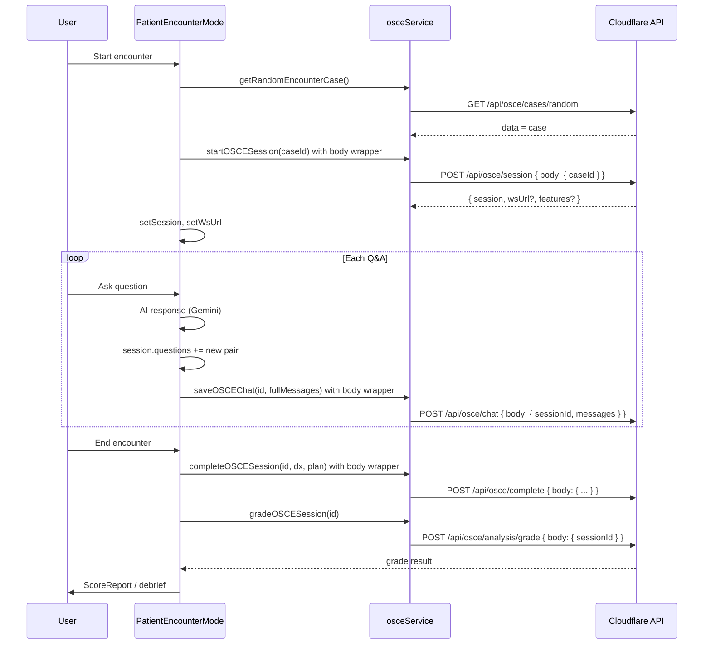

# OSCE Module Deep Audit — Execution Plan

## Summary of Findings

The OSCE module spans [components/modes/PatientEncounterMode.tsx](components/modes/PatientEncounterMode.tsx) (3k+ lines), [components/modes/osce/](components/modes/osce/), [components/osce/](components/osce/), [functions/api/osce/](functions/api/osce/), [services/domain/osceService.ts](services/domain/osceService.ts), and supporting hooks/types. Production uses **Cloudflare Pages Functions** under `functions/api/osce/`; the legacy Express [routes/osce.ts](routes/osce.ts) is for local dev only and uses different request shapes.

---

## 1. Core Workflow and State — Critical Fixes

### 1.1 API request/response contract mismatches (blocker)

Cloudflare endpoints use `authenticatedEndpoint` with schemas that expect a **top-level `body`** key. The frontend currently does not send this wrapper for several endpoints, so in production (Pages) **session creation, chat persistence, and completion will fail validation (400)**.

| Endpoint                | Current client payload                            | Required payload                                                                                                   | File to change                                                   |
| ----------------------- | ------------------------------------------------- | ------------------------------------------------------------------------------------------------------------------ | ---------------------------------------------------------------- |
| POST /api/osce/session  | `{ caseId }`                                      | `{ body: { caseId } }`                                                                                             | [services/domain/osceService.ts](services/domain/osceService.ts) |
| POST /api/osce/chat     | `{ sessionId, messages }` or single-message shape | `{ body: { sessionId, messages } }` with `messages: Array<{ role: 'user'|'assistant'|'system', content: string }>` | [services/domain/osceService.ts](services/domain/osceService.ts) |
| POST /api/osce/complete | `{ sessionId, diagnosis, treatmentPlan }`         | `{ body: { sessionId, diagnosis?, treatmentPlan? } }`                                                              | [services/domain/osceService.ts](services/domain/osceService.ts) |

**Steps:**

1. **Session:** In `startOSCESession`, send `body: JSON.stringify({ body: { caseId } })`. Parse full response: `data.session`, `data.wsUrl`, `data.features` for optional voice/live features.
2. **Chat:** In `saveOSCEChat`, send `body: JSON.stringify({ body: { sessionId, messages } })`. Ensure `messages` use `role: 'user' | 'assistant' | 'system'` and `content: string` (chat API does not accept `speaker`/`text`).
3. **Complete:** In `completeOSCESession`, send `body: JSON.stringify({ body: { sessionId, diagnosis, treatmentPlan } })`.
4. **PatientEncounterMode:** Replace the two `saveChatMessage` calls after each Q&A with a single `saveOSCEChat` call: build `messages` from current `session.questions` (map each to `{ role: 'user', content: q.questionText }` and `{ role: 'assistant', content: q.response }`), append the new exchange, then call `saveOSCEChat(session.id, messages, token)`. Remove or deprecate `saveChatMessage` if no other caller needs single-message append.

### 1.2 Session response and voice/live wiring

- [services/domain/osceService.ts](services/domain/osceService.ts) returns only `data?.session`; `wsUrl` and `features` from the session API are dropped. If voice/live mode should use the returned `wsUrl`, extend the service to return `{ session, wsUrl?, features? }` and in [PatientEncounterMode.tsx](components/modes/PatientEncounterMode.tsx) set `setWsUrl(data.wsUrl ?? null)` and use `features.voiceModeAvailable` / `features.stateMachineAvailable` to drive UI (e.g. “Live voice” button).
- [components/modes/osce/OSCELiveSession.tsx](components/modes/osce/OSCELiveSession.tsx) uses `/api/osce/live-config` and `/api/osce/session/:sessionId/vitals`; ensure these are deployed and that `sessionId` from the created session is passed correctly.

### 1.3 History and grading response parsing

- [functions/api/osce/history.ts](functions/api/osce/history.ts) returns `{ data: { history } }`; middleware sends `result.data`, so response body is `{ history }`. [osceService.getSessionHistory](services/domain/osceService.ts) does `data.history || []` — confirm the fetch parses JSON into `data` (not `data.data`). If the middleware strips to `result.data`, the client receives `{ history }` and parsing is correct.
- Grading: [gradeOSCESession](services/domain/osceService.ts) already sends `{ body: { sessionId } }` and handles `data.data ?? data`; ensure [functions/api/osce/analysis/grade.ts](functions/api/osce/analysis/grade.ts) returns the grade payload under the handler’s `data` so the client gets checklist, score, redFlagsMissed, softSkillsReport.

### 1.4 End-to-end flow checklist

- **Landing → Load case:** `getRandomEncounterCase` → GET `/api/osce/cases/random`. Cloudflare returns `{ data: randomCase }`; client must use `data` (or unwrap `data.data` if middleware doubles). Confirm [functions/api/osce/cases/random.ts](functions/api/osce/cases/random.ts) returns `{ data: randomCase }` and client uses it.
- **Start session:** After case load, `startOSCESession(caseId)` with `{ body: { caseId } }`; then set local `session` and optionally `wsUrl`/features.
- **Active encounter:** Each user question + AI response → build full `messages` from `session.questions` + new pair, call `saveOSCEChat(session.id, messages, token)` with `{ body: { sessionId, messages } }`.
- **Complete:** On “End Encounter”, call `completeOSCESession(session.id, diagnosis, treatmentPlan, token)` with `body` wrapper; then call `gradeOSCESession(session.id, token)` and show [ScoreReport](components/modes/osce/ScoreReport.tsx) / grade result.

---

## 2. Partially Coded Features and Polish

### 2.1 Chat persistence (see 1.1)

Single-message `saveChatMessage` is used but the Cloudflare chat API only accepts full `messages` array; replace with `saveOSCEChat` and correct body shape.

### 2.2 OrderPanel

- [components/modes/osce/OrderPanel.tsx](components/modes/osce/OrderPanel.tsx) calls `/api/osce/orderable-items?category=...&search=...`; [functions/api/osce/orderable-items.ts](functions/api/osce/orderable-items.ts) uses `category` and `search` (and `bundles=true`). Contract matches. Ensure `LabTest`, `ImagingStudy`, `Procedure`, `Drug` exist in Prisma and are seeded so the panel returns data.
- Wire `onOrderPlaced` in PatientEncounterMode so placed orders are stored and reflected in EMR/clinical summary if that’s in scope; otherwise confirm “placed orders” are only local state.

### 2.3 ExamPanel / BodyMap

- [ExamPanel](components/modes/osce/ExamPanel.tsx) and [BodyMap](components/modes/osce/BodyMap.tsx) use types from [types/osce-enhanced.ts](types/osce-enhanced.ts). Ensure `onExamPerformed` is connected in PatientEncounterMode and findings feed into scoring or SOAP if required.
- Suggested regions and findings: confirm `suggestedRegions` and case data are passed from current case (e.g. chief complaint) so the body map highlights the right areas.

### 2.4 RapportMeter and useEnhancedOSCE

- [useEnhancedOSCE](hooks/useEnhancedOSCE.ts) provides rapport/personality state; [RapportMeter](components/modes/osce/RapportMeter.tsx) is shown when `showRapportMeter` is true. Verify that `processMessage` / rapport updates are invoked from the main chat flow so the meter reflects conversation (if not, wire `enhancedOSCE.processMessage` into the path that calls the AI and then update local state from the returned rapport/emotion).

### 2.5 ScoreReport and grading

- After completion, `gradeResult` is set from `gradeOSCESession`. Ensure [ScoreReport](components/modes/osce/ScoreReport.tsx) receives the correct shape (e.g. `OsceGradeResult`: resultId, score, checklist, redFlagsMissed, clinicalReasoningScore, billingCodeSuggestion, softSkillsReport). Handle “Rubric: Unavailable” and “Retry grading” when the grade API fails.

### 2.6 SOAP draft and timing analytics

- [SOAPDraftPanel](components/osce/SOAPDraftPanel.tsx) and [TimingMetricsPanel](components/osce/TimingMetricsPanel.tsx) are used in PatientEncounterMode with `useRealtimeSOAP` and `useTimingAnalytics`. Confirm `finalizeSOAP` and `endTimingSession` are called on “End Encounter” and that optional payloads (e.g. `soapComparison`, `timingAnalytics`) are sent to POST /api/osce/complete when available.

### 2.7 Live voice and LiveInterface

- [OSCELiveSession](components/modes/osce/OSCELiveSession.tsx) uses Gemini Live (browser); [LiveInterface](components/osce/LiveInterface.tsx) uses `getApiEndpoint('/api/osce/live-engine')` and vitals. Ensure `live-engine` and `live-config` exist and return the expected config; ensure [vitals](functions/api/osce/session/[sessionId]/vitals.ts) returns vitals for the session. If voice mode is optional, guard with `features.voiceModeAvailable` and clear loading/error states.

### 2.8 OSCESimulator

- [components/modes/osce/OSCESimulator.tsx](components/modes/osce/OSCESimulator.tsx) has a `// TODO: load specific case`. If this component is used, implement case loading (e.g. by caseId or random) and align with the same session/chat APIs (body wrapper, saveOSCEChat format).

### 2.9 State machine and AV engine

- [functions/api/osce/state-machine.ts](functions/api/osce/state-machine.ts) generates a PatientAVStateMachine via Gemini. PatientEncounterMode has `avEngine`, `currentAVState`, `wsUrl`, `voiceMode`; confirm whether Module 1 AV is in use and wire state machine fetch/usage if required, or document as future work.

---

## 3. Design System — Stormy Slate and Gold (#7a6f52)

### 3.1 Semantic tokens and OSCE accent

- Global theme in [index.css](index.css) uses `--color-accent` as slate (e.g. `#64748b` light, `#94a3b8` dark) for “Stormy Slate.” OSCE/exam mode is intended to use **darker gold (#7a6f52)** for accents: [tailwind.config.js](tailwind.config.js) defines `.exam-mode` with `--color-accent: '#7a6f52'`.
- **Steps:**
  1. Wrap the active OSCE/Patient Encounter UI (e.g. the main container in PatientEncounterMode when `viewState === 'active'` or `viewState === 'results'`) in a div with class `exam-mode` so that OSCE screens use the gold accent consistently.
  2. Audit all OSCE-specific components under [components/modes/osce/](components/modes/osce/) and [components/osce/](components/osce/) for hardcoded colors (e.g. `blue-500`, `green-600`) and replace with semantic tokens: `var(--color-accent)`, `var(--color-accent-button)`, `var(--color-text-primary)`, `var(--color-border)`, etc., so that when `exam-mode` is applied, gold is used.
  3. In [index.css](index.css), ensure no rule overrides `--color-accent` inside `.exam-mode` with slate; keep `.exam-mode` as the single place that sets gold for OSCE.

### 3.2 Components to audit for tokens

- [components/modes/osce/OrderPanel.tsx](components/modes/osce/OrderPanel.tsx) — already uses `var(--color-accent)`; verify under `exam-mode`.
- [components/modes/osce/RapportMeter.tsx](components/modes/osce/RapportMeter.tsx), [ScoreReport.tsx](components/modes/osce/ScoreReport.tsx), [ExamPanel.tsx](components/modes/osce/ExamPanel.tsx), [BodyMap.tsx](components/modes/osce/BodyMap.tsx) — check borders, buttons, and highlights use semantic tokens.
- [components/osce/LiveInterface.tsx](components/osce/LiveInterface.tsx), [OSCELiveSession.tsx](components/modes/osce/OSCELiveSession.tsx), [SOAPDraftPanel.tsx](components/osce/SOAPDraftPanel.tsx), [TimingMetricsPanel.tsx](components/osce/TimingMetricsPanel.tsx) — same.
- [PatientEncounterMode.tsx](components/modes/PatientEncounterMode.tsx) — primary CTAs, phase tabs, and cards should use semantic tokens and respect `exam-mode` when active.

### 3.3 HUD / live OSCE

- [index.css](index.css) defines `.live-osce-hud` with cyan/magenta for vitals and timer. This is intentionally distinct from Stormy Slate. Ensure HUD is only applied in the live OSCE view and does not leak into the rest of the app.

---

## 4. Repository Clean-up (OSCE-related)

### 4.1 Redundant or duplicate code

- **Legacy routes:** [routes/osce.ts](routes/osce.ts) is Express-based and used only for local dev; it does not use the `body` wrapper. Either (a) update the legacy route to accept the same `body` shape as Cloudflare for parity, or (b) document that production uses only Cloudflare and local dev may have different contract (not recommended). Prefer updating legacy to match Cloudflare so one client works everywhere.
- **Two grading endpoints:** [functions/api/osce/analysis/grade.ts](functions/api/osce/analysis/grade.ts) (transcript rubric grading) and [functions/api/osce/grade-soap.ts](functions/api/osce/grade-soap.ts) (SOAP note grading). Both write to `OsceResult`. Document when each is used (post-encounter transcript vs. SOAP submit) and ensure the frontend calls the correct one; no deletion unless product decision to retire one.

### 4.2 Unused or obsolete OSCE files

- [worker/src/PatientVoiceSession.ts](worker/src/PatientVoiceSession.ts) — if the Worker is not deployed, document or remove from active OSCE path.
- No clear evidence of dead OSCE components; after fixing chat/session/complete, run the flow and remove any components that are never rendered or called.

### 4.3 Documentation

- **Keep and update:** [docs/OSCE_ENHANCEMENT_SYSTEM.md](docs/OSCE_ENHANCEMENT_SYSTEM.md) — update API section to state that request bodies must be wrapped in `body` for Cloudflare endpoints; document `saveOSCEChat` with full messages array and correct roles.
- **Reference only / archive:** [docs/AUDIT_VIRTUAL_OSCE_AI_PATIENT.md](docs/AUDIT_VIRTUAL_OSCE_AI_PATIENT.md), [docs/OSCE_GRADING_AUDIT.md](docs/OSCE_GRADING_AUDIT.md), [docs/MODULE_1_AV_ARCHITECTURE.md](docs/MODULE_1_AV_ARCHITECTURE.md), [docs/MODULE_5_INTERFACE_ARCHITECTURE.md](docs/MODULE_5_INTERFACE_ARCHITECTURE.md), [docs/VOICE_TO_VOICE_ARCHITECTURE.md](docs/VOICE_TO_VOICE_ARCHITECTURE.md) — ensure they are not the single source of truth for API contracts; point to OSCE_ENHANCEMENT_SYSTEM and code. Consider moving historical audits to `docs/archive/` if they are obsolete.
- **Cross-links:** In [README](README.md) or main docs, add a short “OSCE / Patient Encounter” section linking to [docs/OSCE_ENHANCEMENT_SYSTEM.md](docs/OSCE_ENHANCEMENT_SYSTEM.md) and seed instructions (`npm run seed:osce-cases`, `npm run seed:osce-rubrics`).

---

## 5. Prioritized Execution Order

| Priority | Task                                                                                                           | Files to modify / create / delete                                                                                                                                       |
| -------- | -------------------------------------------------------------------------------------------------------------- | ----------------------------------------------------------------------------------------------------------------------------------------------------------------------- |
| P0       | Fix API body wrapper for session, chat, complete                                                               | [services/domain/osceService.ts](services/domain/osceService.ts)                                                                                                        |
| P0       | Use saveOSCEChat with full messages array after each Q&A; remove dual saveChatMessage                          | [components/modes/PatientEncounterMode.tsx](components/modes/PatientEncounterMode.tsx)                                                                                  |
| P0       | Parse and use session response (session, wsUrl, features) from startOSCESession                                | [services/domain/osceService.ts](services/domain/osceService.ts), [components/modes/PatientEncounterMode.tsx](components/modes/PatientEncounterMode.tsx)                |
| P1       | Add `exam-mode` wrapper to OSCE active/results view; audit OSCE components for semantic tokens and gold accent | [PatientEncounterMode.tsx](components/modes/PatientEncounterMode.tsx), [components/modes/osce/*.tsx](components/modes/osce/), [components/osce/*.tsx](components/osce/) |
| P1       | Ensure getSessionHistory and grade response parsing match Cloudflare response shape                            | [services/domain/osceService.ts](services/domain/osceService.ts)                                                                                                        |
| P1       | Wire finalizeSOAP and endTimingSession on “End Encounter”; optional payload to complete                        | [components/modes/PatientEncounterMode.tsx](components/modes/PatientEncounterMode.tsx)                                                                                  |
| P2       | Align legacy Express [routes/osce.ts](routes/osce.ts) with Cloudflare body contract (or document deviation)    | [routes/osce.ts](routes/osce.ts)                                                                                                                                        |
| P2       | RapportMeter: ensure processMessage/rapport updates are called from main chat flow                             | [components/modes/PatientEncounterMode.tsx](components/modes/PatientEncounterMode.tsx), [hooks/useEnhancedOSCE.ts](hooks/useEnhancedOSCE.ts)                            |
| P2       | OrderPanel: confirm DB seeding for labs/imaging/procedures/drugs; wire onOrderPlaced if needed                 | [scripts/seed-*.ts](scripts/), [components/modes/PatientEncounterMode.tsx](components/modes/PatientEncounterMode.tsx)                                                   |
| P2       | OSCESimulator: implement “load specific case” or remove TODO                                                   | [components/modes/osce/OSCESimulator.tsx](components/modes/osce/OSCESimulator.tsx)                                                                                      |
| P3       | Update OSCE docs (body wrapper, saveOSCEChat, seed) and archive or link old audits                             | [docs/OSCE_ENHANCEMENT_SYSTEM.md](docs/OSCE_ENHANCEMENT_SYSTEM.md), [docs/](docs/)                                                                                      |
| P3       | Document or remove Worker PatientVoiceSession from OSCE path if unused                                         | [worker/src/PatientVoiceSession.ts](worker/src/PatientVoiceSession.ts), docs                                                                                            |

---

## 6. Blockers and Technical Debt

- **Immediate blocker:** Request body shape mismatch for session, chat, and complete in production (Cloudflare). Until fixed, session creation, chat persistence, and completion will fail with 400.
- **Technical debt:** Large monolithic [PatientEncounterMode.tsx](components/modes/PatientEncounterMode.tsx) (3k+ lines); consider extracting sub-flows (landing, active encounter, results) into smaller components or hooks for maintainability.
- **Inconsistency:** Legacy Express routes use a different body shape; either align them or accept that local dev differs from production (not ideal).
- **Design inconsistency:** Global theme uses slate for `--color-accent`; OSCE should consistently use gold only when `exam-mode` is applied so that other modes are not affected.

---

## 7. Diagram — OSCE Data Flow (High Level)

---

This plan is ready for implementation. Execute P0 items first to unblock the OSCE workflow in production, then P1/P2 for polish and design, and P3 for docs and cleanup.