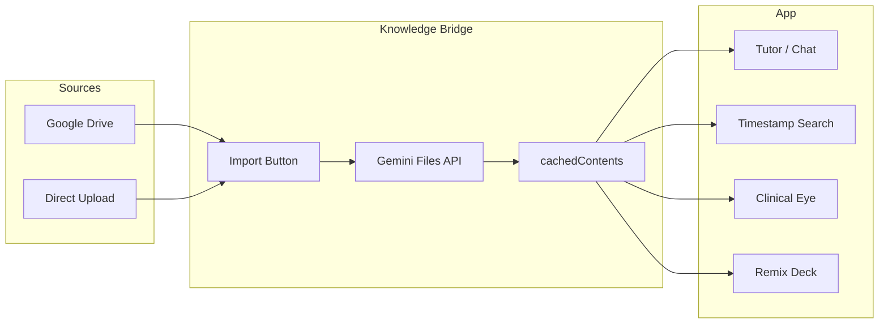

# Personalized Knowledge Engine Implementation Plan

## Current State (Relevant to This Plan)

- **Gemini usage**: Proxy at `[functions/api/gemini/index.ts](functions/api/gemini/index.ts)` and `[functions/api/gemini/stream.ts](functions/api/gemini/stream.ts)` — text-only `generateContent` / `streamGenerateContent`; no Files API, no `cachedContent`.
- **No Google Drive**: Only mentioned in docs (`[docs/PRODUCTION_READINESS_MASTER_PLAN.md](docs/PRODUCTION_READINESS_MASTER_PLAN.md)` §1.3) as future work.
- **BYON**: Types and design in `[types/custom-session.ts](types/custom-session.ts)` and `[docs/features/CUSTOM_STUDY_SESSIONS.md](docs/features/CUSTOM_STUDY_SESSIONS.md)`; no Prisma models or API routes for user materials yet.
- **Uploads today**: Supabase Storage for admin media and syllabus; `[components/analytics/SyllabusDecompiler.tsx](components/analytics/SyllabusDecompiler.tsx)` reads file client-side and calls an API for parsing (no Gemini cache).
- **Constraint**: Cloudflare Pages Functions (Edge) — no Node `fs`/`path`; use Web APIs and `fetch` only.

---

## Target Architecture (High Level)




- **No RAG/vector DB**: Rely on Gemini long context (up to 2M tokens) and **Context Caching** for textbooks/PDFs; use **Gemini Files API** for large/multimodal files.
- **Import, not sync**: Single “Import” action (e.g. select Drive folder or upload file) → upload to Gemini → create/update cache → use cache in Tutor and feature UIs.

---

## Phase 1: Context Caching + “Chat with your Library” (Start Here)

**Goal**: Ground the Tutor and a new “Chat with your Library” experience in user-selected PDFs (or other docs) via Gemini Context Caching. No Drive yet.

**Backend (Edge-safe)**  

- **Gemini Files API**: Upload via `POST https://generativelanguage.googleapis.com/upload/v1beta/files` (multipart). Use `fetch` from a Pages Function; accept file from client (or from Drive later). Respect Cloudflare request body limits and timeouts; for very large PDFs, consider resumable upload or background job if needed.  
- **CachedContent**:  
  - `POST https://generativelanguage.googleapis.com/v1beta/cachedContents` — create cache from `contents` (e.g. `fileData.fileUri` from Files API), `model`, `systemInstruction`, `ttl` (e.g. `"3600s"` or 1–24 hours).  
  - `GET cachedContents`, `GET cachedContents/{name}`, `PATCH` (extend TTL), `DELETE` as needed.
- **Generate with cache**: Existing `[functions/api/gemini/index.ts](functions/api/gemini/index.ts)` and `[functions/api/gemini/stream.ts](functions/api/gemini/stream.ts)` currently send only `contents: [{ parts: [{ text: prompt }] }]`. Extend request body to accept optional `cachedContent: "cachedContents/xxx"` and pass it through to Gemini `generateContent` / `streamGenerateContent` so Tutor and “Chat with Library” use the user’s active cache.

**New API surface (suggested)**  

- `POST /api/knowledge/upload` — auth’d; body: multipart file (or base64 + mimetype). Function uploads to Gemini Files API, returns `{ fileUri, name, mimeType }`.  
- `POST /api/knowledge/cache` — auth’d; body: `{ displayName, fileUri (or file name), ttlSeconds?, systemInstruction? }`. Create cachedContent; return `{ name: "cachedContents/...", expireTime }`.  
- `GET /api/knowledge/caches` — auth’d; list user’s caches (from DB); optionally call Gemini `cachedContents.list` and merge with DB metadata.  
- `DELETE /api/knowledge/cache/:name` — auth’d; delete from DB and call Gemini `cachedContents.delete` if still valid.

**Database**  

- New table, e.g. `KnowledgeCache`: `userId`, `displayName`, `geminiCacheName` (e.g. `cachedContents/xxx`), `geminiFileIds[]` (or single file), `expiresAt`, `source` (`'upload' | 'drive'`), `createdAt`. Ensures you can show “My caches” and which cache is “active” for the user without calling Gemini for every page load.

**Client**  

- “My Library” or “Knowledge” section: upload PDF (or select file) → call upload → create cache → show list of caches with “Set as active” / “Use in Tutor”.  
- Tutor (e.g. `[components/panels/ExplanationPanel.tsx](components/panels/ExplanationPanel.tsx)` and any existing chat) and a new “Chat with your Library” view: when user has an active cache, send `cachedContent` with each Gemini request (extend `[services/ai/geminiService.ts](services/ai/geminiService.ts)` / domain geminiService and API request shapes to include optional `cachedContent`).

**Pro tip (solo dev)**: Add a one-off script or admin flow to upload PANCE Blueprint + primary study guide PDF to Gemini and create a long-TTL cache, then set that as the default “active” library so every Tutor interaction is grounded in that content.

**Risks / mitigations**:  

- Large PDFs: Edge request size/timeout limits; use Gemini’s resumable upload if available, or cap file size in UI and document limits.  
- Cost: ~$4.50/1M cached tokens/hour; set sensible TTL (e.g. 1–6 hours for heavy use, longer for “today’s library”) and show expiry in UI.

---

## Phase 2: Google Drive “Import” (Knowledge Bridge)

**Goal**: Let the user select a Drive folder (e.g. “Cardiology Rotation”) and “Import” its files into the app: list files → download → upload to Gemini Files API → create/update caches (and DB rows).

**Auth choice**:  

- **OAuth (recommended for “student selects folder”)**: Each user connects their own Drive; multi-tenant ready; requires `GOOGLE_CLIENT_ID`, `GOOGLE_CLIENT_SECRET`, redirect URI, and Drive API scopes (e.g. `drive.readonly`).  
- **Service account**: Single Drive (e.g. your own); no user OAuth; good for solo dev with one shared Drive.  
Clarify which you want; the plan below assumes OAuth so “Import” is user-specific.

**Backend**  

- **Drive API**: From Pages Functions, use `fetch` to Drive API (list files in folder, get export/download links or `files.get` with `alt=media`).  
- **Flow**: `GET /api/drive/auth-url` → redirect user to Google; `GET /api/drive/callback` → exchange code, store refresh token (encrypted in DB or existing secrets store). `GET /api/drive/folders` (optional) and `POST /api/drive/import` with `folderId`: list files (filter by PDF/video/image), for each file download (stream) and upload to Gemini Files API, then create cachedContent (and DB row) per file or one cache per folder (your choice; one cache per folder is simpler).  
- **DB**: Extend `KnowledgeCache` (or add) with `driveFolderId`, `driveFileIds[]` if you want to re-import same folder later.

**Client**  

- “Import from Google Drive” button → OAuth → folder picker (Drive UI or list of folders) → “Import” → call `POST /api/drive/import` with selected folder ID → show progress and then list of created caches in “My Library”.

**Edge considerations**: Downloading large files from Drive inside a Worker may hit body size/timeout limits; consider importing only smaller files first, or a background job (e.g. queue + separate worker) for large files.

---

## Phase 3: File-Type-Specific Features

**A. PDFs (already covered in Phase 1)**  

- Optional: For mobile-friendly reading, integrate **Adobe PDF Embed** with Liquid Mode; keep AI reasoning on Gemini with cached PDF.

**B. Video lectures (Instant Timestamp Search)**  

- Upload video to Gemini Files API (supported formats); create cachedContent with the video file.  
- New UI: “Instant Search” — user types e.g. “When did the professor discuss murmurs?”; send as prompt with `cachedContent`; model returns timestamp (e.g. `00:42:15`) and short summary.  
- Optional: “Audio Overview” (Lecture Converter): separate flow that asks Gemini for a short podcast-style summary; can re-use same cached video.

**C. Photos / diagrams (Clinical Eye)**  

- Batch: upload image to Gemini (Files API or inline for small images); prompt: structured output (e.g. JSON with `diagnosis`, `key_visual_features`, `bounding_box`). Store result linked to asset.  
- “Clinical Eye” flashcard mode: show image; AI (with cached or inline image) acts as Socratic tutor; on wrong answer, use `bounding_box` to highlight region (e.g. overlay or caption “Look at the irregular border here”).

**D. Anki decks (.apkg)**  

- **Preprocessing**: Use Python (e.g. `anki-export` or similar) to extract .apkg → JSON/CSV (cards, fields). Run as local/CLI script or, if you add a Python runtime, as a serverless step.  
- **Remix My Deck**: API that accepts extracted JSON (or upload .apkg and run extractor in a job):  
  - “Audit these cards against the uploaded textbook” — send cards + `cachedContent` (textbook cache).  
  - “Generate a clinical vignette that tests these 10 cards” — same.
- Depends on Phase 1 cache (textbook) and optional “active deck” selection.

---

## Suggested File / Module Map


| Area             | New or modified                                                                                                                                                                     |
| ---------------- | ----------------------------------------------------------------------------------------------------------------------------------------------------------------------------------- |
| Gemini proxy     | Extend `[functions/api/gemini/index.ts](functions/api/gemini/index.ts)`, `[functions/api/gemini/stream.ts](functions/api/gemini/stream.ts)` to accept and forward `cachedContent`.  |
| Knowledge API    | New: `functions/api/knowledge/upload.ts`, `cache.ts` (create/list/delete), plus shared Zod schemas and auth.                                                                        |
| Drive (Phase 2)  | New: `functions/api/drive/auth-url.ts`, `callback.ts`, `import.ts`; `lib/services/driveService.ts` (or under `services/`).                                                          |
| DB               | New: `KnowledgeCache` (and optionally `UserDriveToken` if storing OAuth server-side). Migration.                                                                                    |
| Client           | New: “My Library” / “Knowledge” page or section: upload, list caches, set active; “Chat with your Library” view. Optional: Drive OAuth + folder picker component.                   |
| Tutor / chat     | Use “active” cache when calling Gemini: extend `[services/ai/geminiService.ts](services/ai/geminiService.ts)` and callers (e.g. ExplanationPanel) to pass `cachedContent` when set. |
| Video/Photo/Anki | New endpoints and UI as in Phase 3; reuse same cache and upload patterns.                                                                                                           |


---

## Open Decisions (Clarify Before Implementation)

1. **Drive auth**: OAuth (per-user Drive) vs service account (single shared Drive)? Affects Phase 2 scope.
2. **Cache granularity**: One cache per file vs one cache per “library” (e.g. one cache per Drive folder containing multiple files). One per folder is simpler for “activate Cardiology Rotation.”
3. **Anki**: Run Python extractor only locally/CI and upload JSON via app, or support .apkg upload and run extractor in a backend job (would require a Python runtime or a Node .apkg parser if available).

---

## Summary

- **Phase 1** delivers the highest leverage: Context Caching + “Chat with your Library” and Tutor grounded in user-uploaded (or admin-uploaded) PDFs, with no Drive dependency.  
- **Phase 2** adds the “Import from Drive” bridge (OAuth + folder import → Gemini Files + caches).  
- **Phase 3** adds video timestamp search, Clinical Eye (photos + bounding box), and Anki “Remix Deck” on top of the same cache and Files API patterns.  
- All of this stays within Edge-safe patterns (fetch, Web APIs, no vector DB), and aligns with your existing Gemini proxy, auth, and Prisma setup.

Based on your previous request for the **Smart Library** (Module 4) and **The Tutor** (Module 5) from your original list (or potentially *Tutor* and *Lecture Converter* if referencing the previous code block list), the most powerful combination for a PA student is an **"Intelligent Study Companion"**.


This combines **The Smart Library** (the source of truth/textbooks) with **The Tutor** (the reasoning engine).


This prompt instructs the Cursor agent to build a unified endpoint that allows a student to **"Chat with their Textbook."** It handles the complex orchestration of fetching the file from **Supabase**, ensuring it is cached in **Gemini** (to save costs), and using **Adobe Extract** data to visually highlight the evidence for the answer on the student's screen.


### **Combined Module: The Intelligent Study Companion (Library + Tutor)**


**Copy/Paste into Cursor:**


```markdown

Role: Senior Full-Stack TypeScript Engineer

Task: Create a unified "Study Companion" endpoint at `functions/api/study/chat.ts`.


Context:

We are combining the "Smart Library" (PDF ingestion) and "The Tutor" (Reasoning) into a single interactive feature. Students will chat with a medical textbook stored in Supabase. We need to answer their questions using Gemini 1.5 Pro (with Context Caching) and return precise page coordinates for highlighting using Adobe Extract data.


Dependencies:

- `@supabase/supabase-js`: For file retrieval.

- `@google/genai`: For LLM interaction.

- `lib/prisma.ts`: For database state.


Requirements:


1. **Cache Management Middleware (The "Brain"):**

- Input: `resourceId` (UUID) and `userQuery` (String).

- Database Check: Query `Prisma.Resource` to see if a valid `geminiCacheName` exists and is not expired (TTL > 10 mins remaining).

- *Cold Start (If no cache):*

- Download the PDF from Supabase Storage `storagePath`).

- Upload to Gemini Files API.

- Create a `cachedContent` object with a 60-minute TTL.

- Update `Prisma.Resource` with the new `geminiCacheName`.


2. **The Tutor Logic (Gemini 1.5 Pro):**

- Call `models.generateContent` using the `cachedContent` name.

- **System Instruction:** "You are a senior clinical educator for PA students. Answer using the provided cached textbook. You MUST cite your sources using the format `[Page X]`."

- **Config:** Set `thinking_level="high"` (if supported) or temperature `0.2` to strictly adhere to the textbook content (grounding).


3. **Visual Evidence (Adobe Extract Integration):**

- Fetch the pre-processed Adobe Extract JSON file from Supabase (stored as `adobeDataPath` on the Resource model).

- **Citation Parsing:** Regex parse the Gemini response to find `[Page X]` references.

- **Coordinate Lookup:** For each citation, look up the `Bounds` in the Adobe JSON for the matching page and paragraph.

- **Coordinate Transformation:** Adobe uses bottom-left origin (72 DPI). Convert these to percentages (%) relative to the page width/height so the frontend can render a highlight overlay regardless of screen size.


4. **Output Response:**

- Return a JSON object: `{ answer: string, citations: [{ page: number, highlightBox: { top: %, left: %, width: %, height: % } }] }`.


5. **Error Handling:**

- Handle Supabase 404s (missing files).

- Handle Gemini 429s (rate limits) with exponential backoff.


Ref Files:

- `functions/api/content/library.ts`

- `functions/api/questions/generate.ts`

- `lib/prisma.ts`

```