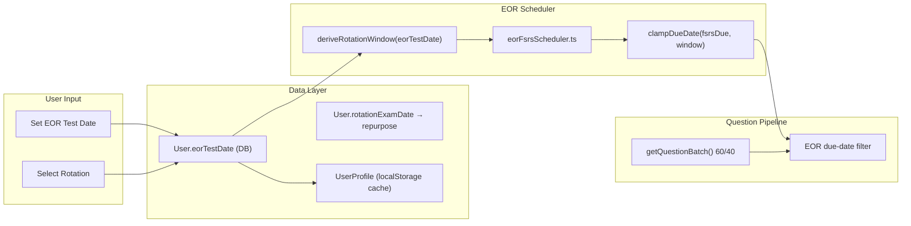
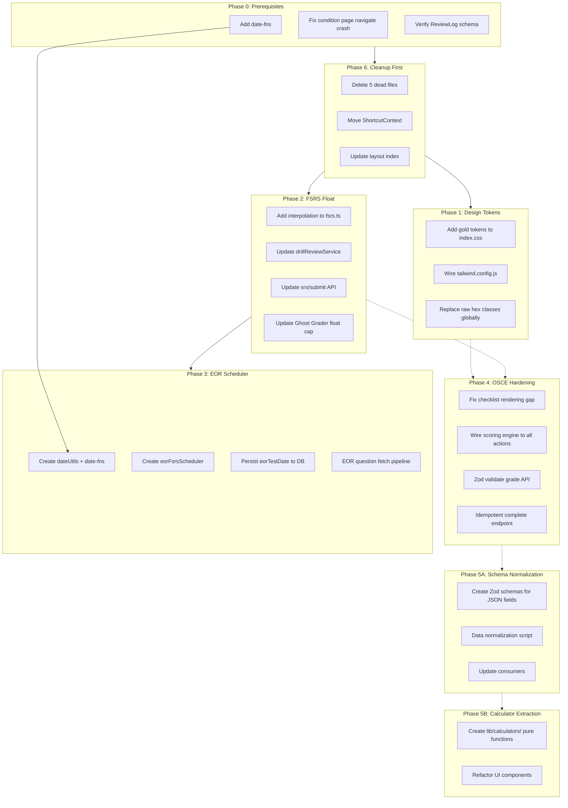

# PANaCEa Remediation Sprint — Technical Execution Roadmap (Deep Audit)

This document is a strict, architecturally-aware execution plan derived from deep codebase analysis. For each phase, the exact files, line numbers, formulas, data flows, and edge cases are documented. No implementation code is written.

---

## Phase 0: Prerequisites, Blockers, and Crash Fixes

### 0A: Add `date-fns` dependency

No date-time utility library exists in [package.json](package.json). Required by Phase 3 (EOR scheduler) and useful globally.

- Run `npm install date-fns`
- Verify edge-runtime compatibility (date-fns is pure ESM, no Node APIs)

### 0B: Fix crash in `pages/conditions/[id].tsx`

**Bug found during audit:** [pages/conditions/[id].tsx](pages/conditions/[id].tsx) imports `useNavigate` (line 2) but never declares `const navigate = useNavigate()`. Lines 330 and 453 call `navigate()`, which will throw `ReferenceError: navigate is not defined` at runtime. This crashes the condition detail page.

- **Fix:** Add `const navigate = useNavigate();` inside the `ConditionPage` component (after line 104)

### 0C: Verify `ReviewLog` schema state

- [prisma/schema.prisma](prisma/schema.prisma): Confirm `ReviewLog` has `grade Int?` and `grade_continuous Float?`
- Confirm migration `20260201190000_add_osce_analysis_models` (and any subsequent) applied
- Confirm `softSkillsReport` column exists on `OsceResult` per migration `20260204190001`

---

## Phase 1: Design System — Gold Accent Token Integration

### Problem Statement

The darker gold accent `#7a6f52` exists only inside the `.exam-mode` plugin in [tailwind.config.js](tailwind.config.js) (line 149). It is not wired into the CSS custom property layer, meaning any component needing the darker gold must hardcode the hex value or reference `.exam-mode` — both violations of the token system.

### Current Token Architecture

```
index.css :root
  --color-action:        #9a8f72   (cooler gold)
  --color-gold:          #9a8f72
  --color-accent:        #64748b   (Stormy Slate)
  --color-accent-button: #475569   (Slate-600)

index.css .dark
  --color-action:        #a89b7a   (lighter gold for dark bg)
  --color-gold:          #a89b7a
  --color-accent:        #94a3b8   (Slate-400)
  --color-accent-button: #64748b   (Slate-500)

tailwind.config.js .exam-mode plugin (line 149)
  --color-accent:       #7a6f52   (darker gold — ISOLATED)
  --color-accent-hover: #6a5f42
```

### Implementation Steps

1. **[index.css](index.css) — Add semantic gold tokens:**
  - `:root`: Add `--color-gold-dark: #7a6f52`, `--color-gold-dark-hover: #6a5f42`
  - `.dark`: Add `--color-gold-dark: #8a7f62`, `--color-gold-dark-hover: #9a8f72` (lighter for dark bg contrast)
  - Decide: should `--color-accent-button` switch from Slate to gold-dark? If so, update both modes. If gold CTA is distinct from accent CTA, add `--color-cta-gold: var(--color-gold-dark)`.
2. **[tailwind.config.js](tailwind.config.js) — Wire tokens:**
  - In `.exam-mode` plugin (line 149): Replace hardcoded `#7a6f52` with `var(--color-gold-dark)`
  - In `theme.extend.colors`: Add `'gold-dark': 'var(--color-gold-dark)'` for Tailwind utility access
3. **Global audit:**
  - Search for raw `#7a6f52`, `#6a5f42`, and any `bg-amber-`*, `bg-yellow-`*, `text-amber-*` or other unauthorized warm-palette classes
  - Replace with `var(--color-gold-dark)` or `gold-dark` Tailwind utilities
  - Verify WCAG AA: `#7a6f52` on `#ffffff` = 4.58:1 (passes AA for normal text at 14px+). On `#0f172a` dark bg, use the lighter variant.

### WCAG Contrast Matrix


| Token                       | On White (#fff)         | On Dark (#0f172a) | Status           |
| --------------------------- | ----------------------- | ----------------- | ---------------- |
| `#7a6f52` (gold-dark)       | 4.58:1                  | 2.63:1 (FAIL)     | Light only       |
| `#8a7f62` (gold-dark-dark)  | 3.66:1 (FAIL AA normal) | 3.29:1 (FAIL)     | Needs adjustment |
| `#6a5f42` (gold-dark-hover) | 5.60:1                  | 2.15:1 (FAIL)     | Light only       |


**Decision required:** The darker gold only passes AA on light backgrounds. On dark mode, use `#c4b78a` or similar (already used for `--color-accent-border` in dark mode, 7.2:1). Document this in the design system.

---

## Phase 2: FSRS Continuous Ratings — Full Pipeline Refactor

### Problem Statement

`Rating` is an enum restricting values to integers 1–4. The pipeline already computes `gradeContinuous` (float 1.0–4.0) but passes the **discrete** rating to `fsrs.next()`, then applies a post-hoc stability modifier. This is a lossy approximation. We need FSRS to natively accept floats for precise scheduling.

### FSRS Rating Usage Map (from deep audit)

Every place `rating` appears in [lib/fsrs.ts](lib/fsrs.ts):


| Usage                | Line    | Formula/Branch                       | Float-Safe?                 |
| -------------------- | ------- | ------------------------------------ | --------------------------- |
| Lapse increment      | 197     | `rating === Rating.Again`            | Needs `rating < 1.5`        |
| State transition L/R | 209     | `rating === Good                     |                             |
| State transition R   | 224     | `rating === Again`                   | Needs `rating < 1.5`        |
| Short-term stability | 302     | `Math.exp(w17 * (rating - 3 + w18))` | Already float-safe          |
| Short-term mask      | 307     | `rating >= Rating.Hard`              | Already float-safe (Hard=2) |
| Initial stability    | 320     | `w[rating - 1]`                      | Needs interpolation         |
| Initial difficulty   | 333     | `Math.exp((rating - 1) * w5)`        | Already float-safe          |
| Difficulty delta     | 339     | `(rating - 3)`                       | Already float-safe          |
| Hard penalty         | 385     | `rating === Hard ? w15 : 1`          | Needs interpolation         |
| Easy bonus           | 386     | `rating === Easy ? w16 : 1`          | Needs interpolation         |
| Learning intervals   | 252-256 | Discrete switch                      | Needs interpolation         |


### Refactoring Strategy: Interpolation, Not Branching

**Signature change:**

```typescript
next(card: FSRSCard, now: Date, rating: Rating | number): { card: FSRSCard; due: Date }
```

**6 modifications needed:**

1. **Lapse increment (line 197):** `if (rating < 1.5) newCard.lapses += 1;`
2. **State transitions (line 209, 224):**
  - Learning/Relearning → Review: `rating >= 2.5` (instead of `=== Good || === Easy`)
  - Review → Relearning: `rating < 1.5` (instead of `=== Again`)
3. **Initial stability (line 320):** `w[rating - 1]` with float index:

```
   floor = Math.floor(rating - 1), ceil = Math.ceil(rating - 1)
   t = (rating - 1) - floor
   stability = w[floor] * (1 - t) + w[ceil] * t
   

```

1. **Hard penalty (line 385):** Interpolate between 1.0 and w15:

```
   hardPenalty = rating <= 2 ? w15 : rating >= 3 ? 1 : lerp(w15, 1, (rating - 2))
   

```

1. **Easy bonus (line 386):** Interpolate between 1.0 and w16:

```
   easyBonus = rating <= 3 ? 1 : rating >= 4 ? max(1.08, w16) : lerp(1, max(1.08, w16), (rating - 3))
   

```

1. **Learning intervals (lines 252–256):** Interpolate:

```
   if (rating < 1.5)      interval = 0.0035;  // ~5 min
   else if (rating < 2.5) interval = lerp(0.007, 1, (rating - 1.5));
   else if (rating < 3.5) interval = lerp(1, 4, (rating - 2.5));
   else                   interval = 4;
   

```

### Consumer Unification (4 FSRS Paths)

The audit revealed **4 independent paths** that call `fsrs.next()`:


| Path                          | File                                                                                                               | Lines    | Rating Type                          | Stability Modifiers                                 |
| ----------------------------- | ------------------------------------------------------------------------------------------------------------------ | -------- | ------------------------------------ | --------------------------------------------------- |
| **A: drillReviewService**     | [lib/services/drillReviewService.ts](lib/services/drillReviewService.ts)                                           | 473      | Discrete (from continuous)           | grade + circadian + implicit confidence             |
| **B: srsService**             | [lib/services/srsService.ts](lib/services/srsService.ts)                                                           | 453, 588 | Discrete (from quality 0–5)          | None                                                |
| **C: automaticRatingService** | [lib/services/cognitiveScience/automaticRatingService.ts](lib/services/cognitiveScience/automaticRatingService.ts) | 301      | Discrete (from behavioral inference) | Custom stability multiplier + difficulty adjustment |
| **D: srs/submit API**         | [functions/api/srs/submit.ts](functions/api/srs/submit.ts)                                                         | ~166     | Discrete (user-supplied or Gemini)   | implicit difficulty only                            |


**Unification plan:**

1. **Path A (drillReviewService):** Change `fsrs.next(currentCard, new Date(), rating)` (line 473) to `fsrs.next(currentCard, new Date(), gradeContinuous)`. Since FSRS now handles float natively, the post-hoc `applyStabilityModifierFromGrade(gradeContinuous)` at line 475 becomes **partially redundant** — the interpolated hard/easy penalty already captures the grade's effect on stability. However, keep it for now as a secondary adjustment (its range is [0.85, 1.15], narrow enough to be additive rather than conflicting). Evaluate removal after A/B testing.
2. **Path B (srsService):** This path uses `mapQualityToRating(quality)` (lines 249–255), which maps quality 0–5 → discrete 1–4. This is a **legacy path** (quality-based). No change needed unless we want to accept continuous quality here too. Leave as-is for now; document as legacy.
3. **Path C (automaticRatingService):** `applyAutoFSRS` (line 301) passes `inferredRating.rating` (discrete). This path is **not called by any active submit flow** (standalone cognitive science API). Leave as-is; update to accept float when cognitive science pipeline is activated.
4. **Path D (srs/submit API):** This endpoint has its **own FSRS path** separate from drillReviewService. Currently accepts `rating` (1–4 int) or Gemini-derived `effectiveRating`. **Decision:** migrate this endpoint to delegate to drillReviewService (DRY) or accept `gradeContinuous` from the payload. Short term: accept float from payload and pass to FSRS.

### Stability Modifier Chain Analysis

Current chain in drillReviewService (lines 473–484):

```
S_raw   = fsrs.next(card, now, rating).card.stability
S_grade = S_raw * applyStabilityModifierFromGrade(gradeContinuous)    // [0.85, 1.15]
S_circ  = applyCircadianModifier(S_grade, circadianContext)           // ~[0.9, 1.1]
S_conf  = S_circ * (1 - implicitDifficulty * 0.5)  if implicitDifficulty >= 0.5
S_final = max(0.01, S_conf)
```

**After float refactor:** FSRS internally interpolates hard/easy penalties, so the grade modifier is partially baked in. The chain becomes:

```
S_raw   = fsrs.next(card, now, gradeContinuous).card.stability   // grade effect is internal
S_circ  = applyCircadianModifier(S_raw, circadianContext)
S_conf  = S_circ * (1 - implicitDifficulty * 0.5)  if implicitDifficulty >= 0.5
S_final = max(0.01, S_conf)
```

**Recommendation:** Remove `applyStabilityModifierFromGrade` call after float refactor (its effect is now inside FSRS). Keep circadian and confidence modifiers.

### Ghost Grader Interaction

[lib/srs/ghostGrader.ts](lib/srs/ghostGrader.ts) `applyHonestRating` (line 47) operates on discrete ratings and caps to `Rating.Hard`. With float ratings:

- Input: discrete `rating` from `deriveContinuousRating.discreteRating`
- If Ghost Grader triggers, set `gradeContinuous = Math.min(gradeContinuous, 2.0)` (not just discrete)
- Lines to change: drillReviewService ~306–316

### Files to Modify


| File                                                                     | Change                                                                                                              | Lines                              |
| ------------------------------------------------------------------------ | ------------------------------------------------------------------------------------------------------------------- | ---------------------------------- |
| [lib/fsrs.ts](lib/fsrs.ts)                                               | Accept float; interpolation logic for 6 sites                                                                       | 184–260, 297–310, 318–321, 383–388 |
| [lib/services/drillReviewService.ts](lib/services/drillReviewService.ts) | Pass `gradeContinuous` to `fsrs.next()`; remove `applyStabilityModifierFromGrade`; update Ghost Grader to cap float | 306–316, 473–484                   |
| [lib/implicit-metrics.ts](lib/implicit-metrics.ts)                       | No change needed (already outputs float `grade`)                                                                    | —                                  |
| [functions/api/srs/submit.ts](functions/api/srs/submit.ts)               | Accept `gradeContinuous` in payload; pass float to FSRS                                                             | ~163–166                           |
| [lib/services/srsService.ts](lib/services/srsService.ts)                 | Document as legacy path; no immediate change                                                                        | —                                  |


### Optimizer Compatibility

[lib/fsrs-optimizer.ts](lib/fsrs-optimizer.ts) `convertReviewLogRows` (line 393) casts `r.grade as Rating`. The optimizer uses `review.success = grade >= 2 || wasCorrect` for Brier score (line 237–263). Since `grade` in `ReviewLog` is stored as `Int`, and `grade_continuous` as `Float?`:

- **No optimizer change needed.** `ReviewLog.grade` stays as rounded int for the optimizer.
- `ReviewLog.grade_continuous` is for analytics and future float-aware optimization.
- The optimizer's binary success metric (`grade >= 2`) works regardless.

---

## Phase 3: EOR Module — Isolated Time-Blocked FSRS Scheduler

### Problem Statement

EOR study mode needs reviews constrained to a rotation window (start date → exam date). Currently:

- `eorTestDate` is **localStorage-only** — not persisted to DB, lost on device/browser switch
- No `rotationStartDate` exists anywhere
- No FSRS clamping logic exists for time-bounded review windows
- Question fetching uses a 60/40 split (rotation systems vs background) but does NOT filter by FSRS due dates

### Current Data Flow (from audit)

```
UserProfile (localStorage: panceai_user_profile)
  └── eorTestDate: string (ISO date)
  └── currentRotation: ClinicalRotation (e.g., "Surgery")

User (Prisma)
  └── rotationExamDate: DateTime?  ← UNUSED for EOR; exists but not synced

services/analytics/userProfileService.ts
  └── loadUserProfile() → reads localStorage
  └── updateUserProfile() → writes localStorage ONLY

CommandCenterHub.tsx
  └── handleEorTestDateChange() → updateUserProfile (local only)
  └── EorCountdownCard rendered when eorTestDate + currentRotation + isEorRotation

services/questionService.ts: getQuestionBatch()
  └── 60% rotation systems, 40% background (lines 442–455)
  └── NO due-date awareness; purely system-based filtering
```

### Architecture Design




### Implementation Steps

**3A: Persist `eorTestDate` to DB**

1. **[prisma/schema.prisma](prisma/schema.prisma):** Repurpose `User.rotationExamDate` as the canonical EOR exam date. Add a comment mapping it to `eorTestDate` in the frontend. No new column needed.
2. **[functions/api/user/profile.ts](functions/api/user/profile.ts):** Accept `eorTestDate` in the update payload; map to `rotationExamDate` in the Prisma write. Accept `rotationStartDate` optionally (for future).
3. **[hooks/useUserProfile.ts](hooks/useUserProfile.ts):** Sync `eorTestDate` from API response to local state. On profile save, POST to API.
4. **[components/navigation/CommandCenterHub.tsx](components/navigation/CommandCenterHub.tsx) (lines 1021–1024):** Call API profile update (not just localStorage) when `eorTestDate` changes.
5. **[components/settings/EnhancedSettingsTab.tsx](components/settings/EnhancedSettingsTab.tsx) (line 567):** Same — persist to API.

**3B: Date utilities**

Create **[lib/utils/dateUtils.ts](lib/utils/dateUtils.ts):**

- `differenceInCalendarDays(a, b)` — from date-fns
- `addDays(date, days)` — from date-fns
- `isWithinInterval(date, { start, end })` — from date-fns
- `deriveRotationWindow(eorTestDate: string, blockDays = 28): { start: Date, end: Date }` — custom: `start = eorTestDate - blockDays`, `end = eorTestDate`
- All edge-safe (no Node APIs)

**3C: EOR FSRS Scheduler**

Create **[lib/eorFsrsScheduler.ts](lib/eorFsrsScheduler.ts):**

```
scheduleEorReview(
  card: FSRSCard,
  now: Date,
  rating: number,
  window: { start: Date, end: Date }
): { card: FSRSCard, due: Date }

Algorithm:
1. result = fsrs.next(card, now, rating)
2. if result.due > window.end:
     result.due = window.end
     result.card.scheduled_days = differenceInCalendarDays(window.end, now)
3. if result.due < now:
     result.due = addDays(now, 1)  // minimum 1 day
4. return { card: result.card, due: result.due }
```

**Key design decisions:**

- EOR reviews use the **same** FSRS algorithm but clamp output
- If item's natural interval would exceed the exam date, it gets scheduled for exam day (last chance review)
- Items with very high stability (already mastered) are deprioritized in favor of weak items
- EOR sessions should NOT update the global `UserProgress.fsrsCard` — use a separate `eorFsrsState` or flag reviews as `sessionType: 'eor'`

**3D: Question fetch integration**

In [services/questionService.ts](services/questionService.ts) (lines 442–455), the 60/40 split is system-based only. Add:

- When `eorTestDate` is set and `isEorRotation(currentRotation)`:
  - Fetch rotation-system questions ordered by `UserProgress.nextReviewDate ASC` (weakest first)
  - Exclude questions with `nextReviewDate > eorTestDate` AND `stability > threshold` (already mastered)
  - This requires a new API parameter: `eorMode=true&eorDeadline=<ISO date>`
- Backend ([functions/api/questions/session.ts](functions/api/questions/session.ts)): Add EOR query path

### Files to Create/Modify


| File                                                                                       | Action                                                  |
| ------------------------------------------------------------------------------------------ | ------------------------------------------------------- |
| `lib/utils/dateUtils.ts`                                                                   | **Create** — date-fns wrappers + `deriveRotationWindow` |
| `lib/eorFsrsScheduler.ts`                                                                  | **Create** — clamp FSRS due dates to rotation window    |
| [prisma/schema.prisma](prisma/schema.prisma)                                               | Document `rotationExamDate` as EOR exam date            |
| [functions/api/user/profile.ts](functions/api/user/profile.ts)                             | Accept/persist `eorTestDate`                            |
| [hooks/useUserProfile.ts](hooks/useUserProfile.ts)                                         | API sync for `eorTestDate`                              |
| [components/navigation/CommandCenterHub.tsx](components/navigation/CommandCenterHub.tsx)   | Use API update                                          |
| [components/settings/EnhancedSettingsTab.tsx](components/settings/EnhancedSettingsTab.tsx) | Use API update                                          |
| [services/questionService.ts](services/questionService.ts)                                 | EOR due-date-aware filtering                            |
| [functions/api/questions/session.ts](functions/api/questions/session.ts)                   | EOR query path                                          |
| [package.json](package.json)                                                               | Add `date-fns`                                          |


### Blockers

- **Design decision:** Fixed 28-day rotation block vs user-entered start date. Recommendation: start with fixed 28 days; add optional start date later.
- **FSRS isolation:** EOR reviews must NOT pollute global FSRS state. Mark as `sessionType: 'eor'` in ReviewLog; skip `updateUserProgressWithHistory` for EOR reviews, or maintain separate EOR-specific progress.

---

## Phase 4: OSCE Module — End-to-End Workflow Hardening

### Problem Statement

The OSCE has multiple gaps between in-memory scoring, API grading, and UI display. The deep audit reveals 4 specific issues.

### Issue 1: Checklist Rendering Gap

**Location:** [PatientEncounterMode.tsx](components/modes/PatientEncounterMode.tsx) lines 2626–2712.

**Bug:** The rendering condition is:

```typescript
gradeResult && (gradeResult.checklist?.length > 0 || gradeResult.redFlagsMissed?.length > 0)
```

When the grade API returns a valid `gradeResult` with `score: 75` but both `checklist` and `redFlagsMissed` are empty arrays, the UI shows "Rubric: Unavailable for this case" — even though a valid score exists.

**Fix:** Display `gradeResult.score` and `gradeResult.clinicalReasoningScore` even when checklist is empty. Only show "Unavailable" when `gradeResult` is null. Show "No critical actions tracked" when checklist is empty but gradeResult exists.

### Issue 2: Scoring Engine Not Wired to All Encounter Actions

**Location:** [hooks/useEnhancedOSCE.ts](hooks/useEnhancedOSCE.ts), [PatientEncounterMode.tsx](components/modes/PatientEncounterMode.tsx).

**Finding from audit:** `OSCEScoringEngine` tracks critical actions via `trackQuestion`, `trackOrder`, `trackExam`. But:

- `handleAskQuestion` (the main text-based history Q&A flow in PatientEncounterMode) does **NOT** call `scoringEngineRef.current.trackQuestion()`.
- Legacy `handleOrderTest` and `handleExamAction` flows do **NOT** call `placeOrder`/`recordExamFinding` on the enhanced OSCE hook.

**Impact:** In-memory score report is incomplete — doesn't reflect questions asked or tests ordered through legacy flows.

**Fix:**

1. In `handleAskQuestion`: After receiving patient response, call `enhancedOSCE.processMessage(questionText, 'history')` (or appropriate phase).
2. In `handleOrderTest`: Call `enhancedOSCE.placeOrder(order)`.
3. In `handleExamAction`: Call `enhancedOSCE.recordExamFinding(finding)`.
4. Guard all calls with `if (scoringEngineRef.current)`.

### Issue 3: Grade API Validation Gaps

**Location:** [functions/api/osce/analysis/grade.ts](functions/api/osce/analysis/grade.ts) lines 171–194.

**Findings:**

- `parseGradePayload` does JSON.parse of raw Gemini text with basic code-fence stripping. If Gemini returns malformed JSON (partial response, timeout), `JSON.parse` throws and the entire request 500s.
- `validateGradeChecklist` uses Zod (`GRADE_CHECKLIST_ITEM`) for each item — good. But drops invalid items silently.
- `score` is coerced via `Number(parsed.score) || 0` — a string "N/A" becomes 0. No validation range (0–100).

**Fixes:**

1. Wrap `JSON.parse` in try-catch; on failure, return structured error with raw text for debugging.
2. Add Zod schema for the full `GradePayload`:

```
   GradePayloadSchema = z.object({
     score: z.number().min(0).max(100),
     checklist: z.array(GRADE_CHECKLIST_ITEM).default([]),
     redFlagsMissed: z.array(z.string()).default([]),
     clinicalReasoningScore: z.number().min(0).max(100),
     billingCodeSuggestion: z.string().default('N/A'),
   })
   

```

1. On Zod validation failure, return 422 with specifics (not 500).

### Issue 4: Complete-Then-Grade Ordering and Idempotency

**Location:** [functions/api/osce/complete.ts](functions/api/osce/complete.ts) lines 49–93.

**Finding:** `updateMany` with `where: { id, userId }` returns `{ count: 0 }` if session doesn't exist OR if already completed. Not distinguished.

**Fixes:**

1. Before `updateMany`, `findUnique` the session to check status:
  - If not found: return 404
  - If already `completed`: return 200 (idempotent success — no error)
  - If `active`: proceed with update
2. Add `completedAt: new Date()` to the update data for audit trail.

### Issue 5: Missing CaseRubric Fallback

When no `CaseRubric` exists for a case, `grade.ts` returns 404. The frontend handles this (`gradeOSCESession` returns null), but could be improved:

**Fix:** When no rubric exists, generate a **synthetic rubric** from `PatientEncounterCase.essentialQuestions` and `idealWorkup` (already available on the case data). This ensures every OSCE session gets rubric-based grading.

### Files to Modify


| File                                                                         | Changes                                                              | Impact                      |
| ---------------------------------------------------------------------------- | -------------------------------------------------------------------- | --------------------------- |
| [PatientEncounterMode.tsx](components/modes/PatientEncounterMode.tsx)        | Fix checklist rendering; wire scoring engine to all actions          | Lines ~2626–2712, ~950–1000 |
| [functions/api/osce/analysis/grade.ts](functions/api/osce/analysis/grade.ts) | Zod payload validation; JSON parse safety; synthetic rubric fallback | Lines 54–194, 280–326       |
| [functions/api/osce/complete.ts](functions/api/osce/complete.ts)             | Idempotency; `completedAt` audit field                               | Lines 49–93                 |
| [services/domain/osceService.ts](services/domain/osceService.ts)             | Better error surfacing from grade API                                | Lines 157–185               |


---

## Phase 5A: MedicalContent Schema Normalization

### Problem Statement

`MedicalContent` has 6 `Json?` fields with ad-hoc, unvalidated shapes. Frontend code uses defensive parsing (`safeParseJson`, `safeParseList`, `handleFakeNull`) everywhere, but there's no single source of truth for what these fields contain.

### Current JSON Field Inventory


| Field             | Prisma Type | Actual Content (from audit)                       | Used By                                                      |
| ----------------- | ----------- | ------------------------------------------------- | ------------------------------------------------------------ |
| `classic_triad`   | `Json?`     | `string[]` or `null`                              | MedicalContentCard (line 93), Pearls section                 |
| `clinical_pearls` | `Json?`     | `string[]` or JSON string of array                | MedicalContentCard (line 91), Pearls section, contentService |
| `age_demographic` | `Json?`     | `{ typical?: string, range?: string }` or `null`  | MedicalContentSchema validates this shape                    |
| `differentials`   | `Json?`     | `string[]` or `null`                              | Condition page, differential section                         |
| `synonyms`        | `Json?`     | `string[]` or JSON string of array                | MedicalContentCard (line 96), search                         |
| `content`         | `Json?`     | Full structured content blob (condition-specific) | contentService, condition-loader                             |


### Existing Zod Coverage

[lib/services/content/types.ts](lib/services/content/types.ts) has `MedicalContentSchema` that validates:

- `clinical_pearls`: `z.array(z.string()).default([])`
- `buzzwords`: `z.array(z.string()).default([])`
- `age_demographic`: `z.object({ typical?, range? })`
- `synonyms`: `z.array(z.string()).optional()`

**Missing:** `classic_triad`, `differentials`, `content` (the full blob).

### Normalization Strategy

**Phase 5A-1: Zod schemas for all JSON fields** — Create [lib/schemas/medicalContentFields.ts](lib/schemas/medicalContentFields.ts):

```
ClassicTriadSchema = z.array(z.string()).max(5).nullable()
ClinicalPearlsSchema = z.array(z.string()).nullable()
AgeDemographicSchema = z.object({ typical: z.string().optional(), range: z.string().optional() }).nullable()
DifferentialsSchema = z.array(z.string()).nullable()
SynonymsSchema = z.array(z.string()).nullable()
ContentBlobSchema = z.record(z.string(), z.unknown()).nullable()   // or more specific per-section schema
```

**Phase 5A-2: Normalization migration script** — Create [scripts/normalize-medical-content-json.ts](scripts/normalize-medical-content-json.ts):

- For each `MedicalContent` row:
  - Parse each Json field with its Zod schema
  - If valid: leave as-is
  - If string (JSON-encoded): `JSON.parse()` and re-save
  - If malformed: log, set to null, record in audit table
- This is a **data migration script**, not a Prisma migration (no schema change)

**Phase 5A-3: Consider Prisma schema changes:**

- `classic_triad Json?` → `classic_triad String[]` (if always string array)
- `clinical_pearls Json?` → `clinical_pearls String[]` (if always string array)
- `differentials Json?` → `differentials String[]` (if always string array)
- `synonyms Json?` → Already `Json?`; could be `String[]`
- `age_demographic Json?` → Keep as `Json?` (structured object)
- `content Json?` → Keep as `Json?` (complex blob)

**Risk:** Changing column types requires a Prisma migration. Existing data must be backfilled first. Run normalization script, then migration.

**Phase 5A-4: Update consumers:**

- [lib/loadConditions.ts](lib/loadConditions.ts): Use typed schemas in `normalizeEntry`
- [components/ui/cards/MedicalContentCard.tsx](components/ui/cards/MedicalContentCard.tsx): Replace `safeParseList` with typed schema parsing
- [functions/api/content/condition/[conditionId].ts](functions/api/content/condition/[conditionId].ts): Validate response shape
- [functions/api/content/library.ts](functions/api/content/library.ts): Type-safe field selection
- [lib/services/content/contentService.ts](lib/services/content/contentService.ts): Extend `MedicalContentSchema`

### Files to Create/Modify


| File                                                                                     | Action                                                                                            |
| ---------------------------------------------------------------------------------------- | ------------------------------------------------------------------------------------------------- |
| `lib/schemas/medicalContentFields.ts`                                                    | **Create** — Zod schemas for all 6 JSON fields                                                    |
| `scripts/normalize-medical-content-json.ts`                                              | **Create** — Data normalization script                                                            |
| [lib/services/content/types.ts](lib/services/content/types.ts)                           | Extend `MedicalContentSchema` with missing fields                                                 |
| [lib/loadConditions.ts](lib/loadConditions.ts)                                           | Use typed schemas                                                                                 |
| [components/ui/cards/MedicalContentCard.tsx](components/ui/cards/MedicalContentCard.tsx) | Use typed schemas                                                                                 |
| [prisma/schema.prisma](prisma/schema.prisma)                                             | **Later** — Change `classic_triad`, `clinical_pearls`, `differentials` from `Json?` to `String[]` |


---

## Phase 5B: Calculator Logic Abstraction

### Problem Statement

Medical calculator formulas are embedded in UI components. This prevents unit testing, reuse (e.g., in API endpoints or AI prompts), and creates maintenance burden.

### Calculator Inventory (from [calculatorRegistry.ts](components/toolkit/calculators/calculatorRegistry.ts))


| Calculator   | File                                                                                     | Formula Location                        | Extractable?         |
| ------------ | ---------------------------------------------------------------------------------------- | --------------------------------------- | -------------------- |
| GFR (MDRD)   | [GFRCalculator.tsx](components/toolkit/calculators/lab/GFRCalculator.tsx)                | Lines 29–37                             | Yes — pure math      |
| CHA2DS2-VASc | [CHADS2VAScCalculator.tsx](components/toolkit/calculators/risk/CHADS2VAScCalculator.tsx) | Lines 33–35 (score), 37–75 (risk table) | Yes — score + lookup |
| CURB-65      | [CURB65Calculator.tsx](components/toolkit/calculators/risk/CURB65Calculator.tsx)         | Score calculation in component          | Yes                  |
| Wells DVT    | [WellsDVTCalculator.tsx](components/toolkit/calculators/risk/WellsDVTCalculator.tsx)     | Score calculation in component          | Yes                  |
| Wells PE     | [WellsPECalculator.tsx](components/toolkit/calculators/risk/WellsPECalculator.tsx)       | Score calculation in component          | Yes                  |
| PERC         | [PERCCalculator.tsx](components/toolkit/calculators/diagnosis/PERCCalculator.tsx)        | Boolean criteria → rule-out             | Yes                  |
| Anion Gap    | [AnionGapCalculator.tsx](components/toolkit/calculators/lab/AnionGapCalculator.tsx)      | AG = Na - (Cl + HCO3)                   | Yes                  |
| Osmolar Gap  | [OsmolarGapCalculator.tsx](components/toolkit/calculators/lab/OsmolarGapCalculator.tsx)  | Formula in component                    | Yes                  |
| Parkland     | [ParklandCalculator.tsx](components/toolkit/calculators/lab/ParklandCalculator.tsx)      | 4 * weight * %BSA                       | Yes                  |


### Abstraction Architecture

Create `**lib/calculators/`** with one file per calculator:

```
lib/calculators/
  index.ts              ← re-exports all
  types.ts              ← shared input/output types
  gfr.ts                ← calculateGFR(params): GFRResult
  chads2vasc.ts         ← calculateCHADS2VASc(criteria): ScoreResult
  curb65.ts             ← calculateCURB65(criteria): ScoreResult
  wellsDvt.ts           ← calculateWellsDVT(criteria): ScoreResult
  wellsPe.ts            ← calculateWellsPE(criteria): ScoreResult
  perc.ts               ← evaluatePERC(criteria): PERCResult
  anionGap.ts           ← calculateAnionGap(params): LabResult
  osmolarGap.ts         ← calculateOsmolarGap(params): LabResult
  parkland.ts           ← calculateParkland(params): DosingResult
```

**Each file exports:**

- Pure function (no React, no state)
- Input type (e.g., `GFRInput = { age: number, sex: 'male'|'female', race: 'black'|'other', creatinine: number }`)
- Output type (e.g., `GFRResult = { gfr: number, stage: string, interpretation: string, recommendation: string, riskLevel: string }`)
- Interpretation logic (e.g., CKD staging)

**Then refactor UI components:**

- Import calculation function from `lib/calculators/`
- Component manages only: input state (useState), formatting, rendering
- Remove all formula/interpretation logic from component files

### Files to Create/Modify


| File                                                                                     | Action                                                   |
| ---------------------------------------------------------------------------------------- | -------------------------------------------------------- |
| `lib/calculators/*.ts` (9 files + index + types)                                         | **Create**                                               |
| [GFRCalculator.tsx](components/toolkit/calculators/lab/GFRCalculator.tsx)                | Import from `lib/calculators/gfr`; remove inline formula |
| [CHADS2VAScCalculator.tsx](components/toolkit/calculators/risk/CHADS2VAScCalculator.tsx) | Import from `lib/calculators/chads2vasc`                 |
| (7 more calculator components)                                                           | Same pattern                                             |


---

## Phase 6: Repository Health — Dead Code Elimination and Context Consolidation

### Dead Code Audit Results


| File                                                                  | Mounted?                    | Active Imports?                    | Verdict                                                       |
| --------------------------------------------------------------------- | --------------------------- | ---------------------------------- | ------------------------------------------------------------- |
| [MainLayout.tsx](components/layout/MainLayout.tsx)                    | No                          | Only by Sidebar                    | **DELETE**                                                    |
| [Sidebar.tsx](components/layout/Sidebar.tsx)                          | No                          | Only by MainLayout                 | **DELETE**                                                    |
| [AppSidebar.tsx](components/layout/AppSidebar.tsx)                    | No                          | Only in docs + layout index export | **DELETE**                                                    |
| [AccountFooter.tsx](components/layout/AccountFooter.tsx)              | No                          | Not imported anywhere              | **DELETE** (also has broken import: `../lib/utils/timeUtils`) |
| [KeybindContext.tsx](contexts/KeybindContext.tsx)                     | Not in index.tsx            | Only in archived docs              | **DELETE**                                                    |
| [KeyboardShortcutsContext.tsx](contexts/KeyboardShortcutsContext.tsx) | Not in index.tsx            | Not imported by active code        | **DELETE**                                                    |
| [SrsFlashcardView.tsx](components/session/SrsFlashcardView.tsx)       | **YES** (App.tsx line 2218) | **Active**                         | **KEEP**                                                      |


### Keyboard Context Consolidation

Three keyboard-related contexts exist:

1. **[src/context/ShortcutContext.tsx](src/context/ShortcutContext.tsx)** — ACTIVE. Mounted in index.tsx. Used by QuizView, ShortcutSettings.
2. **[contexts/KeybindContext.tsx](contexts/KeybindContext.tsx)** — DEAD. Never mounted. Different API (action IDs vs shortcut keys).
3. **[contexts/KeyboardShortcutsContext.tsx](contexts/KeyboardShortcutsContext.tsx)** — DEAD. Never mounted.

**Action:** Delete #2 and #3. Move #1 from `src/context/` to `contexts/` per project conventions.

### ShortcutContext Relocation

**Current location:** `src/context/ShortcutContext.tsx`
**Target location:** `contexts/ShortcutContext.tsx`

**All imports to update (from audit):**


| File                                                                    | Current Import                  | New Import                   |
| ----------------------------------------------------------------------- | ------------------------------- | ---------------------------- |
| [index.tsx](index.tsx) L13                                              | `./src/context/ShortcutContext` | `./contexts/ShortcutContext` |
| [QuizView.tsx](components/session/QuizView.tsx) L4                      | `@/src/context/ShortcutContext` | `@/contexts/ShortcutContext` |
| [ShortcutSettings.tsx](components/settings/ShortcutSettings.tsx) L17-22 | `@/src/context/ShortcutContext` | `@/contexts/ShortcutContext` |


**Note:** QuizView line 4 currently imports as `@src/context/ShortcutContext` (without `/`). This is flagged in `typecheck-fresh.txt` as error TS2307. The move will also fix this TypeScript error.

### Layout Index Update

[components/layout/index.ts](components/layout/index.ts) (line 5) documents deprecated components and exports them. After deletion:

- Remove exports for MainLayout, Sidebar, AppSidebar
- Remove AccountFooter reference
- Update [LAYOUT_README.md](components/layout/LAYOUT_README.md)

### Execution Steps

1. Delete: `MainLayout.tsx`, `Sidebar.tsx`, `AppSidebar.tsx`, `AccountFooter.tsx`, `KeybindContext.tsx`, `KeyboardShortcutsContext.tsx`
2. Move: `src/context/ShortcutContext.tsx` → `contexts/ShortcutContext.tsx`
3. Update 3 import paths (index.tsx, QuizView.tsx, ShortcutSettings.tsx)
4. Update `components/layout/index.ts` (remove dead exports)
5. Update `components/layout/LAYOUT_README.md`
6. Run `npx tsc --noEmit` to verify no broken references

---

## Execution Dependency Graph




**Legend:** Solid arrows = hard dependency. Dashed arrows = recommended order but can be parallelized.

**Parallelization opportunities:**

- Phase 1 (Design) and Phase 2 (FSRS) can run in parallel after Phase 6
- Phase 4 (OSCE) and Phase 5B (Calculators) are independent
- Phase 5A (Schema) and Phase 5B (Calculators) are independent

---

## Risk Matrix


| Risk                                          | Severity | Probability      | Mitigation                                                                          |
| --------------------------------------------- | -------- | ---------------- | ----------------------------------------------------------------------------------- |
| FSRS float breaks existing stability curves   | High     | Low              | Keep `ReviewLog.grade` as int; A/B test float vs discrete on stability growth       |
| MedicalContent migration corrupts data        | High     | Medium           | Dry-run mode in normalization script; full DB backup before migration               |
| EOR dual FSRS paths cause double-counting     | Medium   | Medium           | Tag `sessionType: 'eor'` in ReviewLog; skip `updateUserProgressWithHistory` for EOR |
| ShortcutContext move breaks 3+ imports        | Low      | Low              | Single PR; run `tsc --noEmit` before merge                                          |
| Gold accent fails WCAG AA on dark backgrounds | Medium   | High (confirmed) | Use lighter gold variant (`#c4b78a`) for dark mode; document in design system       |
| OSCE grade API Gemini returns malformed JSON  | Medium   | Medium           | Wrap in try-catch; Zod validation with fallback; retry on transient errors          |
| Condition page navigate crash hits users      | High     | High (confirmed) | **Fix immediately in Phase 0**                                                      |
| EOR eorTestDate lost on device switch         | Medium   | High (current)   | Persist to DB in Phase 3; localStorage serves as cache only                         |


