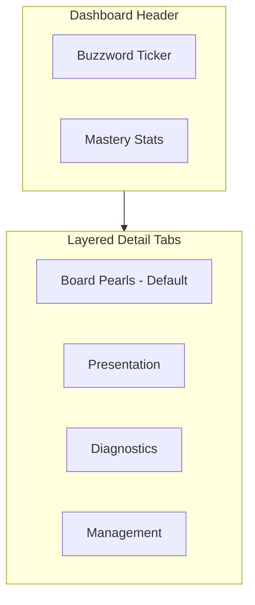

# Smart Condition View: Layered Disclosure

## Overview

Transition the Condition Detail component from a "messy and mushed" vertical scroll to a tabbed, hierarchical interface. Students see high-yield Board Pearls first, with clear layering for deeper dives into presentation, diagnostics, and management.

---

## Current State

**Condition views in the codebase:**

- [ConditionMaster.tsx](components/library/ConditionMaster.tsx) - Modal with hero cards + vertical sections
- [ConditionMasterEmbedded](components/library/ClinicalReferenceLibrary.tsx) - Slide-over panel in Reference Library (collapsible sections)
- [ConditionDetailPanel.tsx](components/library/ConditionDetailPanel.tsx) - Modal with 6 collapsible sections
- [ConditionDetailModal.tsx](components/modals/ConditionDetailModal.tsx) - Uses extended API + BuzzwordBanner
- [ConditionStructuredCards.tsx](components/conditions/ConditionStructuredCards.tsx) - Grid cards (signs, workup, treatment)

**Existing building blocks:**

- [BuzzwordBanner.tsx](components/conditions/BuzzwordBanner.tsx) - Shows single buzzword from registry (condition → buzzword lookup)
- [TopicMasteryBreakdown.tsx](components/dashboard/TopicMasteryBreakdown.tsx) - Per-task-type mastery (Diagnosis, Treatment, Mechanism, Workup, etc.)
- Content fields: `buzzwords`, `classic_triad`, `clinical_pearls`, `mnemonic`, `red_flags`, `gold_standard_dx`, `best_initial_test`, etc.
- Schema: `commonMistakes`, `testQuestionTips` exist on related models (LabTest, Drug, ECGPattern, etc.) and may be in MedicalContent `content` JSONB

---

## Target Design

---

## Implementation Plan

### 1. Dashboard Header (Always Visible)

**1.1 Buzzword Ticker**

- **Purpose:** Dedicated row for high-impact terms (e.g., "S1Q3T3" for PE, "4 Ts" for hypocalcemia).
- **Implementation:**
  - Extend/enhance BuzzwordBanner or create new `BuzzwordTicker` component.
  - Source: `buzzwords` array from content + `classic_triad` + `mnemonic` + buzzword registry.
  - Layout: Horizontal scrolling pill strip or marquee of terms. Each pill is tappable/hoverable for tooltip if needed.
  - If content has 0 buzzwords, fall back to buzzword registry via condition name (current BuzzwordBanner behavior).

**1.2 Mastery Stats**

- **Purpose:** Real-time feedback on user accuracy for this specific topic.
- **Implementation:**
  - Place `TopicMasteryBreakdown` (or a compact variant) in the header.
  - Compact variant: Single row with overall % + sparkline or mini bars for each task type (Diagnosis, Treatment, Workup, Mechanism, Clinical Pearls).
  - Require `conditionId`; hide if unauthenticated or no progress.

### 2. Layered Detail Tabs

Replace the current vertical sections with **four tabs**. Default to **Board Pearls** so high-yield content is shown first.

| Tab                        | Focus                                    | Content Fields                                                                                                                     |
| -------------------------- | ---------------------------------------- | ---------------------------------------------------------------------------------------------------------------------------------- |
| **Board Pearls** (default) | Buzzwords, Triads, Exam Gotchas          | `buzzwords`, `classic_triad`, `clinical_pearls`, `mnemonic`, `red_flags`, `commonMistakes` (from content JSON), `testQuestionTips` |
| **Presentation**           | Vignette (signs, symptoms, epidemiology) | `classic_patient`, `symptoms`, `physicalExam`, `signs`, `epidemiology`, `riskFactors`, `etiology`                                  |
| **Diagnostics**            | Gold Standard vs Initial Tests           | `gold_standard_dx`, `best_initial_test`, `diagnostics`, `labs`, `imaging` — clear hierarchy                                        |
| **Management**             | Pharmacology, Procedures                 | `first_line_rx`, `treatment`, `rx_mechanism`, `rx_side_effects`, `patient_education`, procedure links                              |

**2.1 Board Pearls Tab**

- Buzzwords as pill badges (existing pattern).
- Classic Triad as numbered list (existing).
- Clinical Pearls as bullet list.
- Mnemonic in a highlighted callout.
- **Common Exam Gotchas:** New subsection. Source: `content.commonMistakes` or `content.testQuestionTips` from MedicalContent JSONB. If not present, add optional field to `MedicalContentDisplay` and populate from content loader.
- Red Flags (if any) in a warning-styled callout.

**2.2 Presentation Tab**

- Classic Patient vignette (prominent).
- Symptoms, Physical Exam, Signs.
- Epidemiology, Risk Factors, Etiology.
- No diagnostics or treatment here — keep vignette-focused.

**2.3 Diagnostics Tab**

- **Hierarchy:**
  - Gold Standard Dx (primary, highlighted)
  - Best Initial Test (secondary)
  - Full diagnostics, labs, imaging (tertiary)
- Clear visual distinction (e.g., cards with labels "Gold Standard" vs "Initial Workup").

**2.4 Management Tab**

- First-line Rx (prominent).
- Treatment approach (markdown).
- Mechanism of Action, Side Effects.
- Patient Education.
- Procedures (if linked; reference `ProcedureConditionLink` or similar).

### 3. Component Strategy

**Option A: Refactor ConditionMasterEmbedded (Recommended)**

- ConditionMasterEmbedded is the primary detail view in ClinicalReferenceLibrary.
- Add header (Buzzword Ticker + Mastery Stats) above the content.
- Replace expandable sections with a tab bar + tab panels.
- Reuse existing `Section`, `TextField`, `MarkdownField`, `PillListField` for tab content.

**Option B: New SmartConditionView Component**

- Create `SmartConditionView.tsx` as the canonical condition detail component.
- Migrate ConditionMaster, ConditionMasterEmbedded, ConditionDetailPanel, and ConditionDetailModal to render SmartConditionView.
- Single source of truth for condition detail UI.

**Recommendation:** Option A for faster delivery; Option B for long-term consistency across all entry points (modal, embedded, menu).

### 4. Data and Schema

- **commonMistakes / testQuestionTips:** MedicalContent has `content` JSONB. Check if `commonMistakes` and `testQuestionTips` are stored there. If not, add to content loader/API response when merging extended condition data.
- **API:** `/api/content/library` and condition detail endpoints already return MedicalContent. Ensure `content` JSONB is included and parsed for `commonMistakes` and `testQuestionTips`.

### 5. Files to Modify/Create

| File                                              | Action                                                                                            |
| ------------------------------------------------- | ------------------------------------------------------------------------------------------------- |
| `components/library/ClinicalReferenceLibrary.tsx` | Refactor ConditionMasterEmbedded: add header, tab bar, tab panels                                 |
| `components/conditions/BuzzwordBanner.tsx`        | Enhance to BuzzwordTicker (multi-term strip) or create `BuzzwordTicker.tsx`                       |
| `components/dashboard/TopicMasteryBreakdown.tsx`  | Add compact variant for header (or new `TopicMasteryHeader.tsx`)                                  |
| `components/library/ConditionMaster.tsx`          | Align with new tabbed layout (if still used)                                                      |
| `components/modals/ConditionDetailModal.tsx`      | Use same layout; ensure BuzzwordBanner/Ticker + Mastery + Tabs                                    |
| `types/medical-content.ts`                        | Optional: add `commonMistakes?: string[]`, `testQuestionTips?: string[]` to MedicalContentDisplay |
| `lib/utils/normalization.ts`                      | Parse `content.commonMistakes`, `content.testQuestionTips` in normalizeMedicalContent             |

### 6. Tab Order and Default

- Tab order: **Board Pearls** | Presentation | Diagnostics | Management
- Default open: **Board Pearls**
- Persist last-selected tab in sessionStorage (optional) for return visits.

---

## Summary

| Deliverable        | Description                                                                  |
| ------------------ | ---------------------------------------------------------------------------- |
| Dashboard Header   | Buzzword Ticker (multi-term strip) + Mastery Stats (compact)                 |
| Board Pearls Tab   | Buzzwords, Triads, Pearls, Mnemonic, Exam Gotchas                            |
| Presentation Tab   | Classic patient, symptoms, exam, epidemiology                                |
| Diagnostics Tab    | Gold Standard → Best Initial → Full workup hierarchy                         |
| Management Tab     | First-line Rx, treatment, MoA, side effects, procedures                      |
| Component refactor | ConditionMasterEmbedded (or new SmartConditionView) as single implementation |

