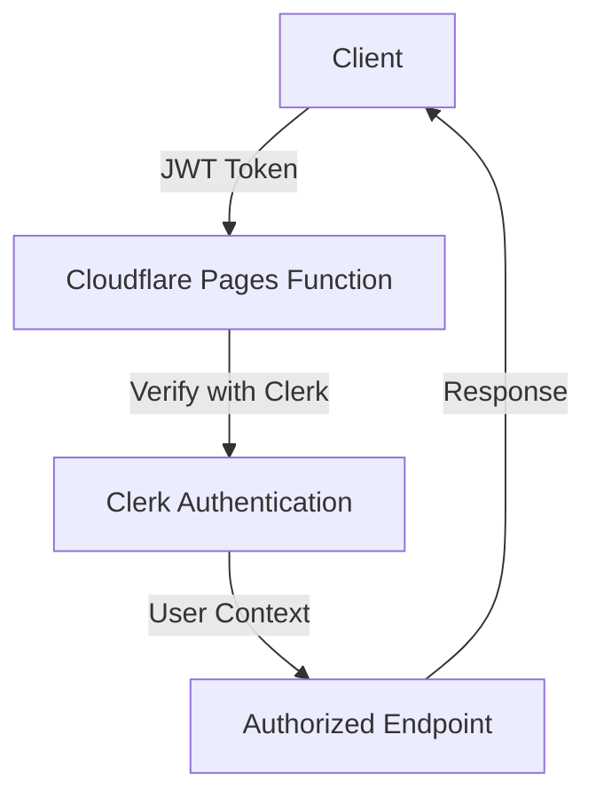
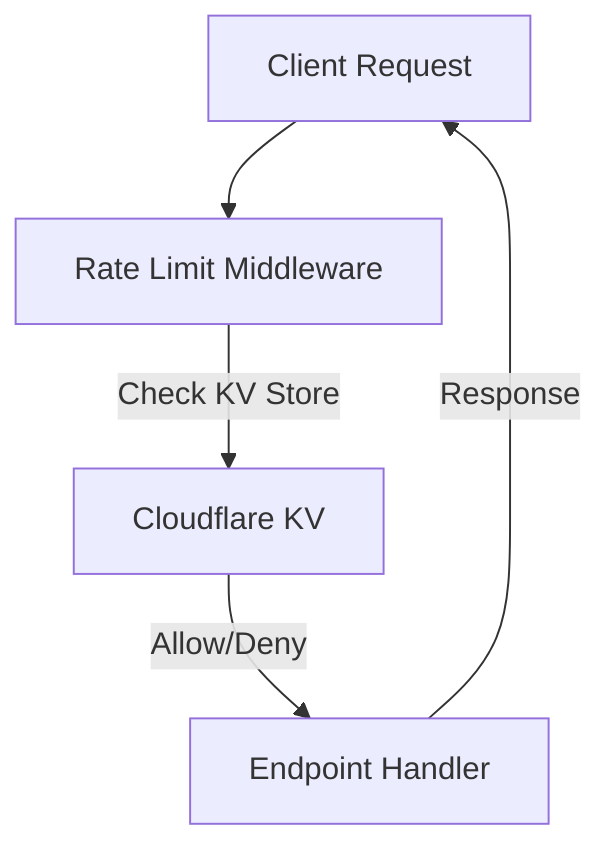
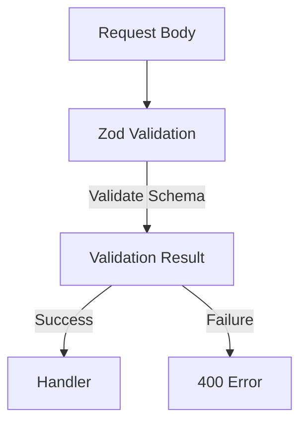

# 🔒 Security Implementation Guide for StudyPANaCEa

## 🎯 Overview

This document outlines the comprehensive security implementation for StudyPANaCEa, covering authentication, authorization, rate limiting, input validation, and data protection.

## 🛡️ Security Architecture

### 1. Authentication System



**Components:**
- **Clerk**: JWT-based authentication
- **Middleware**: `withAuth()` for endpoint protection
- **Context**: User context injected into handlers

### 2. Rate Limiting Strategy



**Implementation:**
- **Cloudflare KV**: Distributed rate limiting
- **Tiered Limits**: Different limits for API/auth/admin endpoints
- **Fallback**: Graceful degradation if KV unavailable

### 3. Input Validation



**Validation Layers:**
- **Zod Schemas**: Type-safe input validation
- **Payload Size**: Enforce maximum payload sizes
- **Sanitization**: Clean input data

## 🔐 Authentication Implementation

### Clerk Integration

```typescript
// functions/api/_shared/auth.ts
export async function authenticateRequest(request: Request, env: Env): Promise<AuthContext | null> {
  const secretKey = env.CLERK_SECRET_KEY;

  // Validate secret key
  if (!secretKey) {
    console.error('[AUTH] CLERK_SECRET_KEY is not configured');
    return null;
  }

  const authHeader = request.headers.get('Authorization');
  const userId = await verifyAuthToken(authHeader, secretKey);

  if (!userId) {
    return null;
  }

  return { userId, clerkId: userId };
}
```

### Middleware Usage

```typescript
// Protected endpoint
export const onRequestPost = authenticatedEndpoint(
  questionGenerationSchema,
  async (context) => {
    // context.auth.userId is guaranteed to exist
    const userId = context.auth.userId;
    // Business logic...
  }
);
```

## 🚦 Rate Limiting Implementation

### Cloudflare KV Configuration

```toml
# wrangler.toml
kv_namespaces = [
  { binding = "RATE_LIMIT_KV", id = "your-kv-namespace-id" }
]
```

### Rate Limit Middleware

```typescript
export function withRateLimit(options: {
  requestsPerMinute: number;
  endpointType?: 'api' | 'auth' | 'admin';
}): Middleware<AuthenticatedContext> {
  return async (context, next) => {
    const identifier = context.auth?.userId || context.request.headers.get('cf-connecting-ip') || 'unknown';
    const key = `rate_limit:${identifier}`;

    const isRateLimited = await checkRateLimit(context.env, key, options.requestsPerMinute, 60);

    if (isRateLimited) {
      return { status: 429, error: 'Too many requests' };
    }

    return next();
  };
}
```

### Tiered Rate Limits

| Endpoint Type | Requests/Minute | Window (seconds) |
|---------------|-----------------|------------------|
| API           | 100             | 60               |
| Auth          | 20              | 60               |
| Admin         | 30              | 60               |

## 📋 Input Validation

### Zod Schema Example

```typescript
const questionGenerationSchema = z.object({
  system: z.string().min(2).max(50),
  difficulty: z.enum(['easy', 'medium', 'hard']),
  count: z.number().int().min(1).max(50).default(10),
  includeExplanation: z.boolean().default(true),
});
```

### Validation Middleware

```typescript
export function withValidation<T>(
  schema: z.ZodSchema<T>,
  options: { maxPayloadSize?: number } = {}
): Middleware<ValidatedContext<T>> {
  return async (context, next) => {
    const data = await context.request.json();

    if (options.maxPayloadSize) {
      enforcePayloadSize(data);
    }

    const result = validateSchema(schema, data, 'API');

    if (!result.success) {
      return { status: 400, error: `Validation failed: ${result.errors.join('; ')}` };
    }

    const validatedContext = { ...context, validated: result.data };
    return next.call(null, validatedContext);
  };
}
```

## 🔒 Security Headers

### CSP Configuration

```typescript
app.use(
  helmet({
    contentSecurityPolicy: {
      directives: {
        defaultSrc: ["'self'"],
        scriptSrc: ["'self'", "'unsafe-inline'", 'https://*.clerk.accounts.dev'],
        styleSrc: ["'self'", "'unsafe-inline'"],
        connectSrc: ["'self'", 'https://*.clerk.accounts.dev', process.env.FRONTEND_URL],
      },
    },
  })
);
```

### CORS Configuration

```typescript
app.use(
  cors({
    origin: process.env.FRONTEND_URL || 'http://localhost:3000',
    credentials: true,
  })
);
```

## 🛡️ Security Checklist

### Authentication & Authorization

- [x] JWT verification with Clerk
- [x] Role-based access control
- [x] Secure session management
- [x] Token expiration handling

### Rate Limiting

- [x] Cloudflare KV integration
- [x] Tiered rate limits
- [x] Graceful degradation
- [x] Comprehensive logging

### Input Validation

- [x] Zod schema validation
- [x] Payload size limits
- [x] Data sanitization
- [x] Error handling

### Network Security

- [x] CSP headers
- [x] CORS restrictions
- [x] HTTPS enforcement
- [x] Secure cookies

## 📊 Security Monitoring

### Logging Strategy

```typescript
logger.info('Request completed', {
  method: context.request.method,
  path: url.pathname,
  status,
  duration,
  userId: context.auth?.userId,
});
```

### Error Tracking

```typescript
logger.error('Handler error', error, {
  path: new URL(context.request.url).pathname,
  userId: context.auth?.userId,
});
```

## 🚀 Deployment Security

### Environment Variables

```env
# Required for production
CLERK_SECRET_KEY=sk_live_...
DATABASE_URL=prisma://accelerate.prisma-data.net/?api_key=...
SENTRY_DSN=https://...
```

### Cloudflare Configuration

```toml
# wrangler.toml
compatibility_date = "2024-01-01"
compatibility_flags = ["nodejs_compat"]

kv_namespaces = [
  { binding = "RATE_LIMIT_KV", id = "your-kv-namespace-id" }
]

[vars]
NODE_ENV = "production"
```

## 🎓 Best Practices

### 1. Principle of Least Privilege

```typescript
// Only grant necessary permissions
if (user.role !== 'admin') {
  throw new Error('Unauthorized');
}
```

### 2. Defense in Depth

```typescript
// Multiple security layers
app.use(helmet());       // Security headers
app.use(cors());         // CORS restrictions
app.use(rateLimit());    // Rate limiting
app.use(authMiddleware); // Authentication
```

### 3. Secure Error Handling

```typescript
try {
  // Business logic
} catch (error) {
  logger.error('Secure error handling', error);
  return { status: 500, error: 'Internal server error' };
}
```

### 4. Regular Security Audits

```bash
# Run security audits
npm audit
npx prisma generate --check
npx tsc --noEmit
```

## 📚 References

- [OWASP Top 10](https://owasp.org/www-project-top-ten/)
- [Clerk Security](https://clerk.com/docs/security)
- [Cloudflare Security](https://developers.cloudflare.com/workers/runtime-apis/security/)
- [Prisma Security](https://www.prisma.io/docs/guides/security)