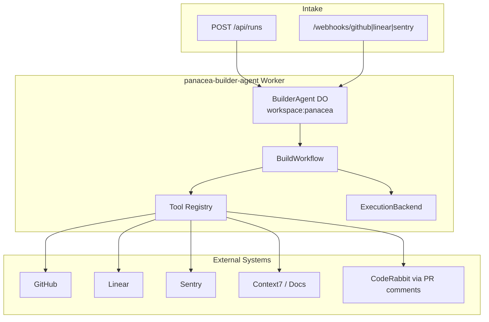

# PANaCEa Builder Agent Architecture

**Status:** v1 implemented (2026-07-15)  
**Discovery:** [builder-agent-current-state.md](./builder-agent-current-state.md)  
**Design:** [../superpowers/specs/2026-07-15-panacea-builder-agent-design.md](../superpowers/specs/2026-07-15-panacea-builder-agent-design.md)

## Overview

The Builder Agent is an internal Cloudflare Worker that orchestrates engineering work from intake through tested PR creation. It uses:

- **Cloudflare Agents SDK** — `BuilderAgent` Durable Object (SQLite state per workspace)
- **Cloudflare Workflows** — `BuildWorkflow` (15 durable phases)
- **ExecutionBackend** — `LocalDevExecutionBackend` (default) or `SandboxExecutionBackend` (when enabled)

## Component diagram

## State model

| Status | Meaning |
|--------|---------|
| `intake` | Run accepted |
| `analyzing` | Gathering context |
| `awaiting_plan_approval` | High-risk plan needs human OK |
| `approved` | Plan approved |
| `executing` | Implementation / workspace prep |
| `testing` | Validation suite |
| `awaiting_pr_review` | PR open, monitoring CI |
| `revising` | Addressing CI/review feedback |
| `awaiting_merge_approval` | Ready but merge blocked |
| `completed` / `failed` / `canceled` | Terminal |

Transitions validated in `lib/builder-agent/state/transitions.ts`.

## Directory layout

| Path | Purpose |
|------|---------|
| `workers/builder-agent/` | Deployable Worker (DO + Workflow) |
| `lib/builder-agent/` | Shared logic (testable without Worker runtime) |
| `tests/builder-agent/` | Unit, integration, dry-run e2e |

## Relationship to existing agents

| System | Relationship |
|--------|--------------|
| `lib/services/agents` (Gemini clinical) | **Separate** — student product surface |
| `functions/api/agents/*` (admin audits) | **Retained** — content/infra checks |
| `scripts/cloud-agents/` (Cursor API) | **Legacy** — migration comparison required |
| `docs/autoclaw/` | **Reference** — human workflow playbooks |

## Security

- API key auth for `/api/*`
- Webhook HMAC (`X-Builder-Signature`)
- Merge/deploy/infra/credential actions require approval records
- Secret redaction in all logs
- `BUILDER_AGENT_DRY_RUN=true` default in wrangler.toml until production sign-off

## Sandbox

Cloudflare Sandbox requires Workers Paid plan. When unavailable:

- `SandboxExecutionBackend.available === false`
- Falls back to `LocalDevExecutionBackend`
- API responses include `integrationStatus` per tool

See [builder-agent-secrets.md](../configuration/builder-agent-secrets.md) and [builder-agent runbook](../runbooks/builder-agent.md).
