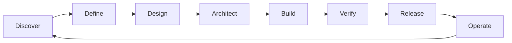

# Application Delivery Orchestration Guide

A project management roadmap for leading mobile and web apps from discovery through live operations. Use this as a checklist, communication framework, and quality gate reference.

---

## How to use this guide

| Role | Start here |
|------|------------|
| Product / PM | Phase 0–1, milestone tables, communication cadence |
| Engineering lead | Phase 3–5, team assignment, Definition of Done |
| Design lead | Phase 2, design QA gates |
| QA lead | Phase 6, release checklist |
| DevOps | Phase 8, deployment strategies |

**North star:** Every phase has explicit deliverables and a quality gate. Do not advance without sign-off.

---

## Delivery lifecycle



| Phase | Primary output | Gate owner |
|-------|----------------|------------|
| Discover | Problem statement, success metrics | PM + stakeholders |
| Define | PRD, prioritized backlog | PM |
| Design | Prototypes, design system | Design + PM |
| Architect | Tech spec, ADRs, sprint plan | Eng lead |
| Build | Working increments | Eng team |
| Verify | Test sign-off | QA + PM |
| Release | Live deployment | DevOps + eng lead |
| Operate | Monitoring, iteration | All |

---

## Phase 0: Project charter

**Objective:** Align on *why* before *what*.

### Actions

1. **Problem statement** — Who has the problem? How painful? Cost of not solving?
2. **Success metrics** — 2–3 measurable outcomes (activation, retention, task completion, revenue, NPS).
3. **Scope boundaries** — Explicit in-scope / out-of-scope for v1.
4. **Platform decision** — Mobile (native vs cross-platform), web (SPA vs SSR), or both; document trade-offs.
5. **Stakeholder map** — Decision-makers, approvers, user representatives.
6. **RACI matrix** — Responsible, Accountable, Consulted, Informed per workstream.
7. **Risk register** — Initial risks with owners (see Phase 7 template).
8. **Communication plan** — Channels, cadence, escalation path.

### Deliverables

- [ ] One-page project charter
- [ ] RACI matrix
- [ ] Risk register (v0)
- [ ] Communication plan

### Quality gate

> Charter signed by accountable stakeholder before requirements work begins.

---

## Phase 1: Requirements gathering

**Objective:** Convert ideas into testable, prioritized requirements.

### Actions

1. **User research** — Interviews, surveys, competitive analysis, analytics review.
2. **Personas** — 2–4 personas with goals, frustrations, and context.
3. **User journeys** — End-to-end maps for primary flows.
4. **User stories** — Format: *As a [persona], I want [action], so that [outcome].*
5. **Non-functional requirements** — Performance, accessibility (WCAG 2.1 AA), security, offline, i18n, compliance.
6. **MoSCoW prioritization** — Must / Should / Could / Won't for v1.
7. **Acceptance criteria** — Given/When/Then for every Must-have story.
8. **Traceability** — Requirement ID → story → test case mapping.

### Deliverables

- [ ] Product Requirements Document (PRD)
- [ ] Prioritized backlog (Must-haves tagged for MVP)
- [ ] User journey maps
- [ ] Requirements traceability matrix

### Quality gate

> No design or engineering starts on a feature without written acceptance criteria and PM sign-off.

---

## Phase 2: UI/UX design

**Objective:** Validate experience before expensive engineering.

### Actions

1. **Information architecture** — Sitemap, navigation model, content hierarchy.
2. **Wireframes** — Low-fidelity flows for all Must-have journeys.
3. **Design system** — Colors, typography, spacing, components; reuse existing systems when possible.
4. **High-fidelity mockups** — Key screens at all target breakpoints.
5. **Interactive prototype** — Clickable flows for usability testing.
6. **Usability testing** — 5–8 users; document findings and iterate.
7. **Accessibility annotations** — Focus order, labels, contrast notes.
8. **Design handoff** — Dev-ready specs, assets, component naming aligned with code conventions.

### Deliverables

- [ ] Wireframes (all MVP flows)
- [ ] Design system / component library
- [ ] High-fidelity designs with specs
- [ ] Usability test report
- [ ] Accessibility annotations

### Quality gate

> Engineering lead reviews designs before high-fidelity polish to flag technical constraints (API shape, animation cost, offline needs).

### Collaboration touchpoint

| Meeting | Frequency | Attendees | Outcome |
|---------|-----------|-----------|---------|
| Design review | Weekly | Design, PM, eng lead | Aligned UX before build |
| Design QA | Per feature | Design, engineer | Pixel/behavior match before done |

---

## Phase 3: Technical architecture and planning

**Objective:** A buildable plan with clear ownership and dependencies.

### Actions

1. **Architecture Decision Records (ADRs)** — Stack, hosting, auth, data model, API style.
2. **System diagram** — Clients, APIs, databases, third-party services, CI/CD.
3. **Data model** — Entity-relationship diagram; migration strategy.
4. **API contract** — OpenAPI or GraphQL schema stubbed before parallel FE/BE work.
5. **Security review** — Auth flow, secrets management, OWASP checklist, PII handling.
6. **Epic breakdown** — Epics → stories → tasks (1–3 day tasks ideal).
7. **Dependency mapping** — Critical path identification.
8. **Deploy tiers** — Dev, staging, live; feature flags for risky launches.
9. **Definition of Done** — Story-level and release-level criteria.

### Sample Definition of Done (story)

- Code reviewed and merged
- Unit tests pass; coverage meets threshold
- Acceptance criteria verified
- No new critical/high security findings
- API/config changes documented

### Deliverables

- [ ] Technical design document
- [ ] ADRs for major decisions
- [ ] API specification (versioned)
- [ ] Sprint-ready backlog with estimates
- [ ] Definition of Done (story + release)

### Quality gate

> API contract agreed before parallel frontend/backend implementation on shared features.

---

## Phase 4: Team assignment and milestones

**Objective:** Predictable delivery through clear ownership and short feedback loops.

### Role assignment

| Workstream | Owner | Responsibilities |
|------------|-------|------------------|
| Frontend | FE lead | UI, client state, accessibility |
| Backend / API | BE lead | Endpoints, business logic, integrations |
| Mobile | Mobile lead | Platform UX, app store compliance |
| Infrastructure | DevOps | CI/CD, deploy targets, monitoring |
| QA | QA lead | Test plans, automation, regression |
| Design | Design lead | Design QA, iteration |
| Product | PM | Prioritization, acceptance, stakeholder comms |

### Task assignment principles

1. **One owner per task** — Collaborators listed; one person accountable.
2. **Vertical slices** — End-to-end features over layer-by-layer work.
3. **Pair high-risk work** — Auth, payments, data migration.
4. **Limit WIP** — 1–2 in-progress stories per person.

### Milestone template

| Milestone | Entry criteria | Exit criteria |
|-----------|----------------|---------------|
| M1: Foundation | Charter signed | Repo, CI, auth shell, design system in code |
| M2: Core loop | M1 complete | Primary user journey works end-to-end (happy path) |
| M3: Feature complete | M2 complete | All Must-haves implemented |
| M4: Release candidate | M3 complete | Feature freeze, full regression passed |
| M5: Live launch | M4 complete | Deployed, monitored, rollback tested |

### Sprint cadence (2-week example)

| When | Activity |
|------|----------|
| Mon W1 | Sprint planning — commit to sprint goal + stories |
| Daily | Standup (15 min) — yesterday / today / blockers |
| Wed W1 | Mid-sprint check — scope risk, WIP demo |
| Thu W2 | Code freeze for release candidate (if shipping) |
| Fri W2 | Sprint review (demo) + retrospective |

### Communication cadence

| Meeting | Frequency | Attendees | Purpose |
|---------|-----------|-----------|---------|
| Standup | Daily | Dev team | Blockers, sync |
| Sprint planning | Biweekly | Dev, PM, design | Commit to scope |
| Stakeholder demo | Biweekly | All + stakeholders | Progress, feedback |
| Retro | End of sprint | Dev team | Process improvement |

### Quality gate

> Every sprint has one clear sprint goal tied to a milestone or release objective.

---

## Phase 5: Build practices

**Objective:** Maintain quality and velocity throughout build.

### Engineering standards

- **Trunk-based workflow** — Short-lived branches; merge daily.
- **PR requirements** — Reviewer, tests, linked ticket, screenshot/video for UI changes.
- **Feature flags** — Ship incomplete work dark; enable per deploy tier.
- **Conventional commits** — Enables automated changelogs.
- **Documentation** — README setup, API docs, runbooks updated per epic.

### Cross-functional touchpoints

| Touchpoint | When | Outcome |
|------------|------|---------|
| Three-amigos | Before sprinting a story | Shared understanding |
| API review | Before implementing consumers | Contract agreed |
| Security review | Before auth/payment/PII features | Findings tracked |

---

## Phase 6: Testing and quality assurance

**Objective:** Confidence to ship without surprises.

### Test pyramid

```
        /\
       /E2E\        Few, critical paths
      /------\
     /Integration\  API, DB, service boundaries
    /--------------\
   /   Unit tests   \  Many, fast, isolated
  /------------------\
```

### Testing phases

| Phase | When | Owner | Activities |
|-------|------|-------|------------|
| Unit | Continuous | Engineers | Logic, utilities, components |
| Integration | Per PR / nightly | Engineers + QA | API contracts, DB queries |
| E2E | Pre-release | QA | Critical user journeys |
| UAT | Release candidate | PM + stakeholders | Acceptance against PRD |
| Performance | Pre-release | Eng + QA | Load, latency, mobile network |
| Security | Pre-release | Security / eng | SAST, dependency scan, pen test |
| Accessibility | Pre-release | QA + design | Screen reader, keyboard, contrast |

### Bug triage

| Severity | Definition | Response |
|----------|------------|----------|
| P0 | Live system down / data loss | Immediate fix or rollback |
| P1 | Core flow broken, no workaround | Fix before release |
| P2 | Broken with workaround | Fix in current or next sprint |
| P3 | Cosmetic / minor | Backlog |

### Release quality gate

- [ ] All P0/P1 bugs resolved
- [ ] E2E suite green on staging
- [ ] Performance budgets met
- [ ] Security scan clean (or exceptions documented)
- [ ] PM sign-off on UAT
- [ ] Rollback procedure tested

---

## Phase 7: Risk management

**Objective:** Surface problems early; have mitigations ready.

### Risk register template

| ID | Risk | Likelihood | Impact | Mitigation | Owner | Status |
|----|------|------------|--------|------------|-------|--------|
| R1 | Third-party API dependency | Med | High | Fallback + cache layer | BE lead | Open |
| R2 | App store rejection | Low | High | Pre-review checklist | Mobile lead | Open |
| R3 | Scope creep | High | Med | Change control process | PM | Open |
| R4 | Key person unavailable | Med | High | Pairing, documentation | Eng lead | Open |

### Common risks and mitigations

| Risk | Mitigation |
|------|------------|
| Scope creep | Change control: new work replaces old unless timeline extends |
| Integration delays | Mock APIs early; contract tests |
| Performance issues | Budget metrics from day one; profile before launch |
| Security incidents | Threat modeling in architecture; secrets never in repo |
| Launch failure | Staged rollout, feature flags, tested rollback |

### Weekly risk review (15 min)

Update likelihood/impact, add new risks, close mitigated ones.

---

## Phase 8: Deployment and release

**Objective:** Safe, repeatable path to live.

### Pre-launch checklist

- [ ] Live deploy target provisioned
- [ ] Secrets in vault (not committed env files)
- [ ] CI/CD deploys to staging automatically
- [ ] Database migrations tested on staging copy
- [ ] Monitoring and alerting configured
- [ ] On-call rotation defined
- [ ] Runbook: deploy, rollback, incident response
- [ ] Legal: privacy policy, terms, app store metadata

### Release strategies

| Strategy | Best for |
|----------|----------|
| Big bang | Small apps, internal tools |
| Staged rollout | Consumer apps (1% → 10% → 100%) |
| Blue/green | Zero-downtime web APIs |
| Feature flags | Decouple deploy from release |

### Mobile-specific

- TestFlight / Internal App Sharing for beta
- App store screenshots, descriptions, review notes
- Plan 1–2 week buffer for review rejection

### Launch day runbook

1. Deploy to live (or enable feature flag)
2. Monitor dashboards for 2–4 hours
3. Smoke test critical paths in live
4. Announce internally, then users
5. Schedule post-launch retrospective within 48 hours

---

## Phase 9: Post-launch operations

**Objective:** Learn, stabilize, iterate.

### First 30 days

- Daily error/latency review
- User feedback channel (support, analytics, store reviews)
- Hotfix process for P0/P1
- Baseline metrics vs targets

### Ongoing

- Biweekly backlog grooming from feedback
- Quarterly roadmap refresh
- Tech debt budget (~20% of sprint capacity)
- Dependency and security patch cadence

---

## Communication and collaboration playbook

### Principles

1. **Single source of truth** — One backlog, one design file, one doc repo.
2. **Write decisions down** — ADRs, meeting notes, async updates.
3. **Default to transparency** — Project channel + workstream channels.
4. **Escalate early** — Blockers > 24h go to eng lead / PM.
5. **Respect focus time** — Cluster meetings; protect deep work blocks.

### Async update template

```markdown
## [Date] — Sprint X, Day Y
**Done:** ...
**In progress:** ...
**Blocked:** ... (@owner)
**Risks:** ...
**Next:** ...
```

### Conflict resolution

1. Discuss data/options in writing first
2. Time-boxed sync if unresolved in 24h
3. Escalate to accountable decision-maker (RACI)
4. Document decision in ADR or meeting note

### Change control

| Change type | Approver | Process |
|-------------|----------|---------|
| Bug fix | Eng lead | Normal PR flow |
| Scope addition | PM + stakeholder | Trade-off documented; timeline impact stated |
| Architecture change | Eng lead + architects | ADR required |
| Release date slip | PM + stakeholders | Revised milestone plan published |

---

## Master checklists

### Before build starts

- [ ] Charter signed off
- [ ] PRD + acceptance criteria for MVP
- [ ] Designs reviewed by engineering
- [ ] Architecture doc + ADRs
- [ ] Backlog estimated; sprint 1 planned
- [ ] CI/CD skeleton running
- [ ] Risk register created

### Before release

- [ ] Feature complete (Must-haves)
- [ ] Full regression passed
- [ ] UAT sign-off
- [ ] Security and performance checks
- [ ] Runbooks and on-call ready
- [ ] Rollback tested
- [ ] Stakeholder launch comms drafted

### After launch

- [ ] Monitoring confirmed
- [ ] Retrospective scheduled
- [ ] v1.1 backlog seeded from feedback

---

## Adapting to team size

| Team size | Adjustments |
|-----------|-------------|
| Solo / 2 | Combine roles; shorter phases; lightweight RACI |
| 3–8 | Standard sprint model above |
| 9–20 | Sub-teams per workstream; integration lead |
| 20+ | Program management; dependency board; release train |

---

## Orchestrating with parallel agents (Cursor /orchestrate)

When using Cursor's `/orchestrate` to fan out build work:

| Node type | Role | Output |
|-----------|------|--------|
| Planner | Decomposes scope, publishes tasks | `plan.json`, user-facing summary |
| Worker | One concrete slice | Handoff markdown |
| Verifier | Acceptance check on a worker | Verdict handoff |
| Subplanner | Owns a slice recursively | Aggregated handoff to parent |

**Principles:**

1. Planners publish tasks; they do not code.
2. Workers are isolated — one task, one branch, one handoff.
3. Quality gates map to verifier tasks.
4. Git + disk (`plan.json`, `state.json`, `handoffs/`) are source of truth.

Map phases to orchestrate tasks:

| App phase | Orchestrate task type |
|-----------|----------------------|
| Requirements doc | Worker: research + PRD draft |
| Design system | Worker: tokens + components |
| API contract | Worker: OpenAPI stub |
| Feature slice | Worker: vertical implementation |
| Release readiness | Verifier: checklist + test run |

---

## Summary

Five habits that predict successful app orchestration:

1. **Define before design, design before build**
2. **Short feedback loops** — daily standups, biweekly demos, continuous testing
3. **Clear ownership** — one accountable person per task and per risk
4. **Quality gates** — no phase advances without explicit criteria
5. **Communicate in writing** — decisions, blockers, and status visible to all

---

*Generated as part of an `/orchestrate` run. For parallel agent orchestration setup, see the [orchestrate skill](https://github.com/cursor/plugins/tree/main/cursor-sdk).*
