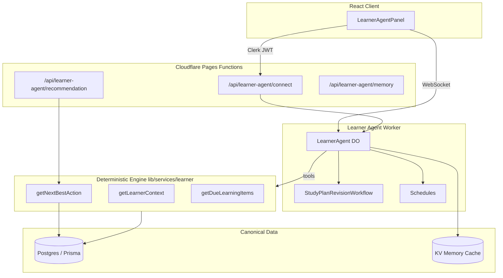

# PANaCEa Learner Agent — Design Specification

**Date:** 2026-07-15  
**Status:** Approved (aligned with product prompt unless noted)  
**Authors:** Principal AI systems / clinical-learning engineering

## Problem statement

PANaCEa needs a **durable, learner-facing agent** that answers: *"What should I study next, and why?"* — without replacing the deterministic learning engine. Today, recommendations are fragmented across five+ services, and the existing Clinical Study Agent is a stateless, read-only chat surface.

## Goals

1. One **LearnerAgent** instance per authenticated learner (Durable Object).
2. **Deterministic** next-best-action ranking; model explains but does not invent actions.
3. Orchestrate existing services: FSRS context, study plans, rotations, assignments, sessions.
4. Durable workflows for plan revision, reminders, and background preparation.
5. Explicit memory policy with user confirmation for high-impact memories.
6. Premium, focused UI — not a dense chat dashboard.
7. Feature-flagged rollout; no production migration of all users.

## Non-goals (v1)

- Replacing Clerk auth with Supabase sessions (repo uses Clerk; document only).
- Graphiti/Neo4j integration.
- Slack/email/voice/calendar channels.
- Code Mode dependency.
- Schema migrations for memory (use KV + DO state until approved).

## Architecture



### Critical boundary

```
┌─────────────────────────────────────────────────────────┐
│  MODEL LAYER (LearnerAgent)                              │
│  - gather context via tools                              │
│  - explain recommendations                               │
│  - facilitate accept/defer/adjust                        │
│  - NEVER write FSRS/mastery directly                     │
└───────────────────────┬─────────────────────────────────┘
                        │ typed tools only
┌───────────────────────▼─────────────────────────────────┐
│  DETERMINISTIC ENGINE (lib/services/learner/*)            │
│  - getNextBestAction (ranked scoring)                     │
│  - getDueLearningItems                                    │
│  - recordAttempt → drillReviewService                     │
│  - updateSchedulingFromVerifiedAttempt                    │
└───────────────────────┬─────────────────────────────────┘
                        │
┌───────────────────────▼─────────────────────────────────┐
│  POSTGRES (canonical)                                     │
└─────────────────────────────────────────────────────────┘
```

## LearnerAgent Durable Object state

Stored in DO (short-lived / session):

| Field | Purpose |
|-------|---------|
| `userId` | Internal user ID (from verified Clerk → resolver) |
| `activeSessionId` | Current study session |
| `currentObjective` | Learner-stated goal |
| `currentItemId` | Active learning item |
| `pendingRecommendation` | Last deterministic NBA + explanation request |
| `pendingConfirmation` | Awaiting accept/defer/adjust |
| `conversationTurn` | Recent turns (bounded, not full long-term memory) |
| `correlationId` | Observability |
| `lastConnectedAt` | Reconnection |

**Not stored in DO:** API keys, raw JWTs, PHI, full attempt history.

## Learning service interfaces

| Interface | Reads | Writes | Implementation |
|-----------|-------|--------|----------------|
| `getLearnerContext` | ✓ | | `learnerContextService.ts` |
| `getDueLearningItems` | ✓ | | `learnerDueItemsService.ts` |
| `getNextBestAction` | ✓ | | `learnerNextActionService.ts` |
| `startStudySession` | ✓ | ✓ | `learnerSessionService.ts` |
| `recordAttempt` | | ✓ | delegates to `submitDrillReview` |
| `gradeAttempt` | ✓ | | correctness from question |
| `updateSchedulingFromVerifiedAttempt` | | ✓ | via `submitDrillReview` only |
| `generateConstrainedStudyPlan` | ✓ | ✓ | workflow + `studyPlanService` |
| `reviseStudyPlan` | ✓ | ✓ | workflow |
| `getUpcomingAssignments` | ✓ | | `learnerAssignmentsService.ts` |
| `getRotationContext` | ✓ | | `learnerRotationService.ts` |
| `getProgressSummary` | ✓ | | `learnerProgressService.ts` |
| `retrieveGroundedContent` | ✓ | | `learnerGroundedContentService.ts` |
| `createReminder` | | ✓ | KV + schedule (idempotent) |
| `completeStudySession` | ✓ | ✓ | `learnerSessionService.ts` |

## Deterministic next-best-action scoring

Weighted candidate actions from:

1. **Overdue FSRS reviews** (weight 100 + days overdue)
2. **Study plan tasks due within 24h** (weight 90 + urgency)
3. **Daily allocator targeted session** when `retentionPriority > readinessPriority` (weight 80)
4. **Rotation-aligned weak systems** (weight 70)
5. **Blueprint gap MAIN session** (weight 60)
6. **New content exposure** (weight 40)

Tie-break: higher priority → earlier due date → lexicographic action ID.

Model receives the **pre-ranked** result and may only rephrase `whyNow`; changing rank requires explicit learner adjustment tools that call deterministic `reviseStudyPlan` / defer endpoints.

## Memory policy

Categories: `preference`, `goal`, `difficulty`, `schedule`, `rotation_note`.

Each candidate memory record:

```ts
interface MemoryCandidate {
  proposed: string;
  category: MemoryCategory;
  source: 'learner_stated' | 'tool_derived' | 'inferred';
  timestamp: string;
  confidence: number;
  expirationPolicy: 'session' | '30d' | 'until_exam' | 'manual';
  userVisible: boolean;
  requiresConfirmation: boolean;
}
```

- Sensitive / ambiguous / high-impact → `requiresConfirmation: true`
- Persist approved memories to KV key `learner-memory:{userId}` (not Postgres v1)
- Full conversations are **not** stored by default

## Authentication & security

1. Browser obtains Clerk session token.
2. `POST /api/learner-agent/connect` verifies token, resolves `userId`, returns WebSocket URL + short-lived connection secret.
3. Worker validates connection secret; derives DO id from `userId` (non-guessable hash).
4. All tools re-verify `userId` matches DO binding.
5. Rate limit: 30 connect/min, 60 tool calls/min per user (KV).
6. Prompt injection: retrieved content wrapped with untrusted markers; model instructed not to follow embedded instructions.
7. Sentry: correlation IDs, no raw conversation text.

## Workflows (Cloudflare Workflows)

| Workflow | Trigger | Idempotency key |
|----------|---------|-----------------|
| `StudyPlanRevisionWorkflow` | Learner requests plan change | `userId:revisionRequestId` |
| `ReminderCreationWorkflow` | Approved reminder | `userId:reminderId` |
| `MemoryProcessingWorkflow` | Confirmed memory candidate | `userId:memoryId` |

## UI: LearnerAgentPanel

Embedded in command center (feature-flagged):

- Recommended next action card with **Why this now?**
- Accept / Defer / Adjust buttons
- Compact message area (not full-page chat)
- Session progress strip
- Reconnect indicator

Preserves Stormy Slate design tokens; uses `GlassCard`, `Button`, `useReducedMotion`.

## Feature flag

`ENABLE_LEARNER_AGENT` — env var via `isFeatureEnabled`.

Client: `VITE_ENABLE_LEARNER_AGENT` for UI gating.

## Rollout phases

1. Local mocked tools + unit tests
2. Local Supabase/Postgres dev
3. Staging + test account
4. Internal users
5. Broader (after evals)

## Observability

Correlation ID propagated: `x-correlation-id` header → DO state → Sentry tags → tool logs.

Metrics: recommendation accept/reject, session complete, tool errors, workflow retries, reconnections.

## Clinical-learning safety

- Educational framing only; no patient-specific advice.
- Grounded explanations cite `retrieveGroundedContent` sources.
- Missing evidence → explicit uncertainty.
- No model writes to mastery/FSRS.

## Open decisions / repo conflicts

| Item | Resolution |
|------|------------|
| Supabase auth in prompt | Use **Clerk** (established); Postgres remains Supabase-hosted |
| Pages + DO deploy | Separate `workers/learner-agent` worker; Pages proxies connect |
| Memory in Postgres | Deferred; KV + DO until migration approved |
