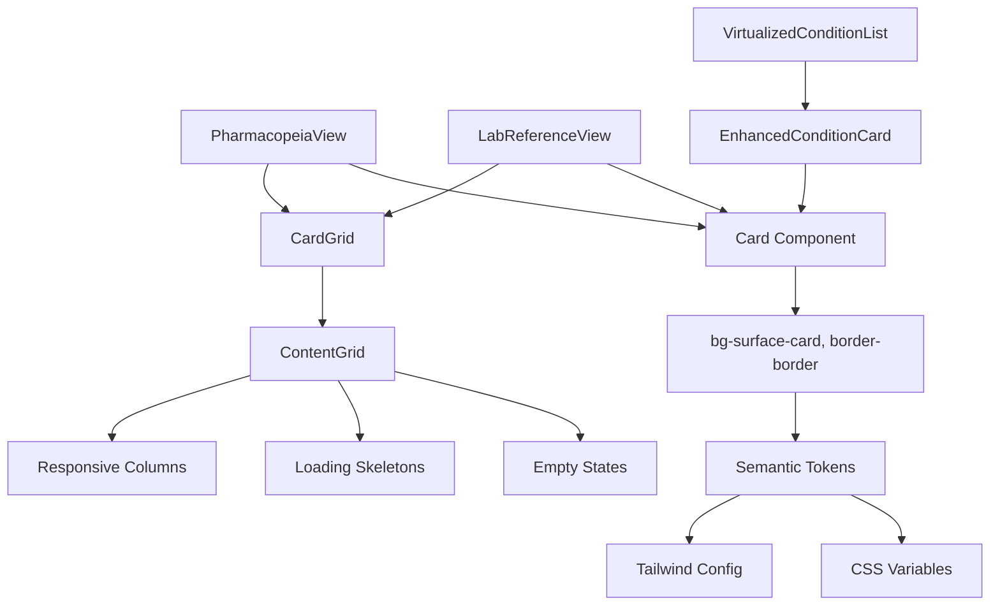

# Card-Grid Layout System Implementation Plan

**Date:** 2026-02-22  
**Author:** Roo (Architect Mode)  
**Goal:** Implement a consistent "card-grid" layout system across content-dense pages per the second recommendation of the "Site-wide Layout & Organization Audit".

## 1. Overview

We will create a unified card and grid component system that ensures visual consistency, responsiveness, and adherence to the PANaCEa semantic design token system. The plan includes:

- **Card Component Update**: Modernize the existing `Card` component to use semantic tokens.
- **CardGrid Component**: Create a wrapper around `ContentGrid` with sensible defaults for card layouts.
- **Target Component Refactoring**: Apply the new system to `VirtualizedConditionList`, `PharmacopeiaView`, and `LabReferenceView`.

## 2. Detailed Steps

### 2.1. Add Missing Semantic Token (`surface-card`)

**Problem:** The CSS variable `--color-surface-card` exists but is not exposed as a Tailwind utility or in `design-tokens.ts`.

**Actions:**
1. Add `card: 'var(--color-surface-card)'` to the `surface` object in `tailwind.config.js`.
2. Add `card: 'bg-surface-card'` to the `SURFACE` constant in `lib/design-tokens.ts`.

**Files to Modify:**
- `tailwind.config.js` (lines 167–173)
- `lib/design-tokens.ts` (add `card` property)

### 2.2. Update Card Component (`components/ui/card.tsx`)

**Current Issues:** Uses hardcoded colors (`bg-white dark:bg-slate-800`) instead of semantic tokens.

**Proposed Changes:**
- Replace background with `bg-surface-card`
- Replace border with `border-border`
- Update text colors to `text-text-primary`, `text-text-secondary` where appropriate
- Keep the same API (`Card`, `CardHeader`, `CardTitle`, `CardContent`) for backward compatibility
- Add optional `variant` prop (future extensibility) but not required for this iteration

**Example Updated Code Snippet:**
```tsx
export const Card: React.FC<CardProps> = ({ children, className = '' }) => {
  return (
    <div
      className={`bg-surface-card border border-border rounded-xl shadow-sm ${className}`}
    >
      {children}
    </div>
  );
};
```

**Verification:**
- Run `npm run typecheck` to ensure no TypeScript errors.
- Verify that existing usages (e.g., `TopicMasteryBreakdown`) still render correctly.

### 2.3. Create CardGrid Wrapper (`components/ui/layouts/CardGrid.tsx`)

**Rationale:** Provide a consistent grid layout for cards with responsive column defaults.

**Implementation:**
- Create a new file `components/ui/layouts/CardGrid.tsx`
- Re‑export `ContentGrid` with default props:
  ```tsx
  import { ContentGrid, ContentGridProps } from './ContentGrid';

  export const CardGrid: React.FC<ContentGridProps> = (props) => (
    <ContentGrid
      columns={{ default: 1, md: 2, lg: 3 }}
      gap={6}
      {...props}
    />
  );

  // Optional: re‑export ContentGridHeader as CardGridHeader
  export { ContentGridHeader as CardGridHeader };
  ```

**Benefits:**
- Consistent column breakpoints across all card‑based pages.
- Retains all features of `ContentGrid` (loading skeletons, empty states, animations).

### 2.4. Refactor PharmacopeiaView

**Current State:** Displays drugs as a vertical list (`<ul>`) inside a single container.

**Desired State:** A responsive grid of drug cards, each card showing:
- Generic name (bold)
- Brand name (if present)
- Drug class(es)

**Actions:**
1. Create a `DrugCard` component (or inline) using the updated `Card` component.
2. Replace the `<ul>` with `<CardGrid>`.
3. Map each drug to a card.
4. Update styling to match semantic tokens (background, border, text).

**File:** `components/knowledge/PharmacopeiaView.tsx`

**Considerations:** The drug list is currently static; the grid will improve scanability.

### 2.5. Refactor LabReferenceView

**Current State:** Vertical list of expandable lab‑test cards (each card is a `<div>` with custom styling).

**Desired State:** Responsive grid (2 columns on desktop, 1 column on mobile) of expandable cards.

**Actions:**
1. Wrap the list of lab cards with `<CardGrid columns={{ default: 1, md: 2 }}>`.
2. Keep the existing expandable card structure but replace the outer `<div>` with the updated `Card` component (or keep custom styling but ensure it uses semantic tokens).
3. Ensure the expand/collapse functionality remains intact.

**File:** `components/knowledge/LabReferenceView.tsx`

**Note:** The card content is detailed; we may need to adjust padding and spacing to fit the grid.

### 2.6. Update VirtualizedConditionList Card Styling

**Current State:** Uses `EnhancedConditionCard` which already employs CSS variables for styling.

**Action:** Verify that `EnhancedConditionCard` uses semantic tokens (`bg-surface-card`, `border-border`). If not, update its background and border to match the new card style.

**File:** `components/library/EnhancedConditionCard.tsx`

**Important:** Do not change the virtualized grid layout; only update the card appearance.

### 2.7. Verify Consistency Across Other Pages

**Checklist:**
- `MedicalContentBrowser` already uses `ContentGrid`; confirm it works with the new tokens.
- Any other content‑dense pages that use ad‑hoc grid layouts should be evaluated for potential migration (out of scope for this task).

## 3. Component Relationships (Mermaid)



## 4. Success Criteria

- All card backgrounds and borders use semantic tokens (no hardcoded colors).
- Grid layouts are responsive (mobile‑first) and consistent across the three target pages.
- No regression in existing functionality (virtualization, expand/collapse, filtering).
- TypeScript compiles without new errors (`npm run typecheck` passes).
- Visual review confirms reduced cognitive load and improved scanability.

## 5. Risk Mitigation

- **Backward Compatibility:** The updated `Card` component changes only styling; API remains the same.
- **Performance:** `CardGrid` is a thin wrapper; no performance impact.
- **Testing:** Manual verification of each target page; consider adding snapshot tests later.

## 6. Next Steps

1. **Approve this plan** – make any adjustments before implementation.
2. **Switch to Code Mode** – execute the steps sequentially.
3. **Run type check and visual tests** after each major change.
4. **Commit and push** changes with descriptive messages.

---

**Ready for implementation?** Please review and provide approval or requested modifications.