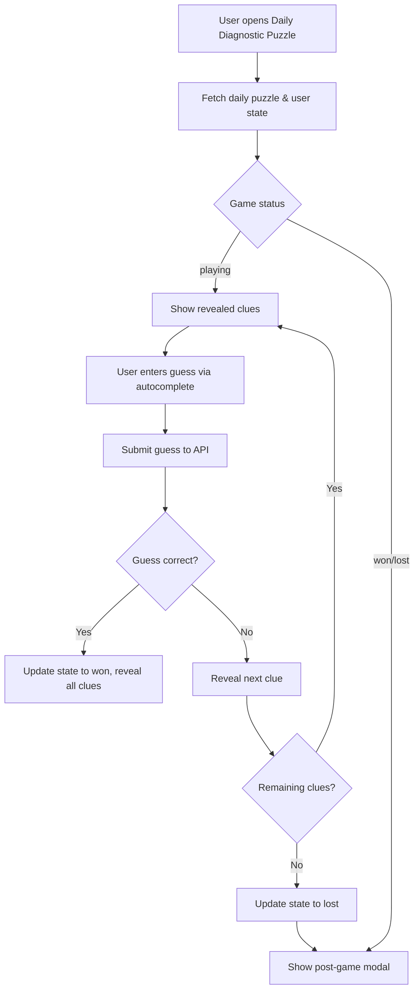

# Diagnostic Puzzle (Doctordle) Implementation Plan

## Overview
Implement a daily mini-game where PA students guess a diagnosis based on progressively revealed clinical clues. Inspired by Wordle/Doctordle, the game presents a clinical vignette broken into 5‑6 sequential clues. The user starts with only Clue 1 visible; each incorrect guess reveals the next clue. The game ends when the user guesses correctly (win) or exhausts all clues (loss). All users see the same case each day.

## Database Schema

### New Prisma Models

```prisma
model DiagnosticPuzzle {
  id          String   @id @default(cuid())
  conditionId String   // correct diagnosis (references Condition)
  clue1       String   // demographics & chief complaint
  clue2       String?  // HPI / triggers
  clue3       String?  // associated symptoms / pertinent negatives
  clue4       String?  // physical exam findings
  clue5       String?  // labs & imaging
  clue6       String?  // pathophysiology / genetics (dead giveaway)
  title       String?  // short descriptive title (e.g., “14‑year‑old boy with yellow eyes”)
  difficulty  Int?     // 1–5 (optional)
  system      String?  // denormalized organ system (from Condition.system)
  createdAt   DateTime @default(now())
  updatedAt   DateTime @updatedAt

  Condition   Condition @relation(fields: [conditionId], references: [id], onDelete: Cascade)
  DailyDiagnosticPuzzle DailyDiagnosticPuzzle[]
}

model DailyDiagnosticPuzzle {
  id        String   @id @default(cuid())
  date      DateTime @unique @db.Date   // calendar date (UTC midnight)
  puzzleId  String
  createdAt DateTime @default(now())
  updatedAt DateTime @updatedAt

  DiagnosticPuzzle DiagnosticPuzzle @relation(fields: [puzzleId], references: [id], onDelete: Cascade)
  @@index([date])
  @@index([puzzleId])
}

model UserDiagnosticPuzzleState {
  id        String       @id @default(cuid())
  userId    String
  date      DateTime     @db.Date   // same as DailyDiagnosticPuzzle.date
  guesses   String[]     @default([])  // array of condition IDs guessed (in order)
  status    WordleStatus @default(playing)  // reuse existing WordleStatus enum
  updatedAt DateTime     @updatedAt

  User      User         @relation(fields: [userId], references: [id], onDelete: Cascade)
  @@unique([userId, date])
  @@index([date])
  @@index([userId])
}
```

*Note:* The `WordleStatus` enum (`playing`, `won`, `lost`) already exists in the schema.

### Schema Migration Steps
1. Add the three models to `prisma/schema.prisma`.
2. Run `npx prisma migrate dev --name add_diagnostic_puzzle_tables`.
3. Generate the Edge Client (`npx prisma generate`).

## Backend Service (`diagnosticPuzzleService`)

Create a new service in `services/core/diagnosticPuzzleService.ts` that mirrors the patterns of `wordleService.ts`.

### Core Functions
- `getOrCreateDailyPuzzle(date: Date)` – ensures a daily puzzle exists (selects a random DiagnosticPuzzle for the date, using a deterministic seed).
- `getOrCreateUserState(userId, date)` – retrieves or creates a UserDiagnosticPuzzleState.
- `submitGuess(userId, guessConditionId, date?)` – validates the guess, updates user state, reveals next clue if incorrect, and returns updated game state.
- `buildPayload(dailyPuzzle, userState)` – assembles the client‑side payload.

### API Payload Shape
```typescript
interface DiagnosticPuzzlePayload {
  id: string;                     // DailyDiagnosticPuzzle id
  date: string;                   // ISO date (YYYY‑MM‑DD)
  puzzle: {
    id: string;
    conditionId: string;
    conditionName: string;        // from Condition table
    clues: string[];              // only revealed clues (clue1…clueN)
    totalClues: number;           // 5 or 6
  };
  userState: {
    guesses: string[];            // condition IDs guessed so far
    status: 'playing' | 'won' | 'lost';
    attemptsLeft: number;         // totalClues - guesses.length
    revealedClueCount: number;    // clues revealed (guesses.length + 1 unless won)
  };
  stats?: {
    currentStreak: number;
    maxStreak: number;
    winPercentage: number;
    guessDistribution: number[];  // histogram of wins by guess number (1‑6)
  };
}
```

## API Endpoints

Create three Cloudflare Functions under `functions/api/games/diagnostic/`:

### 1. `daily.ts` – GET `/api/games/diagnostic/daily`
Returns the daily puzzle and the current user’s state (or a fresh state). Uses `getDailyWordForUser` pattern.

### 2. `submit.ts` – POST `/api/games/diagnostic/submit`
Accepts `{ guess: string }` (condition ID) and updates the user’s game state. Returns the updated payload.

### 3. `stats.ts` – GET `/api/games/diagnostic/stats`
Returns aggregate statistics for the authenticated user (streak, win percentage, guess distribution).

All endpoints will:
- Use the shared Edge Prisma client (`createEdgePrismaClient`).
- Validate authentication (Clerk).
- Return JSON with proper error handling.

## Frontend Hook (`useDiagnosticPuzzle`)

Create a hook `src/hooks/useDiagnosticPuzzle.ts` that:
- Fetches the daily puzzle and user state on mount.
- Manages local state for guesses, revealed clues, and game status.
- Provides a `submitGuess` function that calls the submit endpoint and updates local state.
- Returns loading, error, and game state.

The hook will follow the same pattern as `useWordleGame`.

## UI Component (`DiagnosticPuzzleMode`)

New component at `components/modes/DiagnosticPuzzleMode.tsx`:

### Layout
- **Header**: “Daily Diagnostic Puzzle”, current streak, win stats.
- **Clue Stack**: Vertical list of clue cards (initially only first clue visible). Each clue card has a subtle border and background using semantic tokens (`bg-surface-card`, `border-border`).
- **Input Area**:
  - Autocomplete combobox that searches the Condition table via the existing `/api/conditions/search` endpoint.
  - Fuzzy matching, displays condition name and system.
  - “Submit Guess” button styled with the darker gold accent (`#7a6f52`).
- **Feedback**:
  - Incorrect guess: subtle shake animation + muted red text.
  - Correct guess: success animation + revealed remaining clues (optional).
- **Post‑Game Modal** (like Wordle):
  - Shows win/loss message.
  - Displays guess distribution chart (bar graph).
  - Shows streak and win percentage.
  - “Share” button (copy results to clipboard).

### Styling Compliance
- Strictly adhere to the “Stormy Slate” semantic design tokens (no hex colors except the approved gold accent).
- Use `bg-surface-primary`, `bg-surface-card`, `text-action-primary`, etc.
- Ensure responsive layout.

## Autocomplete for Condition Search

Leverage the existing condition search endpoint (`/api/conditions/search`). Wrap it in a reusable `ConditionSearchCombobox` component that can be used elsewhere.

## Integration with Training Modes

1. Add a new entry in `config/training-modes.ts`:
   ```typescript
   {
     id: 'diagnostic-puzzle',
     name: 'Daily Diagnostic Puzzle',
     description: 'Guess the diagnosis from progressive clinical clues',
     icon: Puzzle,
     color: 'from-data-pass to-data-pass/70',
     route: '/drill/diagnostic-puzzle',
     isAvailable: true,
   }
   ```
2. Add a lazy‑loaded route in `routes/index.tsx` (or the existing routing structure).
3. Update the DrillHub page to include the new mode.

## Seed Data

Create a seed script (`prisma/seed-diagnostic-puzzles.ts`) that:
- Selects a set of high‑yield PANCE conditions (from the Condition table).
- For each condition, generates a plausible 5‑6 clue vignette (using the existing AI generation pipeline or manual curation).
- Inserts DiagnosticPuzzle records linked to the condition.

We can start with 30‑50 puzzles to ensure a month of unique daily cases.

## Testing

- **Unit tests** for `diagnosticPuzzleService` (Vitest).
- **Component tests** for `DiagnosticPuzzleMode` (React Testing Library).
- **E2E test** for the full game flow (Playwright).

## Deployment Checklist

- [ ] Schema migration applied to production database.
- [ ] Edge Client regenerated (`npx prisma generate`).
- [ ] API endpoints deployed (Cloudflare Pages).
- [ ] Frontend bundle includes new component.
- [ ] Seed data populated (run seed script in production).
- [ ] Verify game works end‑to‑end.

## Mermaid Diagram: Game Flow



## Next Steps

1. **Review** this plan with the team (or stakeholder).
2. **Switch to Code mode** to implement the schema migration.
3. Proceed step‑by‑step following the todo list.

---
*Last updated: 2026‑03‑08*
