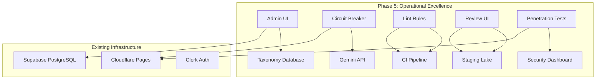

# Phase 5: Operational Excellence & Content Governance

## Overview
Following the successful completion of the "High-Fidelity Precision & Feature Expansion" strategic plan, Phase 5 focuses on operational maturity, content governance, and system resilience. This phase addresses long‑term audit recommendations and introduces foundational capabilities for scalable, maintainable, and secure platform operations.

## Strategic Goals
1. **Enable runtime content curation** – Move medical taxonomies from static registries to database‑backed admin interfaces.
2. **Enhance external API resilience** – Implement circuit‑breaker patterns to gracefully handle third‑party service failures.
3. **Enforce architectural guardrails** – Codify design‑system and database‑first principles via lint rules.
4. **Establish human‑in‑the‑loop moderation** – Provide a UI for reviewing and approving AI‑generated content in the staging lake.
5. **Strengthen security posture** – Conduct penetration testing on AI endpoints and implement findings.

## Prioritized Feature List

### 1. Admin UI for Taxonomy Curation
**Priority:** High  
**Impact:** Enables non‑developer subject‑matter experts to update medical taxonomies, ensuring content remains current with NCCPA blueprint changes.  
**Effort:** Medium (2‑3 weeks)  
**Architectural Components:**
- New `TaxonomyAdmin` React component (CRUD interface)
- Backend REST endpoints (`/api/admin/taxonomies`)
- Database tables: `MedicalTaxonomy`, `SystemMapping`, `BlueprintCategory`
- Role‑based access control (RBAC) using Clerk roles

### 2. Circuit‑Breaker Pattern for External APIs
**Priority:** High  
**Impact:** Prevents cascading failures when Gemini API or other external services become unresponsive; improves user experience with graceful degradation.  
**Effort:** Low (1 week)  
**Architectural Components:**
- `CircuitBreaker` utility class with configurable failure thresholds and backoff strategies
- Integration into `analyzeBehaviorGemini.ts` and `geminiService.ts`
- Monitoring dashboard for circuit‑breaker state (open/closed/half‑open)

### 3. Lint Rules for Semantic Tokens & Static Taxonomies
**Priority:** Medium  
**Impact:** Ensures long‑term adherence to design system (Stormy Slate) and database‑first architecture; prevents regression.  
**Effort:** Medium (2 weeks)  
**Architectural Components:**
- Custom ESLint plugin `eslint-plugin‑panacea‑tokens` that flags hard‑coded hex colors
- Custom ESLint rule `no‑static‑taxonomy` that detects inline arrays of medical content
- CI integration (fail builds on violations)
- Autofix support for common violations

### 4. Human‑Review UI for Staging‑Lake Moderation
**Priority:** Medium  
**Impact:** Guarantees quality and safety of AI‑generated questions before they enter the active pool.  
**Effort:** High (3‑4 weeks)  
**Architectural Components:**
- `StagingLakeReview` interface with side‑by‑side comparison (original prompt ↔ generated question)
- Bulk‑approve/reject workflows
- Integration with `StagingQuestion` and `Question` Prisma models
- Email notifications for reviewers

### 5. Penetration Testing on AI Endpoints
**Priority:** Medium  
**Impact:** Identifies vulnerabilities in Gemini API integration, prompt injection, and data exfiltration risks.  
**Effort:** Medium (2 weeks)  
**Architectural Components:**
- Engagement with external security firm or internal red‑team
- OWASP ASVS compliance checklist
- Remediation plan for any discovered vulnerabilities
- Continuous security scanning integration (Shift‑Left)

## Architecture Diagram

## Success Metrics
- **Taxonomy update latency** < 5 seconds for CRUD operations
- **External API failure rate** reduced by 50% with circuit‑breaker active
- **Zero new violations** of semantic‑token or static‑taxonomy rules in CI
- **Staging‑lake turnaround time** < 24 hours for human review
- **Critical vulnerabilities** resolved within 7 days of discovery

## Integration Points
- **Admin UI** integrates with existing Clerk role management (`isAdmin` flag)
- **Circuit‑breaker** integrates with existing `fetchWithTimeout` pattern in `lib/utils/fetchWithTimeout.ts`
- **Lint rules** integrate with existing ESLint configuration (`eslint.config.js`)
- **Review UI** integrates with existing `StagingQuestionService` and `QuestionService`
- **Penetration tests** integrate with existing CI/CD pipeline (blocking deployment on critical findings)

## Risks & Mitigations
| Risk | Mitigation |
|------|------------|
| Admin UI complexity may overwhelm non‑technical users | Iterative design with user testing; provide clear documentation and training |
| Circuit‑breaker false positives could block legitimate requests | Fine‑tune thresholds based on historical failure patterns; include manual override |
| Lint rules may be too restrictive, slowing development | Gradual rollout with warnings first; provide autofix scripts |
| Human‑review bottleneck if volume grows | Implement priority queues and automated pre‑screening (confidence scoring) |
| Penetration tests may uncover costly architectural changes | Budget for remediation; phase fixes over multiple sprints |

## Next Steps
1. **Approval of this plan** – Obtain stakeholder sign‑off.
2. **Detailed specification** for each feature (separate documents).
3. **Resource allocation** – Assign developers, designers, and security specialists.
4. **Sprint planning** – Break down into 2‑week sprints with clear deliverables.

## Conclusion
Phase 5 transforms PANaCEa from a feature‑rich application into a professionally managed, resilient, and scalable platform. By addressing operational and governance concerns, the project ensures long‑term sustainability while maintaining its core mission as a clinical‑grade cognitive prosthetic for PANCE certification.

---
**Prepared by:** Architect  
**Date:** 2026‑03‑02  
**Version:** 1.0