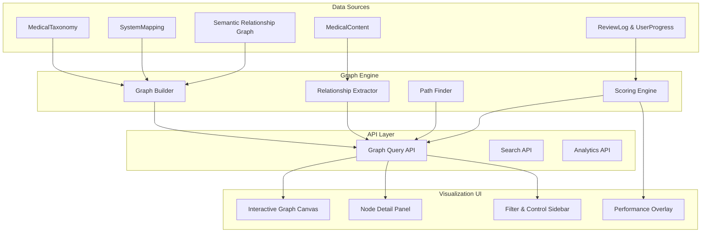

# Phase 6: Cross‑System Integration Explorer

## Overview
The **Cross‑System Integration Explorer** is an interactive graph‑based visualization tool that reveals hidden relationships between medical conditions, findings, treatments, and NCCPA blueprint systems. It allows learners and administrators to navigate the complex web of medical knowledge, discover cross‑system connections (e.g., how a Cardiovascular condition influences Pulmonary physiology), and understand the holistic clinical picture required for PANCE‑style integrative questions.

## Strategic Goals
1. **Visual Knowledge Mapping** – Render a dynamic, interactive graph where nodes represent taxonomy items (conditions, findings, drugs, procedures) and edges represent semantic or clinical relationships.
2. **Cross‑System Discovery** – Highlight connections that span multiple NCCPA blueprint categories (e.g., “Diabetes mellitus” → “Cardiovascular” + “Endocrine” + “Renal”).
3. **Clinical Integration Pathways** – Identify common “bridging” concepts that frequently appear in multi‑system vignettes.
4. **Personalized Learning Insights** – Overlay the learner’s performance data to reveal weak spots in interconnected knowledge clusters.
5. **Administrative Oversight** – Enable curriculum designers to see coverage gaps and ensure the content network reflects real‑world clinical integration.

## Architectural Principles
- **Interactive First:** The graph must be responsive, with smooth zoom/pan, node highlighting, and edge tracing.
- **Incremental Loading:** Large graphs (>10k nodes) should be loaded on‑demand; initial view focuses on a seed node and its immediate neighbors.
- **Real‑Time Querying:** Graph queries must execute within 200ms to maintain fluid interaction.
- **Extensible Relationship Model:** New relationship types (e.g., “complicates”, “treats”, “contraindicates”) can be added without schema changes.
- **Privacy‑Safe:** Learner‑specific data is only shown to that learner; aggregate analytics are anonymized.

## High‑Level Architecture



## Component Breakdown

### 1. Graph Builder
**Purpose:** Construct a property graph from relational database tables.
- **Inputs:** `MedicalTaxonomy`, `SystemMapping`, `MedicalContent`, optionally pre‑computed semantic relationships.
- **Algorithm:** Transform each taxonomy node into a graph vertex; create edges based on:
  - **Hierarchical Edges:** Parent‑child relationships within taxonomy tree.
  - **System Co‑occurrence:** Two nodes frequently appear together in the same MedicalContent item.
  - **Semantic Similarity:** Cosine similarity of embeddings above threshold.
  - **Explicit Relationships:** Manually curated relationships (future).
- **Output:** Graph representation stored in a dedicated **Neo4j** instance or as a materialized view in PostgreSQL using `ltree` and adjacency lists.

### 2. Relationship Extractor
**Purpose:** Derive implicit relationships from existing content.
- **Inputs:** MedicalContent text, structured fields (e.g., “associated findings”, “differential diagnoses”).
- **Algorithm:** Use Gemini to extract relation triples (`subject`, `predicate`, `object`) from clinical pearls; store in `SemanticRelationship` table.
- **Output:** Enriched edge set for the graph.

### 3. Path Finder
**Purpose:** Compute shortest paths, common ancestors, and connectivity metrics between nodes.
- **Algorithm:** Breadth‑first search (BFS) for unweighted graphs; Dijkstra for weighted edges (weight = 1 – similarity).
- **Use Cases:** “Show me how ‘Heart failure’ connects to ‘Renal artery stenosis’” (path length, intermediate nodes).

### 4. Scoring Engine
**Purpose:** Augment graph nodes with learner‑specific performance metrics.
- **Inputs:** `ReviewLog` accuracy, `UserProgress` stability, `FSRS` retrievability.
- **Algorithm:** Compute a “confidence score” per node (0–1) based on rolling accuracy; color‑code nodes in visualization.
- **Output:** Performance‑weighted graph with heat‑map overlay.

### 5. Graph Query API
**RESTful endpoints:**
- **`GET /api/graph/node/:id`** – Returns node details and immediate edges.
- **`POST /api/graph/expand`** – Given a set of node IDs, returns their neighbors up to depth N.
- **`POST /api/graph/path`** – Returns shortest path(s) between two nodes.
- **`GET /api/graph/search`** – Full‑text search across node labels and attributes; returns matching nodes with snippets.
- **`GET /api/graph/analytics`** – Aggregate metrics (e.g., node degree distribution, system connectivity).

### 6. Interactive Graph Canvas
**Frontend Component:** Based on **Cytoscape.js** or **Vis.js** for performant rendering of thousands of nodes.
- **Features:**
  - Zoom/pan with mouse and touch gestures.
  - Node dragging and repositioning (layout algorithms: force‑directed, hierarchical, concentric).
  - Click node to show detail panel; click edge to show relationship description.
  - Highlight sub‑graph by system (e.g., show only Cardiovascular‑related nodes).
  - Animate path tracing.

### 7. Node Detail Panel
**Side Panel:** Shows comprehensive information about a selected node:
- Taxonomy metadata (code, display name, depth).
- Assigned NCCPA system(s) and weight.
- Related MedicalContent items (with links).
- Learner performance stats (if applicable).
- Edges to other nodes (expandable).

### 8. Filter & Control Sidebar
**UI Controls:**
- **System Filter:** Toggle visibility of nodes by NCCPA blueprint category.
- **Edge Type Filter:** Show/hide hierarchical, co‑occurrence, semantic edges.
- **Performance Filter:** Only show nodes where confidence < threshold (knowledge gaps).
- **Layout Selector:** Switch between force‑directed, tree, radial layouts.
- **Search Box:** Real‑time type‑ahead search across node labels.

### 9. Performance Overlay
**Visual Layer:** Color nodes by learner’s confidence score (red = low, green = high). Optionally size nodes by importance (e.g., frequency in PANCE blueprint).

## Data Models

### GraphNode
```typescript
interface GraphNode {
  id: string;                 // e.g., "taxonomy:12345"
  type: 'CONDITION' | 'FINDING' | 'DRUG' | 'PROCEDURE' | 'SYSTEM';
  label: string;              // display name
  taxonomyCode?: string;
  systemCodes: string[];      // NCCPA system codes
  metadata: {
    depth: number;
    parentId?: string;
    contentCount: number;
    averageAccuracy?: number; // learner‑specific
    stability?: number;       // FSRS stability
  };
}
```

### GraphEdge
```typescript
interface GraphEdge {
  id: string;
  source: string;            // source node ID
  target: string;            // target node ID
  type: 'HIERARCHICAL' | 'CO_OCCURRENCE' | 'SEMANTIC' | 'EXPLICIT';
  weight: number;            // 0–1 strength
  description?: string;      // human‑readable relationship
  evidenceCount?: number;    // number of supporting content items
}
```

### GraphResponse
```typescript
interface GraphResponse {
  nodes: GraphNode[];
  edges: GraphEdge[];
  layoutHint?: 'FORCE' | 'TREE' | 'RADIAL';
  totalNodes: number;
  totalEdges: number;
}
```

## Technology Stack
- **Graph Database:** Neo4j (preferred) or PostgreSQL with `ltree`/`jsonb` (simpler).
- **Backend API:** Cloudflare Pages Functions (Edge Runtime) – query translation layer.
- **Frontend Visualization:** Cytoscape.js (industry standard for interactive graphs).
- **Search:** PostgreSQL full‑text search + Elasticsearch (optional).
- **Caching:** Cloudflare KV for storing pre‑computed graph fragments.
- **AI:** Gemini for relationship extraction (batch job).

## Implementation Phases

### Phase 6.1: Graph Foundation & Basic API (2 weeks)
- Set up Neo4j instance (or design PostgreSQL graph schema).
- Build `GraphBuilder` and `RelationshipExtractor` services.
- Implement `GET /api/graph/node/:id` and `POST /api/graph/expand`.

### Phase 6.2: Visualization Canvas & UI (2 weeks)
- Integrate Cytoscape.js into React component.
- Create `InteractiveGraphCanvas` with zoom/pan and node selection.
- Build `NodeDetailPanel` and `FilterSidebar`.

### Phase 6.3: Search & Path Finding (1.5 weeks)
- Implement full‑text search API.
- Add `PathFinder` service and `POST /api/graph/path` endpoint.
- Enhance UI with search bar and path‑highlighting.

### Phase 6.4: Performance Overlay & Integration (1 week)
- Connect `ScoringEngine` to learner data.
- Color‑code nodes by confidence.
- Add toggle for performance overlay.

### Phase 6.5: Optimization & Polish (0.5 week)
- Lazy loading of large sub‑graphs.
- Pre‑compute and cache frequent queries.
- Improve UI responsiveness on low‑end devices.

## Success Metrics
- **Engagement:** At least 30% of active users interact with the explorer at least once per week.
- **Discovery:** Users discover an average of 5 new cross‑system connections per session.
- **Performance Impact:** Learners who regularly use the explorer show a 10% improvement on multi‑system integrated questions.
- **Administrative Value:** Curriculum designers reduce content gaps by 20% after using the explorer’s coverage visualization.

## Risks & Mitigations
| Risk | Mitigation |
|------|------------|
| **Graph rendering performance** with >10k nodes | Use level‑of‑detail (LOD) rendering; load only visible region. |
| **Neo4j operational overhead** in Cloudflare Edge environment | Use PostgreSQL with recursive CTEs as a fallback; keep Neo4j as optional enhancement. |
| **Relationship extraction quality** (noisy edges) | Human‑curated validation step; confidence threshold filtering. |
| **Data privacy** (learner performance on shared graph) | Store performance data separately; only overlay for the authenticated user. |

## Open Questions
1. Should the graph support collaborative annotation (e.g., learners can add notes to nodes)?
2. Can we integrate real‑time updates when new MedicalContent is added (live graph growth)?
3. Should there be a “story mode” that walks learners through classic clinical pathways (e.g., “ACS → PCI → antiplatelet therapy”)?

---

*This document serves as the architectural blueprint for the Cross‑System Integration Explorer. All implementation must adhere to the project’s existing coding standards, security practices, and database‑first principle.*