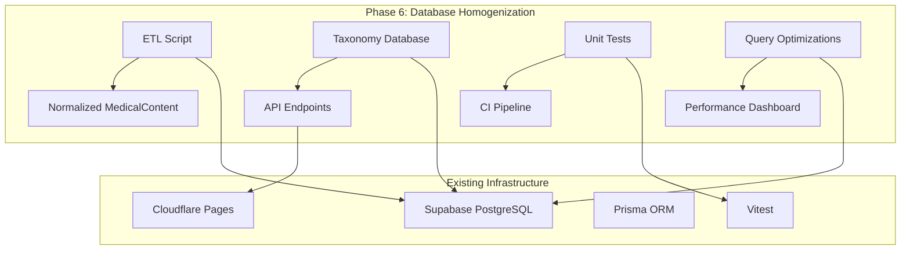

# Phase 6: Database Homogenization & Test Coverage

## Overview
Following the completion of the "High-Fidelity Precision & Feature Expansion" strategic plan (Phases 0-4) and the "Operational Excellence & Content Governance" plan (Phase 5), Phase 6 addresses the remaining **medium-priority audit findings** from the MASTER_AUDIT_CONSOLIDATED.md report. This phase focuses on two core objectives:

1. **Database Homogenization** – Migrate static medical taxonomies from frontend registries to database tables, implement JSON column normalization, and establish a single source of truth for medical content.
2. **Comprehensive Test Coverage** – Implement the prescribed unit tests for core algorithms and services, ensuring regression protection and mathematical correctness.

## Strategic Goals
1. **Eliminate static taxonomies** – Replace all `src/registries/*.ts` imports with database queries, enforcing the "database-first" architectural principle.
2. **Normalize JSON columns** – Add `normalization_version` column and run ETL to ensure consistent JSON structure across `MedicalContent` records.
3. **Achieve >90% unit test coverage** for critical FSRS, telemetry, and analytics services.
4. **Optimize query performance** with appropriate indexes (GIN on JSONB, composite indexes).
5. **Consolidate calibration‑metric queries** to reduce redundancy in analytics dashboards.

## Prioritized Feature List

### 1. JSON Column Normalization & ETL Script
**Priority:** High  
**Impact:** Ensures consistent JSON structure across all `MedicalContent` records, preventing runtime errors and simplifying content updates.  
**Effort:** Medium (1-2 weeks)  
**Architectural Components:**
- Schema migration: add `normalization_version` column to `MedicalContent` table (default `"1.0.0"`)
- ETL script: `scripts/normalize-medical-content.ts` that:
  - Reads all `MedicalContent` records
  - Transforms JSON columns (`classic_triad`, `clinical_pearls`, `age_demographic`, `differentials`, `synonyms`, `content`) to conform to Zod schemas defined in the audit
  - Updates `normalization_version` and logs changes
  - Supports dry‑run mode for validation
- Backend validation middleware: Zod schema validation on write operations

**Integration Points:**
- Prisma schema migration (`prisma migrate dev`)
- Existing `MedicalContent` API endpoints (`/api/content/`, `/api/conditions/`)
- CI/CD pipeline: run ETL script in dry‑run mode before deployment

### 2. Static Taxonomy Migration
**Priority:** High  
**Impact:** Removes technical debt of hard‑coded medical taxonomies; enables runtime updates via admin UI (Phase 5).  
**Effort:** High (2-3 weeks)  
**Architectural Components:**

#### Database Tables (new)
```prisma
model MedicalTaxonomy {
  id          String   @id @default(cuid())
  code        String   @unique  // e.g., "CVS", "PUL"
  name        String   // e.g., "Cardiovascular System"
  description String?
  weight      Float    // PANCE blueprint weight (e.g., 0.11 for 11%)
  isActive    Boolean  @default(true)
  createdAt   DateTime @default(now())
  updatedAt   DateTime

  @@index([code])
}

model SystemMapping {
  id               String   @id @default(cuid())
  taxonomyCode     String
  subcategory      String   // e.g., "Arrhythmias", "Heart Failure"
  canonicalName    String
  aliases          String[]
  searchKeywords   String[]
  parentCategory   String?
  blueprintTags    String[]
  createdAt        DateTime @default(now())
  updatedAt        DateTime

  @@index([taxonomyCode, subcategory])
  @@index([canonicalName])
  @@fulltext([searchKeywords])
}
```

#### Migration Steps
1. Create tables via Prisma migration
2. Seed initial data from existing registries:
   - `src/registries/anatomyRegistry.ts`
   - `src/registries/differentialRegistry.ts`
   - `src/registries/drugRegistry.ts`
   - `src/registries/findingRegistry.ts`
   - `src/registries/imagingRegistry.ts`
   - `src/registries/labTestRegistry.ts`
   - `src/registries/physiologyRegistry.ts`
   - `src/registries/scoringSystemRegistry.ts`
   - `src/registries/specialTestRegistry.ts`
   - `src/registries/surgeryRegistry.ts`
   - `src/registries/symptomRegistry.ts`
   - `src/registries/treatmentRegistry.ts`
3. Update frontend imports to query database via new API endpoints:
   - `/api/taxonomies` (GET, POST, PUT, DELETE)
   - `/api/taxonomies/search` (full‑text search)
4. Update `config/rotation‑systems.ts`, `config/organ‑characters.ts`, and other config files to fetch from database at runtime (with caching).

### 3. Unit Test Implementation
**Priority:** Medium  
**Impact:** Ensures correctness of core algorithms and prevents regression.  
**Effort:** Medium (2 weeks)  
**Test Targets:**

| Service/Module | Test File | Coverage Goal |
|----------------|-----------|---------------|
| `drillReviewService` | `plans/drillReviewService.test.ts` (already exists) → move to `tests/services/drillReviewService.test.ts` | 95% |
| `rolling360Service` | `tests/services/rolling360Service.test.ts` | 90% |
| CoVe (Chain of Verification) pipeline | `tests/services/coveService.test.ts` | 85% |
| `deriveContinuousRating` | `lib/implicit‑metrics.test.ts` (extend existing) | 95% |
| `translateContinuousToDiscrete` (FSRS optimizer bridge) | `lib/fsrs‑optimizer‑bridge.test.ts` | 90% |
| `getCircadianPhase` | `lib/utils/timeUtils.test.ts` | 100% |
| `learningCurveService` | `tests/services/learningCurveService.test.ts` | 85% |

**Testing Strategy:**
- Use Vitest with `@edge‑runtime/vitest` for Edge Function compatibility
- Mock external dependencies (Prisma, Gemini API)
- Include edge cases: rapid‑guess handling, empty datasets, API failures
- Integrate into CI pipeline (fail on < 80% coverage for critical modules)

### 4. Query Consolidation & Indexing
**Priority:** Medium  
**Impact:** Improves analytics dashboard performance and reduces database load.  
**Effort:** Low (1 week)  
**Architectural Components:**
- **GIN index** on `MedicalContent.content` JSONB column for efficient JSON path queries
- **Consolidated calibration‑metric queries** in `rolling360Service`:
  - Replace multiple ad‑-hoc queries with a single optimized query that returns all needed metrics (`rollingAccuracy`, `rollingStability`, `rollingRetrievability`)
  - Cache results for 5 minutes (Redis or in‑memory cache)
- **Dashboard query optimization**:
  - Implement pagination for large datasets (e.g., review history)
  - Use materialized views for frequently aggregated data (e.g., daily performance)

### 5. Frontend Registry Removal
**Priority:** Medium  
**Impact:** Completes the migration to database‑first architecture.  
**Effort:** Medium (1-2 weeks)  
**Steps:**
1. Update all import statements from `src/registries/*` to use new API hooks
2. Create React hooks for taxonomy data:
   - `useMedicalTaxonomies()` – fetches system list with weights
   - `useSystemMapping(systemCode)` – fetches subcategories and aliases
   - `useTaxonomySearch(query)` – performs full‑text search
3. Implement client‑side caching with React Query to minimize network requests
4. Remove `src/registries/` directory (or keep as deprecated fallback during transition)

## Architecture Diagram


## Success Metrics
- **Normalization coverage:** 100% of `MedicalContent` records have `normalization_version = "1.0.0"`
- **Taxonomy migration:** Zero static registry imports in frontend codebase (verified via ESLint rule)
- **Test coverage:** >90% for `drillReviewService`, `rolling360Service`, `deriveContinuousRating`
- **Query performance:** Filtered queries (`status + system`) < 50 ms; JSONB path queries < 100 ms
- **Dashboard load time:** < 2 seconds for rolling‑360 metrics

## Risks & Mitigations
| Risk | Mitigation |
|------|------------|
| ETL script may corrupt existing data | Implement dry‑run mode with detailed diff output; run on staging database first |
| Frontend performance degradation due to network requests for taxonomies | Client‑side caching (React Query) with stale‑while‑revalidate; bundle critical taxonomies in initial load |
| Unit test maintenance burden | Focus on integration tests for critical paths only; use snapshot testing for stable outputs |
| Database migration downtime | Use zero‑downtime migration patterns (add columns nullable, backfill, then enforce constraints) |

## Integration with Phase 5 (Operational Excellence)
- **Admin UI** (Phase 5.1) will consume the new `MedicalTaxonomy` and `SystemMapping` tables for CRUD operations.
- **Lint rules** (Phase 5.3) will be extended to flag any remaining static taxonomy arrays.
- **Circuit‑breaker pattern** (Phase 5.2) will protect taxonomy API endpoints from overload.

## Timeline & Resource Allocation
| Feature | Estimated Effort | Owner |
|---------|-----------------|-------|
| JSON Normalization & ETL | 1‑2 weeks | Backend Engineer |
| Static Taxonomy Migration | 2‑3 weeks | Full‑stack Engineer |
| Unit Test Implementation | 2 weeks | QA Engineer |
| Query Consolidation & Indexing | 1 week | Database Admin |
| Frontend Registry Removal | 1‑2 weeks | Frontend Engineer |

**Total estimated duration:** 4‑6 weeks (parallelizable across teams)

## Next Steps
1. **Approval of this plan** – Obtain stakeholder sign‑off.
2. **Detailed specification** for each sub‑feature (separate documents).
3. **Resource allocation** – Assign engineers, database admin, and QA specialist.
4. **Sprint planning** – Break down into 2‑week sprints with clear deliverables.

## Conclusion
Phase 6 completes the audit‑prescribed remediation for database homogenization and test coverage, eliminating technical debt and establishing a robust, maintainable data architecture. This phase ensures that PANaCEa's medical content is consistently structured, query‑optimized, and thoroughly validated—critical for its evolution from a prototype to a clinical‑grade certification platform.

---
**Prepared by:** Architect  
**Date:** 2026‑03‑02  
**Version:** 1.0