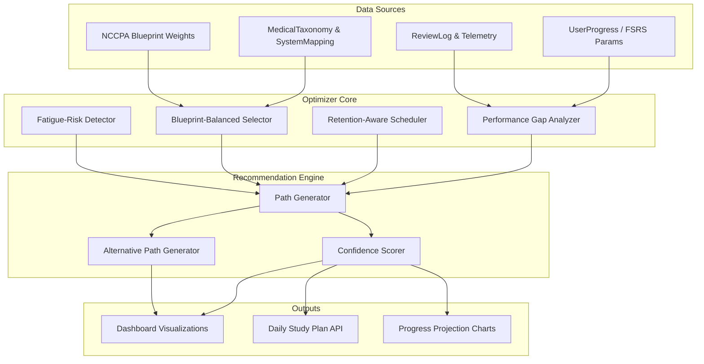

# Phase 6: Dynamic Study Path Optimizer

## Overview
The **Dynamic Study Path Optimizer** is a personalized recommendation engine that analyzes a learner’s performance, retention, and engagement telemetry to propose the most effective next study actions. It leverages the existing FSRS v6 memory model, NCCPA blueprint weights, and real‑time behavioral data to create adaptive, goal‑driven study plans that maximize knowledge retention while minimizing cognitive overload.

## Strategic Goals
1. **Personalized Learning Paths** – Generate daily/weekly study recommendations based on individual performance gaps, desired exam date, and target retention rates.
2. **Blue‑Green Deployment** – Allow learners to switch between an “optimized” path (algorithm‑driven) and a “manual” path (self‑selected) with seamless transition.
3. **Integration with Existing SRS** – Respect FSRS stability and retrievability calculations; never override core SRS scheduling.
4. **Visual Progress Dashboard** – Provide clear, actionable visualizations of the recommended path, projected outcomes, and confidence intervals.
5. **Continuous Feedback Loop** – Use post‑session telemetry to refine future recommendations (reinforcement learning).

## Architectural Principles
- **Learner‑First Design:** Recommendations must be explainable, adjustable, and never feel like a “black box.”
- **Non‑Destructive:** The optimizer does not alter the underlying SRS schedule; it merely suggests additional or alternative study sessions.
- **Scalable:** The recommendation engine must handle thousands of concurrent learners with sub‑second latency.
- **Extensible:** The algorithm can be extended with new signals (e.g., time‑of‑day performance, fatigue metrics) without architectural changes.

## High‑Level Architecture



## Component Breakdown

### 1. Performance Gap Analyzer
**Purpose:** Identify which organ systems/topics have the largest deviation between target and actual performance.
- **Inputs:** `UserProgress.fsrsParams`, `ReviewLog` (filtered by `session_type = 'MAIN'`), `MedicalTaxonomy` mapping.
- **Algorithm:** Compute rolling accuracy (last 200 reviews) per taxonomy node; compare against target retention (default 0.90). Sort gaps by magnitude.
- **Output:** List of `{ taxonomyCode, subcategory, currentAccuracy, targetAccuracy, gap }`.

### 2. Retention‑Aware Scheduler
**Purpose:** Determine the optimal inter‑study interval for each gap item, respecting FSRS stability and retrievability.
- **Inputs:** FSRS parameters (`w[0..20]`), current stability (`S`), desired retention (`R_target`).
- **Algorithm:** Solve for `t` where `R(t) ≈ R_target` using the FSRS v6 retrievability formula. Recommend reviewing when `R` falls below `R_target - tolerance`.
- **Output:** `{ taxonomyCode, recommendedReviewDate, urgencyScore }`.

### 3. Blueprint‑Balanced Selector
**Purpose:** Ensure the recommended study mix respects NCCPA blueprint weights (e.g., Cardiovascular 11%, Pulmonary 9%).
- **Inputs:** NCCPA weight mapping (`lib/constants/blueprint.ts`), current distribution of upcoming reviews.
- **Algorithm:** Apply a “zipper sort” that interleaves high‑gap topics with under‑represented blueprint categories.
- **Output:** Weight‑adjusted priority ordering.

### 4. Fatigue‑Risk Detector
**Purpose:** Prevent cognitive overload by monitoring recent study volume and performance degradation.
- **Inputs:** `ReviewLog.duration_ms`, `ReviewLog.telemetry_json.hesitation_index`, session frequency.
- **Algorithm:** If average `hesitation_index` increases over last 5 sessions and total study time > 2 hours, inject a “light review” day.
- **Output:** `fatigueRiskLevel` (LOW, MEDIUM, HIGH) and optional pacing recommendation.

### 5. Path Generator
**Purpose:** Combine all signals into a coherent daily/weekly study plan.
- **Inputs:** Outputs from components 1‑4, user‑defined constraints (e.g., “30 minutes per day”, “exam in 60 days”).
- **Algorithm:** Knapsack‑style optimization that maximizes total gap reduction while respecting time limits and blueprint balance.
- **Output:** `StudyPlan` object containing `{ date, sessions[], estimatedDuration, confidenceScore }`.

### 6. Confidence Scorer
**Purpose:** Quantify the reliability of each recommendation (based on data density and model certainty).
- **Inputs:** Number of reviews per topic (`N`), variance of accuracy, time since last review.
- **Algorithm:** Bayesian confidence interval; if `N < 60` return low confidence and recommend calibration exercises.
- **Output:** `confidence` (0‑1) and `recommendationFlags` (e.g., “NEEDS_MORE_DATA”).

## Data Models

### StudyPlan
```typescript
interface StudyPlan {
  id: string;
  userId: string;
  generatedAt: Date;
  validUntil: Date;
  sessions: StudySession[];
  totalEstimatedMinutes: number;
  confidence: number;
  metadata: {
    blueprintCoverage: Record<string, number>; // system -> percentage
    projectedRetentionIncrease: number;
    fatigueRisk: 'LOW' | 'MEDIUM' | 'HIGH';
  };
}

interface StudySession {
  id: string;
  date: Date;
  topics: Array<{
    taxonomyCode: string;
    subcategory?: string;
    recommendedAction: 'REVIEW' | 'NEW' | 'CALIBRATE';
    estimatedMinutes: number;
    urgencyScore: number;
  }>;
  notes?: string;
}
```

### Recommendation API Response
```typescript
interface RecommendationResponse {
  plan: StudyPlan;
  alternatives: StudyPlan[]; // up to 3 alternative plans (e.g., “aggressive”, “light”, “balanced”)
  rationale: string; // human‑readable explanation of why this plan was generated
  confidence: number;
  canRegenerate: boolean;
}
```

## Integration Points

### With Existing Services
| Service | Integration Purpose |
|---------|---------------------|
| `FSRS v6 Engine` (`lib/fsrs.ts`) | Retrieve current stability & retrievability for each card; compute optimal review intervals. |
| `ReviewLog` table | Fetch performance history and telemetry for gap analysis. |
| `MedicalTaxonomy` & `SystemMapping` | Map review items to NCCPA blueprint categories. |
| `UserProgress` table | Obtain FSRS parameters and current session preferences. |
| `Telemetry Collector` (`hooks/useResponseTelemetry.ts`) | Gather hesitation, dwell‑time, and rapid‑guess signals for fatigue detection. |

### New API Endpoints
1. **`GET /api/study‑path/recommendation`** – Returns the primary recommended study plan for the authenticated user.
2. **`POST /api/study‑path/regenerate`** – Creates a new plan with optional constraints (e.g., “focus on Cardiovascular”, “limit to 20 minutes”).
3. **`GET /api/study‑path/progress`** – Projects future performance if the current plan is followed (simulation).
4. **`PUT /api/study‑path/accept`** – Marks a plan as “accepted” and logs it for later comparison.

### UI Components
- **`StudyPathDashboard`** – Overview of the current plan with calendar view, confidence indicators, and blueprint coverage pie chart.
- **`PlanAlternativesModal`** – Side‑by‑side comparison of alternative plans with toggle to switch.
- **`ProgressProjectionChart`** – Line chart showing projected retention and accuracy over the next 30 days.
- **`FatigueAlertBanner`** – Warns the learner when risk of burnout is detected.

## Technology Stack
- **Backend:** Cloudflare Pages Functions (Edge Runtime) – same as existing API pattern.
- **Database:** Supabase (PostgreSQL) via Prisma Edge Client.
- **Caching:** Cloudflare KV for storing generated plans (TTL = 24 hours) to avoid recomputation.
- **Real‑time Updates:** Supabase Realtime for live plan updates (optional).
- **Visualizations:** Recharts (already in project) for charts; `react‑calendar` for schedule view.

## Implementation Phases

### Phase 6.1: Core Analysis Engine (2 weeks)
- Implement `PerformanceGapAnalyzer` and `RetentionAwareScheduler` as standalone services.
- Write unit tests with synthetic data.
- Expose a simple `GET /api/study‑path/debug` endpoint that returns raw gap analysis.

### Phase 6.2: Path Generation & API (2 weeks)
- Build `PathGenerator` and `ConfidenceScorer`.
- Create the three main API endpoints.
- Add Cloudflare KV caching layer.

### Phase 6.3: Dashboard UI (1.5 weeks)
- Create `StudyPathDashboard` and `ProgressProjectionChart`.
- Integrate with existing navigation (Command Center Hub).
- Add user‑controls for adjusting constraints.

### Phase 6.4: Fatigue Detection & Advanced Signals (1 week)
- Implement `FatigueRiskDetector` using telemetry data.
- Extend recommendation algorithm with time‑of‑day and weekly rhythm preferences.

### Phase 6.5: Validation & A/B Testing (1 week)
- Deploy behind a feature flag.
- Run a 30‑day A/B test with a cohort of beta users.
- Collect feedback and refine weights.

## Success Metrics
- **Adoption Rate:** > 70% of active users interact with the optimizer at least once per week.
- **Plan Compliance:** Users who follow recommended plans achieve 15% higher retention than self‑directed study.
- **Fatigue Reduction:** Decrease in session abandonment rate during high‑fatigue periods.
- **Blueprint Balance:** Recommended sessions stay within ±2% of NCCPA target weights.

## Risks & Mitigations
| Risk | Mitigation |
|------|------------|
| **Algorithmic bias** toward high‑data topics | Use Bayesian priors that favor under‑sampled topics when confidence is low. |
| **Performance overhead** of real‑time computation | Cache results per user for 24 hours; pre‑compute overnight for heavy users. |
| **User rejection** of “prescriptive” recommendations | Always offer alternatives and allow manual overrides; explain rationale. |
| **Data sparsity** for new users | Fall back to a “calibration plan” that quickly samples all blueprint categories. |

## Open Questions
1. Should the optimizer consider “mood” or self‑reported energy levels (future integration with wearables)?
2. How to handle learners who are preparing for multiple exams (e.g., PANCE + PANRE‑LA) concurrently?
3. Should the optimizer be exposed as a standalone API for third‑party integration (e.g., LMS platforms)?

---

*This document serves as the architectural blueprint for the Dynamic Study Path Optimizer. All implementation must adhere to the project’s existing coding standards, security practices, and database‑first principle.*