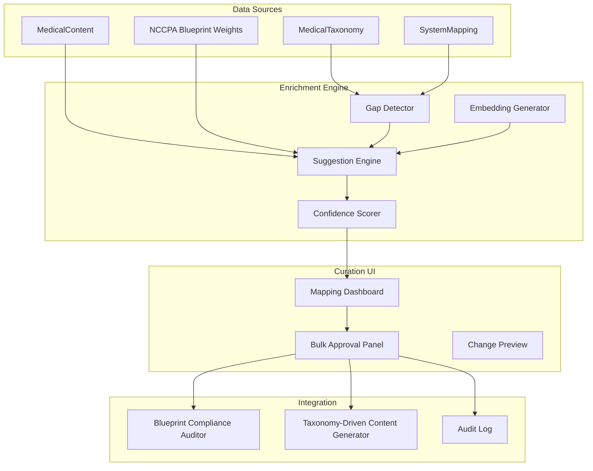

# Phase 6: System Mapping Enrichment Assistant

## Overview
The **System Mapping Enrichment Assistant** is an AI‑powered curation tool that helps administrators discover, validate, and refine the relationships between medical taxonomies and the NCCPA blueprint. It identifies unmapped taxonomy nodes, suggests plausible system assignments using semantic similarity, and provides a streamlined UI for bulk approval—ensuring the content‑generation and compliance‑auditing systems have complete, accurate mapping coverage.

## Strategic Goals
1. **Close Mapping Gaps** – Detect taxonomy nodes (conditions, findings, procedures) that are not yet linked to any NCCPA blueprint system.
2. **AI‑Driven Suggestions** – Use Gemini embeddings and keyword matching to propose likely system assignments with confidence scores.
3. **Human‑in‑the‑Loop Curation** – Provide an intuitive dashboard where administrators can review, approve, or reject suggestions, with optional manual overrides.
4. **Integration with Existing Content** – Enrichment suggestions consider existing MedicalContent items and their associated taxonomy codes to avoid contradictory mappings.
5. **Audit Trail** – Log all mapping changes with timestamps, user IDs, and rationale for future reference.

## Architectural Principles
- **Non‑Destructive:** The assistant never auto‑modifies production mappings without explicit approval.
- **Explainable:** Every suggestion includes a clear reason (e.g., “80% of similar content is already mapped to Cardiovascular”).
- **Incremental:** The tool can process the entire taxonomy in batches, resuming where it left off.
- **Real‑Time Feedback:** Administrators see immediate impact of mapping changes on blueprint coverage and compliance scores.

## High‑Level Architecture



## Component Breakdown

### 1. Gap Detector
**Purpose:** Identify taxonomy nodes that have no corresponding entry in the `SystemMapping` table.
- **Inputs:** `MedicalTaxonomy` (full tree), `SystemMapping` (existing mappings).
- **Algorithm:** Recursive traversal of taxonomy tree; flag any node where `taxonomyCode` not present in `SystemMapping.taxonomyCode`.
- **Output:** List of `{ taxonomyCode, displayName, depth, parentCode }` with missing mappings.

### 2. Embedding Generator
**Purpose:** Convert taxonomy display names and descriptions into semantic vectors for similarity comparison.
- **Inputs:** Taxonomy node text, optionally related MedicalContent snippets.
- **Algorithm:** Call Gemini `embedding‑001` model via `GoogleGenerativeAI`; cache results in a temporary `TaxonomyEmbedding` table.
- **Output:** Vector embeddings (float array) stored per taxonomy node.

### 3. Suggestion Engine
**Purpose:** Propose plausible NCCPA system assignments for unmapped taxonomy nodes.
- **Inputs:** Embeddings of unmapped nodes, embeddings of already‑mapped nodes, NCCPA blueprint category descriptions.
- **Algorithm:** Cosine similarity between unmapped node embedding and each blueprint category’s centroid embedding; also consider keyword overlap (e.g., “cardio” → Cardiovascular).
- **Output:** For each unmapped node: `{ taxonomyCode, suggestedSystemCode, confidence, reason, alternativeSystems[] }`.

### 4. Confidence Scorer
**Purpose:** Quantify reliability of each suggestion.
- **Inputs:** Similarity score, number of existing mappings in the same branch, consistency with sibling nodes.
- **Algorithm:** Weighted combination of factors; produce a 0–1 score. Flag low‑confidence suggestions (<0.6) for manual review.
- **Output:** `confidence` (0–1), `flags` (e.g., “CONFLICT_WITH_SIBLING”, “LOW_SIMILARITY”).

### 5. Mapping Dashboard
**Purpose:** Administrative UI to review and act on suggestions.
- **Features:** 
  - **Summary Cards:** Total unmapped nodes, high‑confidence suggestions, pending approvals.
  - **Filterable Table:** Columns: taxonomy code, display name, suggested system, confidence, reason, actions (Approve/Reject/Ignore).
  - **Bulk Operations:** Select multiple rows and approve/reject in one click.
  - **Change Preview:** Before approving, show how the new mapping will affect blueprint coverage and compliance scores.
  - **Audit Log:** Tab showing historically approved/rejected mappings.

### 6. Bulk Approval Panel
**Purpose:** Streamline mass acceptance of high‑confidence suggestions.
- **Algorithm:** Group suggestions by confidence threshold; allow “Approve All with confidence > 0.8”.
- **Integration:** After approval, insert rows into `SystemMapping` table with `approvedBy` and `approvedAt` fields.

### 7. Change Preview
**Purpose:** Simulate the impact of proposed mappings on the blueprint compliance dashboard.
- **Implementation:** Call the existing `Blueprint Compliance Auditor` service with the temporary mapping set; display side‑by‑side comparison of coverage percentages.

## Data Models

### Suggestion
```typescript
interface MappingSuggestion {
  id: string;
  taxonomyCode: string;
  displayName: string;
  suggestedSystemCode: string; // e.g., "CV", "PUL"
  confidence: number;
  reason: string; // human‑readable explanation
  alternativeSystems: Array<{
    systemCode: string;
    confidence: number;
    reason: string;
  }>;
  createdAt: Date;
  status: 'PENDING' | 'APPROVED' | 'REJECTED' | 'IGNORED';
  reviewedBy?: string;
  reviewedAt?: Date;
}
```

### Audit Log Entry
```typescript
interface MappingAuditLog {
  id: string;
  taxonomyCode: string;
  systemCode: string;
  action: 'APPROVE' | 'REJECT' | 'IGNORE' | 'MANUAL_ADD' | 'MANUAL_REMOVE';
  userId: string;
  timestamp: Date;
  rationale?: string;
  previousSystemCode?: string;
}
```

## Integration Points

### With Existing Services
| Service | Integration Purpose |
|---------|---------------------|
| `MedicalTaxonomy` table | Source of unmapped taxonomy nodes. |
| `SystemMapping` table | Target for new approved mappings; also used to detect gaps. |
| `Blueprint Compliance Auditor` | Preview impact of mapping changes on coverage percentages. |
| `Taxonomy‑Driven Content Generator` | Ensure newly mapped nodes are considered for question generation. |
| `Gemini API` (`services/ai/geminiService.ts`) | Generate embeddings and optionally refine suggestions with LLM reasoning. |

### New API Endpoints
1. **`GET /api/mapping‑enrichment/gaps`** – Returns paginated list of unmapped taxonomy nodes.
2. **`POST /api/mapping‑enrichment/suggest`** – Triggers batch suggestion generation for a list of taxonomy codes (async).
3. **`GET /api/mapping‑enrichment/suggestions`** – Retrieves pending suggestions with filters.
4. **`PUT /api/mapping‑enrichment/suggestions/:id`** – Approve/reject a single suggestion.
5. **`POST /api/mapping‑enrichment/bulk‑approve`** – Bulk approve/reject based on confidence threshold.
6. **`GET /api/mapping‑enrichment/preview`** – Simulate coverage impact of a set of proposed mappings.

### UI Components
- **`MappingEnrichmentDashboard`** – Main dashboard with summary cards and suggestion table.
- **`SuggestionTable`** – Interactive table with sorting, filtering, and row selection.
- **`ConfidenceBadge`** – Visual badge showing confidence score (color‑coded).
- **`ChangePreviewModal`** – Modal showing before/after blueprint coverage charts.
- **`BulkApprovalPanel`** – Side panel for mass actions with confidence slider.

## Technology Stack
- **Backend:** Cloudflare Pages Functions (Edge Runtime) – same pattern as existing APIs.
- **Database:** Supabase (PostgreSQL) – new tables: `MappingSuggestion`, `MappingAuditLog`, `TaxonomyEmbedding` (optional caching).
- **AI:** Gemini `embedding‑001` for semantic similarity; optionally `gemini‑1.5‑pro` for reasoning.
- **Caching:** Cloudflare KV for storing embedding vectors (TTL = 7 days) to avoid repeated API calls.
- **Frontend:** React 19, SWR for data fetching, Recharts for coverage preview.

## Implementation Phases

### Phase 6.1: Gap Detection & Suggestion Engine (2 weeks)
- Build `GapDetector` and `SuggestionEngine` services.
- Implement embedding generation with Gemini and cosine‑similarity calculation.
- Create `GET /api/mapping‑enrichment/gaps` and `POST /api/mapping‑enrichment/suggest` endpoints.

### Phase 6.2: Curation UI & Bulk Operations (1.5 weeks)
- Develop `MappingEnrichmentDashboard` and `SuggestionTable`.
- Add bulk‑approval API and UI.
- Integrate with existing `SystemMapping` table for writes.

### Phase 6.3: Change Preview & Integration (1 week)
- Build `ChangePreviewModal` that calls the Blueprint Compliance Auditor.
- Add audit‑log table and logging middleware.
- Connect to Taxonomy‑Driven Content Generator to refresh its internal cache after mapping changes.

### Phase 6.4: Optimization & Polish (0.5 week)
- Add background job for periodic gap detection (weekly).
- Improve suggestion quality by incorporating MedicalContent context.
- Performance tuning for large taxonomies (batch processing, pagination).

## Success Metrics
- **Coverage Increase:** Reduce unmapped taxonomy nodes by > 90% within one month of deployment.
- **Administrator Efficiency:** Cut manual mapping time by at least 70% compared to spreadsheet‑based curation.
- **Suggestion Accuracy:** > 85% of approved suggestions match expert manual assignment (measured via random sample audit).
- **System Usage:** At least 50% of suggestions approved via bulk‑approval panel (indicating high trust in automation).

## Risks & Mitigations
| Risk | Mitigation |
|------|------------|
| **Embedding API latency/cost** | Cache embeddings aggressively; limit to taxonomy nodes missing mappings. |
| **Low‑confidence suggestions overwhelm admins** | Default UI filters to show only confidence > 0.7; allow adjustable threshold. |
| **Mapping conflicts with existing content** | Preview shows conflicts and allows admins to review before approval. |
| **Taxonomy changes (new nodes) not detected** | Scheduled weekly gap‑detection job; webhook from taxonomy‑admin UI. |

## Open Questions
1. Should the assistant also propose *removing* outdated mappings (e.g., when taxonomy node meaning changes)?
2. Could we integrate with external medical ontologies (SNOMED, MeSH) to improve suggestion accuracy?
3. Should mapping suggestions be shared across multiple institutions (federated learning) while preserving privacy?

---

*This document serves as the architectural blueprint for the System Mapping Enrichment Assistant. All implementation must adhere to the project’s existing coding standards, security practices, and database‑first principle.*