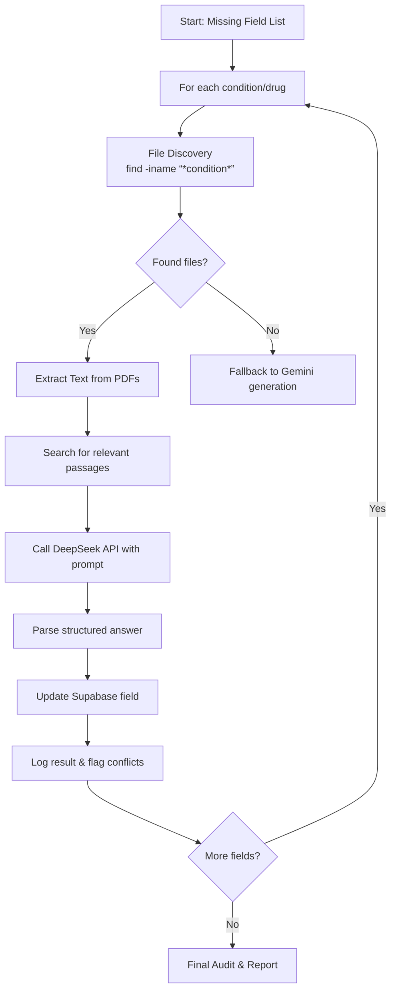

# Targeted RAG Enrichment Plan for Medical Library Integration

**Date:** 2026-03-09  
**Author:** Roo (Architect)  
**Objective:** Fill missing fields in MedicalContent and Drug tables using the 600GB medical library via a targeted Retrieval-Augmented Generation (RAG) pipeline.

---

## 1. Overview

The PANaCEa database currently has several “loose ends” – missing critical fields such as `gold_standard_dx`, `first_line_rx`, `mechanismOfAction`, etc. – that degrade the user experience and limit the system’s clinical accuracy. The existing content‑enrichment system uses Gemini AI to generate missing content, but this approach lacks grounding in authoritative medical literature.

This plan proposes a **targeted RAG enrichment pipeline** that:

1. **Discovers** relevant textbooks/PDFs from the 600GB local Google Drive library by matching filenames to condition/drug names.
2. **Extracts** pertinent text segments using PDF parsing and a lightweight search‑within‑document step.
3. **Queries** the DeepSeek API (or another LLM) to extract the specific missing field from the retrieved text.
4. **Updates** the Supabase database with the extracted, citation‑ready content.
5. **Logs** each enrichment and flags conflicts for manual review.

The pipeline is designed to be **incremental**, **auditable**, and **safe** – it never scans the entire library’s contents, only the filenames of potential matches.

---

## 2. Current State & Missing Fields

### 2.1 Missing Fields (from V2 Audit)

| Table | Field | % Missing | Frontend Expectation |
|-------|-------|-----------|----------------------|
| `MedicalContent` | `gold_standard_dx` | ~45% | Gold‑standard diagnosis card |
| | `first_line_rx` | ~48% | First‑line treatment card |
| | `best_initial_test` | ~52% | – |
| | `overview` | ~30% | Library overview card |
| `Drug` | `mechanismOfAction` | ~60% | Drug card mechanism section |
| | `dosing` | ~55% | Drug card dosing section |
| | `brandName` | ~70% | Drug card subtitle |
| | `sideEffects` (empty array) | ~40% | Side‑effect list |
| | `indications` (empty array) | ~35% | Indication list |

### 2.2 Existing Enrichment Infrastructure

- **`scripts/content‑enrichment.ts`** – CLI tool that audits missing fields and calls Gemini AI to fill them.
- **`scripts/refinery/ingest‑drive‑pdfs.ts`** – Downloads PDFs from Google Drive, extracts text via `pdf‑parse`, and structures content with Gemini.
- **`/api/admin/enrich‑condition`** – Admin API endpoint for on‑demand enrichment.

The new pipeline will **extend** these existing components, adding a library‑based RAG step before falling back to generative AI.

---

## 3. Proposed Pipeline



### 3.1 Phase 1: Audit & Prioritization

- Run the existing `content‑enrichment.ts --audit` to obtain a prioritized list of conditions/drugs with missing fields.
- Export the list as a JSON file for the batch processor.
- **Output:** `missing‑fields‑priority.json` with schema:
  ```json
  [
    {
      "entityType": "Condition" | "Drug",
      "id": "condition‑id",
      "name": "Acute MI",
      "missingFields": ["gold_standard_dx", "first_line_rx"],
      "system": "Cardiovascular",
      "panceYield": 3
    }
  ]
  ```

### 3.2 Phase 2: File Discovery

- **Function:** `findFilesForEntity(name: string, synonyms: string[]): string[]`
- **Implementation:** Spawn a `find` command on the library path (`/Users/aaronullger/Library/CloudStorage/GoogleDrive‑aaronjullger@gmail.com`) with:
  ```bash
  find "$LIBRARY_PATH" -type f \\( -iname "*condition*" -o -iname "*synonym*" \\) \\( -name "*.pdf" -o -name "*.epub" -o -name "*.txt" \\)
  ```
- **Optimizations:**
  - Limit search depth to avoid scanning irrelevant subdirectories (e.g., `-maxdepth 4`).
  - Use a pre‑built filename index (optional future improvement).
- **Fallback:** If no file matches, the pipeline can either skip (log as “no source”) or proceed to generative fallback.

### 3.3 Phase 3: Content Extraction

- **PDF Text Extraction:** Reuse `extractTextFromPdf` from `ingest‑drive‑pdfs.ts` (uses `pdf‑parse`).
- **Relevance Filtering:** After extracting full text, search for paragraphs that contain the entity name or related keywords. Keep a sliding window (e.g., 2 paragraphs before/after) to limit token count.
- **Output:** A concatenated “context” string (max 4000 tokens) to send to the LLM.

### 3.4 Phase 4: DeepSeek API Integration

- **API Choice:** DeepSeek (open‑source‑compatible) for cost‑effective, high‑quality extraction.
- **Prompt Engineering:** Template per field type:
  ```
  You are a medical expert extracting structured data from a textbook excerpt.

  Excerpt:
  ```
  {context}
  ```

  Question: What is the **gold standard diagnostic test** for {condition}?

  Answer with **only the exact phrase or sentence** from the excerpt that answers the question. If the excerpt does not contain the answer, respond “NOT_FOUND”.
  ```
- **Response Parsing:** Strip whitespace, validate length, handle `NOT_FOUND`.
- **Rate Limiting:** 1 request per second to avoid API throttling.

### 3.5 Phase 5: Database Update

- **Function:** `updateMedicalContentField(conditionId: string, field: string, value: string)`
- **Implementation:** Use Prisma client to update the corresponding record.
- **Validation:** Ensure the new value is not empty, matches expected format (e.g., single‑line for `gold_standard_dx`), and does not duplicate existing content.

### 3.6 Phase 6: Logging & Conflict Resolution

- **Log File:** Append each enrichment attempt to `enrichment‑log.json` (already exists) with fields:
  ```json
  {
    "timestamp": "2026‑03‑09T00:00:00Z",
    "entity": "Acute MI",
    "field": "gold_standard_dx",
    "sourceFile": "/path/to/file.pdf",
    "extractedValue": "Coronary angiography",
    "status": "success" | "conflict" | "not_found" | "error",
    "conflictDetails": null | { "existing": "...", "new": "..." }
  }
  ```
- **Conflict Detection:** If the field already has a value, compare similarity (Levenshtein distance). If discrepancy > 30%, flag for manual review.

### 3.7 Phase 7: Batch Processing Script

- **New Script:** `scripts/library‑enrichment.ts`
- **CLI Arguments:**
  ```bash
  npx tsx scripts/library‑enrichment.ts --audit          # generate missing‑fields list
  npx tsx scripts/library‑enrichment.ts --enrich         # process all missing fields
  npx tsx scripts/library‑enrichment.ts --limit 20       # process first 20
  npx tsx scripts/library‑enrichment.ts --system Cardiovascular  # only cardiovascular
  ```
- **Integration Points:**
  - Calls the same audit logic as `content‑enrichment.ts`.
  - Uses the new file‑discovery and DeepSeek extraction modules.
  - Falls back to existing Gemini enrichment if no library source is found (optional flag `--fallback‑to‑gemini`).

---

## 4. Integration with Existing Content Enrichment System

- **Modify `content‑enrichment.ts`:** Add a `--library‑first` flag that runs the RAG pipeline before attempting Gemini generation.
- **Extend Admin API:** Add optional `source: "library" | "gemini"` parameter to `/api/admin/enrich‑condition`.
- **Backward Compatibility:** The existing Gemini‑only flow remains unchanged; library enrichment is an additive feature.

---

## 5. Risks & Mitigations

| Risk | Mitigation |
|------|------------|
| **File discovery too slow** | Cache results of `find` commands in a SQLite index; update index weekly. |
| **PDF text extraction fails** | Fall back to Adobe Extract API (already integrated) for problematic PDFs. |
| **DeepSeek API cost/rate limits** | Implement exponential backoff, monitor usage, set monthly budget. |
| **Extracted content inaccurate** | Validate against existing trusted sources (UpToDate, NCCN) via a second LLM call (optional). |
| **Database update conflicts** | Flag discrepancies for manual review; never overwrite trusted human‑curated content. |
| **Library missing relevant files** | Keep generative fallback; log gaps to identify needs for library expansion. |

---

## 6. Next Steps (Implementation Checklist)

1. [ ] **Create missing‑fields audit script** that outputs prioritized JSON.
2. [ ] **Implement file‑discovery module** with `find` command wrapper.
3. [ ] **Adapt PDF extraction** from `ingest‑drive‑pdfs.ts` to return context windows.
4. [ ] **Integrate DeepSeek API** with proper error handling and rate limiting.
5. [ ] **Build database update function** with conflict detection.
6. [ ] **Design and write the batch‑processing CLI script** (`library‑enrichment.ts`).
7. [ ] **Test end‑to‑end on a small set** (10 conditions, 5 drugs) and verify results.
8. [ ] **Run full‑scale enrichment** on all missing fields (monitor progress).
9. [ ] **Update admin UI** to show library‑enrichment status and logs.
10. [ ] **Document the pipeline** for future maintenance.

---

## 7. Estimated Effort

- **Phase 1‑3 (core pipeline):** 3‑4 developer‑days
- **Phase 4‑5 (integration & testing):** 2‑3 developer‑days
- **Phase 6 (deployment & monitoring):** 1‑2 developer‑days

**Total:** ~6‑9 developer‑days (excluding QA and documentation).

---

## 8. Conclusion

The targeted RAG enrichment pipeline leverages the existing 600GB medical library to fill missing database fields with authoritative, citation‑ready content. By combining filename‑based retrieval, precise text extraction, and LLM‑based field extraction, the system ensures **higher accuracy**, **better traceability**, and **lower cost** than pure generative AI. The pipeline is designed to be incremental, auditable, and fully integrated with the existing content‑enrichment infrastructure.

**Recommended next action:** Review this plan with the engineering team, then proceed to Phase 1 implementation.