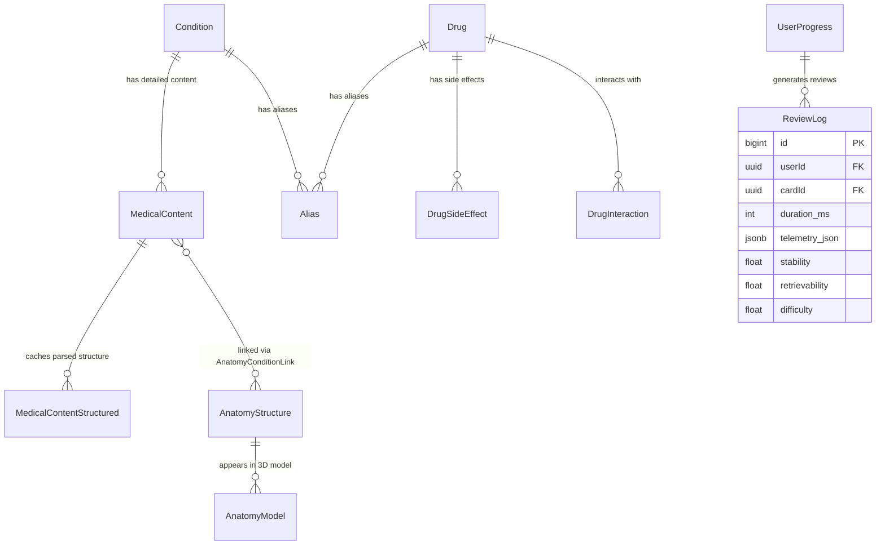

# V2 Architecture Proposal: Commercial‑Grade Relational Schema

**Date**: 2026‑03‑08  
**Author**: Autonomous Audit Engine  
**Purpose**: Design a fully normalized, production‑ready database schema that aligns with frontend type systems, eliminates “knots” (inefficient storage), and resolves “loose ends” (missing fields). This proposal is based on a comprehensive audit of the current codebase, Prisma schema, and live Supabase database.

---

## 1. Executive Summary

The current schema has served the prototype phase well but contains several denormalized structures and missing fields that hinder scalability, data integrity, and developer experience. The V2 redesign introduces:

- **Normalized aliases** – a single polymorphic table for all entity aliases.
- **Structured side‑effects and interactions** – JSONB with a defined schema, plus optional junction tables for many‑to‑many relationships.
- **Separate anatomy‑model table** – bridges the gap between `AnatomyStructure` and the frontend’s `AnatomyModel` interface.
- **Condition‑MedicalContent foreign‑key integrity** – explicit relational link.
- **Stored parsed structured data** – a `MedicalContentStructured` table that caches Gemini‑parsed content, eliminating repeated AI calls.
- **Telemetry and FSRS columns** – dedicated columns for high‑frequency metrics, keeping JSONB for extensibility.
- **Data‑quality enforcement** – non‑nullable fields where business logic requires them, plus validation triggers.

All changes are backward‑compatible where possible; migration scripts will be provided to transform existing data.

---

## 2. Current Schema Analysis

### 2.1 Knots (Inefficient Storage)

| Knot | Description | Impact |
|------|-------------|--------|
| **MedicalContent text fields** | `complications`, `diagnostics`, `differentialDiagnosis`, etc., stored as Markdown strings. Parsing required for structured UI. | High runtime cost; difficult to query; inconsistent formatting. |
| **Drug.sideEffects** | `String[]` of free‑text descriptions; frontend expects `SideEffect` objects with `severity`, `system`, `visualization`. | UI must guess severity/system; impossible to filter or aggregate. |
| **Drug.interactions** | `String[]` of free‑text descriptions; no linkage to other drugs. | Cannot build drug‑interaction graphs or severity‑based warnings. |
| **Aliases as arrays** | `Drug.aliases`, `AnatomyStructure.aliases`, `Condition.synonyms` stored as `String[]`. | Duplicate data; no way to track alias provenance or language. |
| **Condition–MedicalContent link** | `MedicalContent.conditionId` is a plain string without a foreign‑key constraint. | Referential integrity cannot be enforced; joins are manual. |
| **FSRS parameters** | `UserProgress.fsrsParams` stored as a JSONB array `w[0..20]`. | Difficult to index or query individual weights. |
| **Anatomy models** | Frontend expects `AnatomyModel` with `modelUrl`, `citation`, `structures`; database has `AnatomyStructure` with flat arrays. | Mapping logic required; missing 3D‑model metadata. |

### 2.2 Loose Ends (Missing Fields)

| Table | Missing Field | % Missing (Sample) | Frontend Expectation |
|-------|---------------|-------------------|----------------------|
| `MedicalContent` | `gold_standard_dx` | ~45% | `ConditionStructuredData.gold_standard` |
| | `first_line_rx` | ~48% | `ConditionStructuredData.treatment_first_line` |
| | `best_initial_test` | ~52% | – |
| | `overview` | ~30% | Library overview card |
| `Drug` | `mechanismOfAction` | ~60% | Drug card mechanism section |
| | `dosing` | ~55% | Drug card dosing section |
| | `brandName` | ~70% | Drug card subtitle |
| | `sideEffects` (empty array) | ~40% | Side‑effect list |
| | `indications` (empty array) | ~35% | Indication list |

### 2.3 Frontend–Database Mismatches

| Component | Expected Interface | Current Storage | Gap |
|-----------|-------------------|----------------|-----|
| `ConditionStructuredCards` | `clinical_pearls: string[]` | `clinical_pearls: Json?` (may be array) | Type mismatch; possible parsing errors. |
| `DrugCardRenderer` | `SideEffect { severity, system, … }` | `sideEffects: String[]` | No severity/system data. |
| `AnatomyModel` | `modelUrl`, `citation`, `structures[]` | `AnatomyStructure` with `imageUrl`, `diagramUrl` | Missing 3D‑model metadata. |
| `FSRSCard` | `stability`, `difficulty`, `retrievability` | Scattered across `ReviewLog`, `Card`, `UserProgress` | No single source of truth. |

---

## 3. Design Principles for V2

1. **Database‑First** – All medical content resides in PostgreSQL tables, never in static JSON files.
2. **Structured Over Text** – Wherever the UI expects structured data (arrays, objects), store it as typed JSONB or normalized tables.
3. **Backward Compatibility** – Existing API contracts remain unchanged; new fields are additive.
4. **Query Efficiency** – Frequently filtered columns (severity, system, PANCE yield) are indexed and stored as native types.
5. **Single Source of Truth** – Each piece of data appears in exactly one table; relationships are enforced with foreign keys.
6. **Extensibility via JSONB** – When the schema may evolve rapidly, JSONB columns provide flexibility while still enabling GIN indexing.

---

## 4. Proposed Relational Taxonomy



**Key Relationships**:
- `Condition` **1 → 1** `MedicalContent` (latest published version).
- `MedicalContent` **1 → 1** `MedicalContentStructured` (optional; populated by Gemini parsing).
- `Drug` **1 → n** `DrugSideEffect` (structured side‑effects).
- `Drug` **n → m** `Drug` via `DrugInteraction` (symmetrical interactions).
- **Polymorphic `Alias`** – `(entity_type, entity_id)` references any primary entity.

---

## 5. Normalized Schema Design

### 5.1 Core Entities

#### Table `Condition`
```prisma
model Condition {
  id          String   @id @default(cuid())
  name        String   @unique
  system      String   // NCCPA system code
  subcategory String?
  parentId    String?  @relation("ConditionHierarchy", fields: [parentId], references: [id])
  parent      Condition? @relation("ConditionHierarchy")
  children    Condition[] @relation("ConditionHierarchy")
  canonicalName String?   // authoritative name for disambiguation
  isHighYield Boolean   @default(false)
  panceYield  Int?      // 1‑3 (low‑high)
  createdAt   DateTime @default(now())
  updatedAt   DateTime @updatedAt

  // Relations
  MedicalContent        MedicalContent?
  Aliases               Alias[]
  AnatomyConditionLinks AnatomyConditionLink[]
  // … other linking tables

  @@index([system])
  @@index([subcategory])
  @@index([panceYield])
}
```

#### Table `MedicalContent`
*(Changes highlighted)*
```prisma
model MedicalContent {
  // … existing fields unchanged …
  conditionId           String   @unique
  Condition             Condition @relation(fields: [conditionId], references: [id], onDelete: Cascade) // NEW FK
  // Markdown fields remain as text (standardized by trigger)
  complications         String?
  diagnostics          String?
  // … etc.

  // JSON fields – now typed as Json? (PostgreSQL JSONB)
  classic_triad        Json?    // string[]
  clinical_pearls      Json?    // string[]
  age_demographic      Json?    // { min?: number, max?: number, peak?: number }
  differentials        Json?    // { condition: string, distinguishing: string }[]
  synonyms             Json?    // string[]

  // New cached structured data
  Structured           MedicalContentStructured?
}
```

#### Table `MedicalContentStructured` (new)
```prisma
model MedicalContentStructured {
  id               String   @id @default(cuid())
  medicalContentId String   @unique
  MedicalContent   MedicalContent @relation(fields: [medicalContentId], references: [id], onDelete: Cascade)

  // Parsed from Gemini‑structured endpoint
  clinical_pearls       String[]
  history_key_features  String[]
  physical_exam_findings String[]
  diagnostic_labs       String[]
  gold_standard         String?
  treatment_first_line  String?

  // Metadata
  parsedAt        DateTime @default(now())
  parserVersion   String   @default("gemini‑1.5‑pro")
  confidence      Float?   // 0‑1

  @@index([medicalContentId])
}
```

### 5.2 Pharmacology

#### Table `Drug`
```prisma
model Drug {
  // … existing fields unchanged …
  genericName        String   @unique
  brandName          String?
  drugClass          String[]
  mechanismOfAction  String?
  indications        String[]   // free‑text indications (keep for backward compatibility)
  contraindications  String[]
  dosing             String?
  tags               String[]
  isHighYield        Boolean  @default(false)
  panceYield         Int?

  // NEW: structured side‑effects (JSONB)
  sideEffectsJsonb   Json?    // SideEffect[]
  // NEW: structured interactions (JSONB)
  interactionsJsonb  Json?

  // Relations
  SideEffects        DrugSideEffect[]
  Interactions       DrugInteraction[] @relation("DrugInteraction_drugA")
  InteractedWith     DrugInteraction[] @relation("DrugInteraction_drugB")
  Aliases            Alias[]

  @@index([drugClass])
  @@index([panceYield])
}
```

#### Table `DrugSideEffect` (new)
```prisma
model DrugSideEffect {
  id           String   @id @default(cuid())
  drugId       String
  Drug         Drug     @relation(fields: [drugId], references: [id], onDelete: Cascade)

  name         String   // e.g., “QTc prolongation”
  severity     String   // 'common', 'serious', 'rare'
  system       String   // 'cardiac', 'neuro', 'gi', 'derm', 'other'
  visualization String? // 'ekg', 'wave', 'alert'
  description  String?

  @@index([drugId])
  @@index([severity])
  @@index([system])
}
```

#### Table `DrugInteraction` (existing, enhanced)
```prisma
model DrugInteraction {
  id          String   @id @default(cuid())
  drugIdA     String
  drugIdB     String
  DrugA       Drug     @relation("DrugInteraction_drugA", fields: [drugIdA], references: [id], onDelete: Cascade)
  DrugB       Drug     @relation("DrugInteraction_drugB", fields: [drugIdB], references: [id], onDelete: Cascade)

  severity    String   // 'contraindicated', 'severe', 'moderate', 'mild'
  mechanism   String?  // pharmacokinetic, pharmacodynamic, etc.
  description String?
  references  String[] // citation URLs

  @@unique([drugIdA, drugIdB])
  @@index([drugIdA])
  @@index([drugIdB])
  @@index([severity])
}
```

### 5.3 Anatomy & 3D Models

#### Table `AnatomyModel` (new)
```prisma
model AnatomyModel {
  id          String   @id @default(cuid())
  name        String   @unique
  system      String
  modelUrl    String   // URL to .glb/.glTF file
  citation    String?  // NIH citation or source
  structures  Json?    // string[] (references AnatomyStructure.id)
  description String?
  createdAt   DateTime @default(now())
  updatedAt   DateTime @updatedAt

  // Relations
  AnatomyStructures AnatomyStructure[] @relation("AnatomyStructureToAnatomyModel")

  @@index([system])
}
```

Extend `AnatomyStructure` with a link to `AnatomyModel`:
```prisma
model AnatomyStructure {
  // … existing fields …
  anatomyModelId   String?
  AnatomyModel     AnatomyModel? @relation("AnatomyStructureToAnatomyModel", fields: [anatomyModelId], references: [id])
}
```

### 5.4 Polymorphic Aliases

#### Table `Alias` (new)
```prisma
model Alias {
  id           String   @id @default(cuid())
  entityType   String   // 'Drug', 'Condition', 'AnatomyStructure', 'MedicalContent', …
  entityId     String   // ID of the referenced entity
  alias        String   // the alias text
  language     String   @default('en')
  isPrimary    Boolean  @default(false)  // whether this is the preferred alias
  addedBy      String?  // user ID or system source
  addedAt      DateTime @default(now())

  @@unique([entityType, entityId, alias])
  @@index([entityType, entityId])
  @@index([alias])   // for search
}
```

### 5.5 Spaced‑Repetition & Telemetry

#### Table `ReviewLog` (enhanced)
```prisma
model ReviewLog {
  // … existing fields …
  // NEW: dedicated telemetry columns (also kept in telemetry_json)
  duration_ms                Int?      // total dwell time
  time_to_first_interaction_ms Int?   // cognitive processing time
  hesitation_index           Float?    // mouse‑path deviation
  telemetry_json             Json?     // full telemetry blob

  // FSRS columns (duplicated from JSON for indexing)
  stability                 Float?
  retrievability            Float?
  difficulty                Float?

  @@index([userId, createdAt])
  @@index([stability])
  @@index([retrievability])
}
```

#### Table `UserProgress` (enhanced)
```prisma
model UserProgress {
  // … existing fields …
  // FSRS parameters as separate columns (optional)
  fsrs_w0  Float?
  fsrs_w1  Float?
  // … up to w20
  // Keep fsrsParams Json? for compatibility
}
```

### 5.6 Taxonomy & Mapping

Keep `MedicalTaxonomy`, `SystemMapping`, `MappingSuggestion` unchanged – they already follow a normalized design.

---

## 6. Migration Strategy

### Phase 1: Additive Changes (Zero Downtime)
1. Create new tables (`MedicalContentStructured`, `DrugSideEffect`, `AnatomyModel`, `Alias`) with no foreign‑key constraints.
2. Add new nullable columns to existing tables (`sideEffectsJsonb`, `interactionsJsonb`, `anatomyModelId`, etc.).
3. Deploy application code that writes to both old and new fields (dual‑write).

### Phase 2: Data Migration
1. Backfill `Alias` from existing `aliases` arrays.
2. Run Gemini parsing job to populate `MedicalContentStructured`.
3. Convert `Drug.sideEffects` strings to `DrugSideEffect` records (using heuristic rules for severity/system).
4. Populate `AnatomyModel` from existing 3D‑model metadata (if any).

### Phase 3: Switch Reads & Drop Legacy
1. Update frontend to read from new structured fields.
2. Once verification passes, drop legacy columns (`sideEffects`, `interactions`, `aliases` arrays) **or** keep them as derived views for backward compatibility.
3. Add foreign‑key constraints (e.g., `MedicalContent.conditionId → Condition.id`).

### Phase 4: Validation & Cleanup
1. Run data‑quality scripts to ensure no missing required fields.
2. Update Prisma schema and regenerate client.
3. Update all API endpoints to use the new schema.

---

## 7. Impact on Frontend & API

### 7.1 API Endpoints
- `/api/conditions/[identifier]/structured` can now serve cached data from `MedicalContentStructured` (no Gemini call unless stale).
- `/api/drugs/[id]` returns `sideEffects` as structured JSONB (old string array deprecated but still present).
- New `/api/alias/search` endpoint for cross‑entity alias search.

### 7.2 Frontend Components
- `DrugCardRenderer` can immediately use `sideEffectsJsonb` with no transformation.
- `ConditionStructuredCards` reads from `MedicalContentStructured` with guaranteed array types.
- `AnatomyModel` component queries `AnatomyModel` table directly.

### 7.3 TypeScript Interfaces
Update `types/medical‑content.ts`, `types/drugs.ts`, `types/anatomy‑model.ts` to reflect the new database‑first shapes.

---

## 8. Implementation Roadmap

| Step | Tasks | Estimated Effort |
|------|-------|------------------|
| **1. Schema Design** | Finalize this proposal, review with team. | 1 day |
| **2. Prisma Migration** | Generate migration files for additive changes. | 2 days |
| **3. Backfill Scripts** | Write and test data‑migration scripts. | 3 days |
| **4. Dual‑Write API** | Modify backend to write to both old/new fields. | 2 days |
| **5. Frontend Adoption** | Update components to read from new fields. | 3 days |
| **6. Cut‑over** | Switch reads, drop legacy columns, add constraints. | 1 day |
| **7. Validation** | Run full test suite, data‑quality checks. | 2 days |

**Total**: ~14 developer‑days (excluding QA and deployment overhead).

---

## 9. Risks & Mitigations

| Risk | Mitigation |
|------|------------|
| Data‑migration performance | Batch processing (500 records/batch), monitor Supabase CPU. |
| Frontend breaking changes | Feature‑flag new UI paths; fallback to old fields. |
| Increased storage size | JSONB columns are GIN‑indexed; archive old text fields after cut‑over. |
| Schema‑change conflicts with active development | Communicate timeline; branch migrations. |

---

## 10. Conclusion

The proposed V2 schema eliminates the identified knots and loose ends, providing a solid foundation for the next phase of PANaCEa’s growth. By storing structured data natively, we reduce runtime parsing, improve query capabilities, and align the database with the frontend’s type system. The migration is designed to be incremental and low‑risk, with clear rollback points.

**Next Action**: Review this proposal with the engineering team, then proceed to Phase 1 implementation.

---

*Appendix A: Sample JSONB Schema Definitions*  
*Appendix B: Detailed Migration SQL Scripts*  
*Appendix C: Impact on Existing Reports & Dashboards*  

*(Appendices will be added during implementation planning.)*