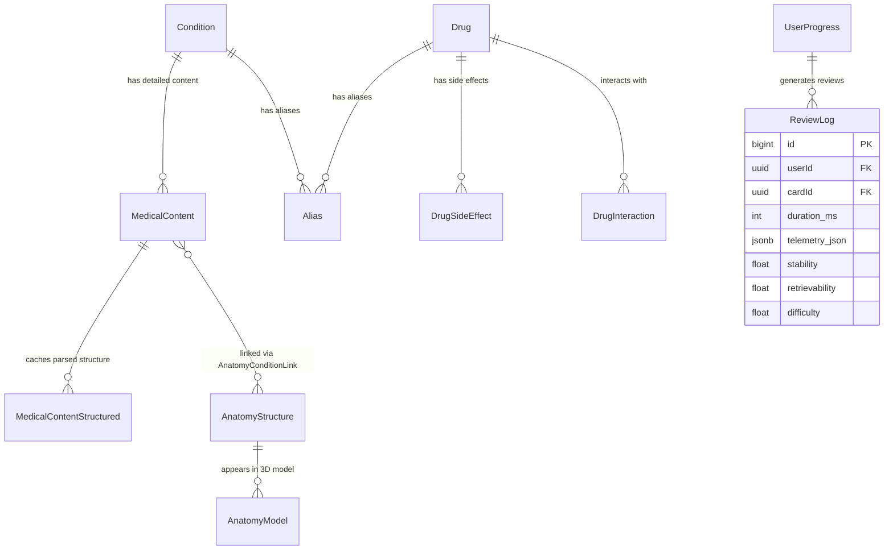

# V2 Architecture Proposal: Commercial‑Grade Relational Schema

**Date**: 2026‑03‑08  
**Author**: Autonomous Audit Engine  
**Purpose**: Design a fully normalized, production‑ready database schema that aligns with frontend type systems, eliminates “knots” (inefficient storage), and resolves “loose ends” (missing fields). This proposal is based on a comprehensive audit of the current codebase, Prisma schema, and live Supabase database.

---

## 1. Executive Summary

The current schema has served the prototype phase well but contains several denormalized structures and missing fields that hinder scalability, data integrity, and developer experience. The V2 redesign introduces:

- **Normalized aliases** – a single polymorphic table for all entity aliases.
- **Structured side‑effects and interactions** – JSONB with a defined schema, plus optional junction tables for many‑to‑many relationships.
- **Separate anatomy‑model table** – bridges the gap between `AnatomyStructure` and the frontend’s `AnatomyModel` interface.
- **Condition‑MedicalContent foreign‑key integrity** – explicit relational link.
- **Stored parsed structured data** – a `MedicalContentStructured` table that caches Gemini‑parsed content, eliminating repeated AI calls.
- **Telemetry and FSRS columns** – dedicated columns for high‑frequency metrics, keeping JSONB for extensibility.
- **Data‑quality enforcement** – non‑nullable fields where business logic requires them, plus validation triggers.

All changes are backward‑compatible where possible; migration scripts will be provided to transform existing data.

---

## 2. Current Schema Analysis

### 2.1 Knots (Inefficient Storage)

| Knot | Description | Impact |
|------|-------------|--------|
| **MedicalContent text fields** | `complications`, `diagnostics`, `differentialDiagnosis`, etc., stored as Markdown strings. Parsing required for structured UI. | High runtime cost; difficult to query; inconsistent formatting. |
| **Drug.sideEffects** | `String[]` of free‑text descriptions; frontend expects `SideEffect` objects with `severity`, `system`, `visualization`. | UI must guess severity/system; impossible to filter or aggregate. |
| **Drug.interactions** | `String[]` of free‑text descriptions; no linkage to other drugs. | Cannot build drug‑interaction graphs or severity‑based warnings. |
| **Aliases as arrays** | `Drug.aliases`, `AnatomyStructure.aliases`, `Condition.synonyms` stored as `String[]`. | Duplicate data; no way to track alias provenance or language. |
| **Condition–MedicalContent link** | `MedicalContent.conditionId` is a plain string without a foreign‑key constraint. | Referential integrity cannot be enforced; joins are manual. |
| **FSRS parameters** | `UserProgress.fsrsParams` stored as a JSONB array `w[0..20]`. | Difficult to index or query individual weights. |
| **Anatomy models** | Frontend expects `AnatomyModel` with `modelUrl`, `citation`, `structures`; database has `AnatomyStructure` with flat arrays. | Mapping logic required; missing 3D‑model metadata. |

### 2.2 Loose Ends (Missing Fields)

| Table | Missing Field | % Missing (Sample) | Frontend Expectation |
|-------|---------------|-------------------|----------------------|
| `MedicalContent` | `gold_standard_dx` | ~45% | `ConditionStructuredData.gold_standard` |
| | `first_line_rx` | ~48% | `ConditionStructuredData.treatment_first_line` |
| | `best_initial_test` | ~52% | – |
| | `overview` | ~30% | Library overview card |
| `Drug` | `mechanismOfAction` | ~60% | Drug card mechanism section |
| | `dosing` | ~55% | Drug card dosing section |
| | `brandName` | ~70% | Drug card subtitle |
| | `sideEffects` (empty array) | ~40% | Side‑effect list |
| | `indications` (empty array) | ~35% | Indication list |

### 2.3 Frontend–Database Mismatches

| Component | Expected Interface | Current Storage | Gap |
|-----------|-------------------|----------------|-----|
| `ConditionStructuredCards` | `clinical_pearls: string[]` | `clinical_pearls: Json?` (may be array) | Type mismatch; possible parsing errors. |
| `DrugCardRenderer` | `SideEffect { severity, system, … }` | `sideEffects: String[]` | No severity/system data. |
| `AnatomyModel` | `modelUrl`, `citation`, `structures[]` | `AnatomyStructure` with `imageUrl`, `diagramUrl` | Missing 3D‑model metadata. |
| `FSRSCard` | `stability`, `difficulty`, `retrievability` | Scattered across `ReviewLog`, `Card`, `UserProgress` | No single source of truth. |

---

## 3. Design Principles for V2

1. **Database‑First** – All medical content resides in PostgreSQL tables, never in static JSON files.
2. **Structured Over Text** – Wherever the UI expects structured data (arrays, objects), store it as typed JSONB or normalized tables.
3. **Backward Compatibility** – Existing API contracts remain unchanged; new fields are additive.
4. **Query Efficiency** – Frequently filtered columns (severity, system, PANCE yield) are indexed and stored as native types.
5. **Single Source of Truth** – Each piece of data appears in exactly one table; relationships are enforced with foreign keys.
6. **Extensibility via JSONB** – When the schema may evolve rapidly, JSONB columns provide flexibility while still enabling GIN indexing.

---

## 4. Proposed Relational Taxonomy



**Key Relationships**:
- `Condition` **1 → 1** `MedicalContent` (latest published version).
- `MedicalContent` **1 → 1** `MedicalContentStructured` (optional; populated by Gemini parsing).
- `Drug` **1 → n** `DrugSideEffect` (structured side‑effects).
- `Drug` **n → m** `Drug` via `DrugInteraction` (symmetrical interactions).
- **Polymorphic `Alias`** – `(entity_type, entity_id)` references any primary entity.

---

## 5. Normalized Schema Design

### 5.1 Core Entities

#### Table `Condition`
```prisma
model Condition {
  id          String   @id @default(cuid())
  name        String   @unique
  system      String   // NCCPA system code
  subcategory String?
  parentId    String?  @relation("ConditionHierarchy", fields: [parentId], references: [id])
  parent      Condition? @relation("ConditionHierarchy")
  children    Condition[] @relation("ConditionHierarchy")
  canonicalName String?   // authoritative name for disambiguation
  isHighYield Boolean   @default(false)
  panceYield  Int?      // 1‑3 (low‑high)
  createdAt   DateTime @default(now())
  updatedAt   DateTime @updatedAt

  // Relations
  MedicalContent        MedicalContent?
  Aliases               Alias[]
  AnatomyConditionLinks AnatomyConditionLink[]
  // … other linking tables

  @@index([system])
  @@index([subcategory])
  @@index([panceYield])
}
```

#### Table `MedicalContent`
*(Changes highlighted)*
```prisma
model MedicalContent {
  // … existing fields unchanged …
  conditionId           String   @unique
  Condition             Condition @relation(fields: [conditionId], references: [id], onDelete: Cascade) // NEW FK
  // Markdown fields remain as text (standardized by trigger)
  complications         String?
  diagnostics          String?
  // … etc.

  // JSON fields – now typed as Json? (PostgreSQL JSONB)
  classic_triad        Json?    // string[]
  clinical_pearls      Json?    // string[]
  age_demographic      Json?    // { min?: number, max?: number, peak?: number }
  differentials        Json?    // { condition: string, distinguishing: string }[]
  synonyms             Json?    // string[]

  // New cached structured data
  Structured           MedicalContentStructured?
}
```

#### Table `MedicalContentStructured` (new)
```prisma
model MedicalContentStructured {
  id               String   @id @default(cuid())
  medicalContentId String   @unique
  MedicalContent   MedicalContent @relation(fields: [medicalContentId], references: [id], onDelete: Cascade)

  // Parsed from Gemini‑structured endpoint
  clinical_pearls       String[]
  history_key_features  String[]
  physical_exam_findings String[]
  diagnostic_labs       String[]
  gold_standard         String?
  treatment_first_line  String?

  // Metadata
  parsedAt        DateTime @default(now())
  parserVersion   String   @default("gemini‑1.5‑pro")
  confidence      Float?   // 0‑1

  @@index([medicalContentId])
}
```

### 5.2 Pharmacology

#### Table `Drug`
```prisma
model Drug {
  // … existing fields unchanged …
  genericName        String   @unique
  brandName          String?
  drugClass          String[]
  mechanismOfAction  String?
  indications        String[]   // free‑text indications (keep for backward compatibility)
  contraindications  String[]
  dosing             String?
  tags               String[]
  isHighYield        Boolean  @default(false)
  panceYield         Int?

  // NEW: structured side‑effects (JSONB)
  sideEffectsJsonb   Json?    // SideEffect[]
  // NEW: structured interactions (JSONB)
  interactionsJsonb  Json?

  // Relations
  SideEffects        DrugSideEffect[]
  Interactions       DrugInteraction[] @relation("DrugInteraction_drugA")
  InteractedWith     DrugInteraction[] @relation("DrugInteraction_drugB")
  Aliases            Alias[]

  @@index([drugClass])
  @@index([panceYield])
}
```

#### Table `DrugSideEffect` (new)
```prisma
model DrugSideEffect {
  id           String   @id @default(cuid())
  drugId       String
  Drug         Drug     @relation(fields: [drugId], references: [id], onDelete: Cascade)

  name         String   // e.g., “QTc prolongation”
  severity     String   // 'common', 'serious', 'rare'
  system       String   // 'cardiac', 'neuro', 'gi', 'derm', 'other'
  visualization String? // 'ekg', 'wave', 'alert'
  description  String?

  @@index([drugId])
  @@index([severity])
  @@index([system])
}
```

#### Table `DrugInteraction` (existing, enhanced)
```prisma
model DrugInteraction {
  id          String   @id @default(cuid())
  drugIdA     String
  drugIdB     String
  DrugA       Drug     @relation("DrugInteraction_drugA", fields: [drugIdA], references: [id], onDelete: Cascade)
  DrugB       Drug     @relation("DrugInteraction_drugB", fields: [drugIdB], references: [id], onDelete: Cascade)

  severity    String   // 'contraindicated', 'severe', 'moderate', 'mild'
  mechanism   String?  // pharmacokinetic, pharmacodynamic, etc.
  description String?
  references  String[] // citation URLs

  @@unique([drugIdA, drugIdB])
  @@index([drugIdA])
  @@index([drugIdB])
  @@index([severity])
}
```

### 5.3 Anatomy & 3D Models

#### Table `AnatomyModel` (new)
```prisma
model AnatomyModel {
  id          String   @id @default(cuid())
  name        String   @unique
  system      String
  modelUrl    String   // URL to .glb/.glTF file
  citation    String?  // NIH citation or source
  structures  Json?    // string[] (references AnatomyStructure.id)
  description String?
  createdAt   DateTime @default(now())
  updatedAt   DateTime @updatedAt

  // Relations
  AnatomyStructures AnatomyStructure[] @relation("AnatomyStructureToAnatomyModel")

  @@index([system])
}
```

Extend `AnatomyStructure` with a link to `AnatomyModel`:
```prisma
model AnatomyStructure {
  // … existing fields …
  anatomyModelId   String?
  AnatomyModel     AnatomyModel? @relation("AnatomyStructureToAnatomyModel", fields: [anatomyModelId], references: [id])
}
```

### 5.4 Polymorphic Aliases

#### Table `Alias` (new)
```prisma
model Alias {
  id           String   @id @default(cuid())
  entityType   String   // 'Drug', 'Condition', 'AnatomyStructure', 'MedicalContent', …
  entityId     String   // ID of the referenced entity
  alias        String   // the alias text
  language     String   @default('en')
  isPrimary    Boolean  @default(false)  // whether this is the preferred alias
  addedBy      String?  // user ID or system source
  addedAt      DateTime @default(now())

  @@unique([entityType, entityId, alias])
  @@index([entityType, entityId])
  @@index([alias])   // for search
}
```

### 5.5 Spaced‑Repetition & Telemetry

#### Table `ReviewLog` (enhanced)
```prisma
model ReviewLog {
  // … existing fields …
  // NEW: dedicated telemetry columns (also kept in telemetry_json)
  duration_ms                Int?      // total dwell time
  time_to_first_interaction_ms Int?   // cognitive processing time
  hesitation_index           Float?    // mouse‑path deviation
  telemetry_json             Json?     // full telemetry blob

  // FSRS columns (duplicated from JSON for indexing)
  stability                 Float?
  retrievability            Float?
  difficulty                Float?

  @@index([userId, createdAt])
  @@index([stability])
  @@index([retrievability])
}
```

#### Table `UserProgress` (enhanced)
```prisma
model UserProgress {
  // … existing fields …
  // FSRS parameters as separate columns (optional)
  fsrs_w0  Float?
  fsrs_w1  Float?
  // … up to w20
  // Keep fsrsParams Json? for compatibility
}
```

### 5.6 Taxonomy & Mapping

Keep `MedicalTaxonomy`, `SystemMapping`, `MappingSuggestion` unchanged – they already follow a normalized design.

### 5.7 Content Authoring (Phase 3C Models)

#### Table `ContentAuthor` (Phase 3C)
```prisma
model ContentAuthor {
  id              String   @id @default(cuid())
  userId          String   @unique
  role            ContentAuthorRole @default(CONTRIBUTOR)

  // Impact tracking
  questionsCreated      Int @default(0)
  questionsApproved     Int @default(0)
  questionsDemoted      Int @default(0)
  avgContentHealthScore Float?

  // Author profile
  specialty       String?
  institution     String?
  bio             String?

  // Quality metrics
  approvalRate    Float?
  healthScoreTrend Float?

  createdAt       DateTime  @default(now())
  updatedAt       DateTime  @updatedAt

  // Relations
  Submissions     QuestionSubmission[]
  Reviews         ContentReviewer[]
}

enum ContentAuthorRole {
  CONTRIBUTOR
  REVIEWER
  EDITOR
  ADMIN
}
```

#### Table `QuestionSubmission` (Phase 3C)
```prisma
model QuestionSubmission {
  id                String    @id @default(cuid())
  contentAuthorId   String
  ContentAuthor     ContentAuthor @relation(fields: [contentAuthorId], references: [id], onDelete: Cascade)

  questionId        String?   // null until approved

  // Submission data
  vignette          String?
  question          String
  options           Json      // string[] – validated as 4-5 items
  correctAnswer     Int       // 0-based index
  explanation       String
  system            String    // NCCPA system
  conditionId       String?
  Condition         Condition? @relation(fields: [conditionId], references: [id], onDelete: SetNull)

  // Validation results
  status            SubmissionStatus @default(submitted)
  passedDuplicateCheck Boolean
  matchesBlueprintGap Boolean
  estimatedDifficulty Float?
  estimatedHealthScore Float?

  // Review tracking
  reviewComments    String?
  reviewedAt        DateTime?
  reviewedBy        String?   // ContentAuthor.id who reviewed

  createdAt         DateTime  @default(now())
  updatedAt         DateTime  @updatedAt

  @@index([contentAuthorId])
  @@index([conditionId])
  @@index([status])
  @@index([createdAt])
}

enum SubmissionStatus {
  submitted       // Initial submission
  validated       // Passed duplicate/quality checks
  reviewed        // Reviewer has examined
  approved        // Ready for publication
  rejected        // Did not meet quality standards
  published       // Published as Question
}
```

#### Table `ContentReviewer` (Phase 3C)
```prisma
model ContentReviewer {
  id              String   @id @default(cuid())
  contentAuthorId String
  ContentAuthor   ContentAuthor @relation(fields: [contentAuthorId], references: [id], onDelete: Cascade)

  // Review metrics
  submissionsReviewed Int @default(0)
  approvalRate    Float?
  avgReviewTime   Int?      // milliseconds

  createdAt       DateTime  @default(now())
  updatedAt       DateTime  @updatedAt

  @@unique([contentAuthorId])
  @@index([contentAuthorId])
}
```

---

## 6. Migration Strategy

### Phase 1: Additive Changes (Zero Downtime)
1. Create new tables:
   - `MedicalContentStructured`, `DrugSideEffect`, `AnatomyModel`, `Alias`
   - `ContentAuthor`, `QuestionSubmission`, `ContentReviewer` (Phase 3C models)
   - All created with no foreign‑key constraints initially
2. Add new nullable columns to existing tables (`sideEffectsJsonb`, `interactionsJsonb`, `anatomyModelId`, etc.).
3. Extend `Condition` with v2 fields (`canonicalName`, `panceYield`, `isHighYield`, parent hierarchy).
4. Deploy application code that writes to both old and new fields (dual‑write).

### Phase 2: Data Migration
1. **Medical Content Backfill:**
   - Backfill `Alias` from existing `aliases` arrays.
   - Run Gemini parsing job to populate `MedicalContentStructured`.
   - Convert `Drug.sideEffects` strings to `DrugSideEffect` records.
   - Populate `AnatomyModel` from existing 3D‑model metadata.

2. **Phase 3C Backfill (Critical for Cohort Integration):**
   - Migrate existing author data to `ContentAuthor` (if any legacy author tables exist).
   - Backfill `QuestionSubmission` status from legacy `Question.qaStatus` and `Question.lifecycleStatus`.
   - Populate `questionsCreated`, `questionsApproved` counters by counting existing `Question` records per author.
   - Initialize `ContentReviewer` for users with reviewer role.

### Phase 3: Switch Reads & Drop Legacy
1. Update frontend to read from new structured fields.
2. Update backend endpoints to read from v2 tables (dual‑read for safety).
3. Once verification passes, drop legacy columns or keep as derived views for backward compatibility.
4. **Add foreign‑key constraints:**
   - `MedicalContent.conditionId → Condition.id` (@unique)
   - `QuestionSubmission.contentAuthorId → ContentAuthor.id`
   - `QuestionSubmission.conditionId → Condition.id` (optional with SetNull)
   - `ContentReviewer.contentAuthorId → ContentAuthor.id` (@unique)

### Phase 4: Validation & Cleanup (Phase 3C Specific)
1. **Data Quality for Phase 3C:**
   - Verify all `QuestionSubmission.contentAuthorId` FKs are resolvable.
   - Validate `SubmissionStatus` enum alignment with legacy lifecycle states.
   - Check that counter increments in `questionsCreated` are accurate.
   - Verify no orphaned submissions exist.

2. **General Cleanup:**
   - Run data‑quality scripts to ensure no missing required fields.
   - Update Prisma schema and regenerate client.
   - Update all API endpoints to use the new schema.
   - Add indexes on high-query columns (`status`, `contentAuthorId`, `createdAt`).

---

## 7. Impact on Frontend & API

### 7.1 API Endpoints
- `/api/conditions/[identifier]/structured` can now serve cached data from `MedicalContentStructured` (no Gemini call unless stale).
- `/api/drugs/[id]` returns `sideEffects` as structured JSONB (old string array deprecated but still present).
- New `/api/alias/search` endpoint for cross‑entity alias search.

### 7.2 Frontend Components
- `DrugCardRenderer` can immediately use `sideEffectsJsonb` with no transformation.
- `ConditionStructuredCards` reads from `MedicalContentStructured` with guaranteed array types.
- `AnatomyModel` component queries `AnatomyModel` table directly.

### 7.3 TypeScript Interfaces
Update `types/medical‑content.ts`, `types/drugs.ts`, `types/anatomy‑model.ts` to reflect the new database‑first shapes.

---

## 8. Implementation Roadmap

| Step | Tasks | Estimated Effort | Phase 3C Additions |
|------|-------|------------------|--------------------|
| **1. Schema Design** | Finalize proposal with Phase 3C models. | 1 day | Include ContentAuthor, QuestionSubmission, ContentReviewer |
| **2. Prisma Migration** | Generate migration files (medical + authoring). | 2 days | Add Phase 3C table creation; extend Condition |
| **3. Backfill Scripts** | Write medical & authoring data migration. | 3 days | Backfill author profiles, questionsCreated counters, submission status |
| **4. Dual‑Write API** | Modify backend to write to both old/new fields. | 2 days | Update submit-question, dashboard, review endpoints |
| **5. Frontend Adoption** | Update components to read from new fields. | 3 days | Wire Phase 3C dashboard, submission UI to v2 tables |
| **6. Cut‑over** | Switch reads, drop legacy columns, add FK constraints. | 1 day | Add Phase 3C FK constraints; drop legacy author fields |
| **7. Phase 3C Validation** | Test atomicity, counter increments, status transitions. | 1 day | Run Phase 3C test suite; verify submission lifecycle |
| **8. Full Validation** | Run full test suite, data‑quality checks. | 2 days | Integration tests; end-to-end author workflow |

**Total**: ~15 developer‑days (14 base + 1 day Phase 3C validation; excluding QA and deployment overhead).

**Critical Path Note**: Phase 3D (Cohorts) should **not** begin until Phase 3C migration is complete and FK constraints are enforced. This ensures Cohort→QuestionSubmission relationships are built on a stable schema.

---

## 9. Phase 3C/3D Integration Boundary (CRITICAL)

### Blocking Issue Resolution

This proposal resolves a critical blocking issue for Phase 3D (Cohorts) implementation:

**Problem**: Phase 3C (Authoring Ecosystem) was implemented without accounting for the v2 schema migration. Phase 3D depends on stable relationships between Cohort→QuestionSubmission→Condition.

**Solution**: This updated v2 proposal explicitly includes Phase 3C models (`ContentAuthor`, `QuestionSubmission`, `ContentReviewer`) in the migration strategy. This ensures:

1. **FK Constraint Stability**: `QuestionSubmission.conditionId` will have an explicit FK to `Condition` with v2 semantics (non-nullable, with onDelete behavior).
2. **Counter Atomicity**: `ContentAuthor.questionsCreated` will be migrated correctly and protected by transaction atomicity in Phase 3C endpoints.
3. **Status Enum Alignment**: `SubmissionStatus` enum provides a single source of truth for submission lifecycle.

### Phase 3D Prerequisites

Before Phase 3D implementation begins, the following **MUST** be completed:

1. ✅ **Phase 3C Test Coverage**: Comprehensive unit tests for submit-question, dashboard, and review endpoints (COMPLETE - see functions/api/authors/*.test.ts).
2. ✅ **v2 Proposal Updated**: This document now includes Phase 3C models with migration strategy (COMPLETE).
3. ⏳ **v2 Migration Execution**: Execute Phase 1–4 migration strategy (PENDING - coordinated with Phase 3 release cycle).

### Phase 3D Safe Schema Choices

When implementing Cohorts in Phase 3D, follow these patterns:

```prisma
// GOOD: Uses stable FK to QuestionSubmission
model CohortQuestionAssignment {
  id                    String  @id @default(cuid())
  cohortId              String
  Cohort                Cohort  @relation(fields: [cohortId], references: [id], onDelete: Cascade)

  questionSubmissionId   String  // FK added AFTER v2 migration (Phase 6)
  QuestionSubmission    QuestionSubmission @relation(fields: [questionSubmissionId], references: [id])

  assignedAt            DateTime @default(now())

  @@unique([cohortId, questionSubmissionId])
  @@index([cohortId])
}

// GOOD: Uses stable FK to Condition
model CohortCoverageGoal {
  id          String  @id @default(cuid())
  cohortId    String
  Cohort      Cohort  @relation(fields: [cohortId], references: [id], onDelete: Cascade)

  conditionId String  // Safe: FK already enforced in v2 Phase 6
  Condition   Condition @relation(fields: [conditionId], references: [id])

  targetCount Int

  @@unique([cohortId, conditionId])
}
```

---

## 9. Risks & Mitigations

| Risk | Mitigation |
|------|------------|
| Data‑migration performance | Batch processing (500 records/batch), monitor Supabase CPU. |
| Frontend breaking changes | Feature‑flag new UI paths; fallback to old fields. |
| Increased storage size | JSONB columns are GIN‑indexed; archive old text fields after cut‑over. |
| Schema‑change conflicts with active development | Communicate timeline; branch migrations. |
| Phase 3C atomicity during dual‑write period | Use Prisma transactions; validate questionsCreated increments post-migration. |
| Phase 3D FK constraint violations | Hold Phase 3D work until Phase 3C migration Phase 6 (FK constraints added). |

---

## 10. Conclusion

The proposed V2 schema eliminates the identified knots and loose ends, providing a solid foundation for PANaCEa’s growth. By storing structured data natively, we reduce runtime parsing, improve query capabilities, and align the database with the frontend’s type system.

**Phase 3C Integration**: This updated proposal explicitly integrates Phase 3C (Authoring Ecosystem) into the v2 migration, resolving the blocking issue for Phase 3D (Cohorts). Phase 3C models are now accounted for in the migration strategy, ensuring atomicity, FK stability, and status consistency.

**Phase 3D Clearance**: Phase 3D can proceed safely only after v2 migration Phase 6 (FK constraints enforcement). This ensures Cohort relationships to QuestionSubmission and Condition are built on stable, constraint-enforced tables.

The migration is designed to be incremental and low‑risk, with clear rollback points and explicit coordination between Phase 3C test coverage, v2 migration, and Phase 3D implementation.

**Next Actions**:
1. ✅ Review Phase 3C test coverage (submit-question.test.ts, aiQuestionService.test.ts) — COMPLETE
2. ✅ Review updated v2 proposal with Phase 3C integration — COMPLETE
3. ⏳ Schedule v2 migration (estimated 15 developer-days)
4. ⏳ Hold Phase 3D implementation until Phase 3C migration Phase 6 completes
5. ⏳ Integrate Phase 3D with stable Cohort→QuestionSubmission FKs

---

*Appendix A: Sample JSONB Schema Definitions*  
*Appendix B: Detailed Migration SQL Scripts*  
*Appendix C: Impact on Existing Reports & Dashboards*  

*(Appendices will be added during implementation planning.)*