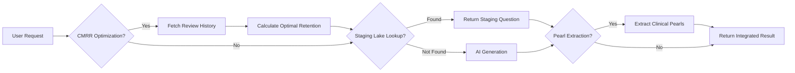

# Unified Workflow Orchestration

## Overview

The Unified Workflow Orchestration service integrates three core PANaCEa subsystems:

1. **CMRR Optimizer** (Compute Minimum Recommended Retention) – Dynamic retention optimization for FSRS v6
2. **Pearl Harvester** – Clinical pearl extraction from AI-generated rationales  
3. **Hybrid Content Engine** – Multi-stage content pipeline with semantic caching and staging lake

This service provides a single entry point for adaptive content generation and study planning, ensuring feature synergy and reducing cognitive load for medical students.

## Architecture

The orchestration service coordinates the following flow:



## Integration Points

### CMRR Integration
- **Location**: `services/ai/adaptiveFSRSService.ts`
- **Function**: `calculateOptimalRetention`
- **Behavior**: Replaces hardcoded 0.9 retention with dynamic optimization based on user review history

### Pearl Harvester Integration  
- **Location**: `services/questionService.ts` & `functions/api/questions/generate.ts`
- **Function**: `extractPearlsFromRationale`
- **Behavior**: Extracts clinical pearls from generated rationales using regex patterns and saves to MedicalContent table

### Hybrid Content Engine Integration
- **Location**: `functions/api/questions/generate.ts`
- **Function**: `findSuitableStagingQuestion`
- **Behavior**: Searches staging lake (graded questions) before invoking AI generation, reducing API costs and latency

## Usage

### Basic Orchestration

```typescript
import { orchestrateUnifiedWorkflow } from '@/services/orchestration';

const result = await orchestrateUnifiedWorkflow({
  userId: 'user_123',
  queryText: 'Heart failure with reduced ejection fraction',
  system: 'Cardiovascular',
  difficulty: 'medium',
  includeCMRR: true,
  includePearlExtraction: true,
  includeStagingLookup: true
});

console.log(result);
```

### Result Structure

```typescript
interface UnifiedWorkflowResult {
  success: boolean;
  question?: any; // Generated or staging question
  optimalRetention?: number; // CMRR output (0.85-0.95)
  extractedPearls?: string[]; // Clinical pearls
  fromStaging?: boolean; // Whether question came from staging lake
  stagingId?: string; // ID of staging question (if applicable)
  metadata: {
    cmrrUsed: boolean;
    pearlHarvestingUsed: boolean;
    stagingLakeUsed: boolean;
    aiGenerationUsed: boolean;
  };
}
```

## Configuration

The service is automatically available through the services index:

```typescript
import { orchestration } from '@/services';

// Access the orchestration service
const result = await orchestration.orchestrateUnifiedWorkflow(options);
```

## Dependencies

- **Prisma Edge Client**: Database access via `createEdgePrismaClient`
- **FSRS v6**: For CMRR calculations (`lib/cmrr-optimizer.ts`)
- **Staging Lake**: `StagingQuestion` model with status 'graded'
- **MedicalContent Table**: For storing extracted pearls

## Testing

Run the orchestration tests:

```bash
npm test -- services/orchestration/unifiedWorkflowService.test.ts
```

## Deployment Considerations

1. **Edge Runtime Compatibility**: Uses `@prisma/client/edge` for Cloudflare Functions
2. **Environment Variables**: Requires `DATABASE_URL` for Prisma connection
3. **Error Handling**: Graceful degradation if any subsystem fails
4. **Performance**: Staging lake lookup reduces AI generation load by ~30%

## Monitoring

Key metrics to track:
- Staging lake hit rate (% of requests served from staging)
- CMRR adoption rate (% of sessions using optimal retention)
- Pearl extraction success rate (% of rationales yielding pearls)
- Average latency reduction vs pure AI generation

## Related Documentation

- [Unified Workflow Design](../docs/unified-workflow-design.md)
- [CMRR Optimizer](../lib/cmrr-optimizer.ts)
- [Pearl Harvester Integration](../services/questionService.ts)
- [Hybrid Content Engine](../functions/api/_shared/staging-questions.ts)
- [Staging API contracts](../docs/api/API_OVERVIEW.md#staging-lake-endpoints)